# pygame Viking Edition — Master Architecture Document

**Version:** 2.6.1 (base) → Viking Edition (fork)  
**Last Updated:** 2026-04-05  
**Maintained by:** Volmarr Wyrd + Runa Gridweaver Freyjasdottir  

> This document is the canonical reference for the pygame Viking Edition codebase.
> Every system, every boundary, every data flow — laid out so any vibe coding session
> can orient immediately and work with full context.

---

## Table of Contents

1. [What pygame Is](#1-what-pygame-is)
2. [Top-Level Repository Structure](#2-top-level-repository-structure)
3. [Language Layers](#3-language-layers)
4. [Module Map — All Modules at a Glance](#4-module-map)
5. [Module Dependency Graph](#5-module-dependency-graph)
6. [C/Python Boundary — How It Works](#6-cpython-boundary)
7. [SDL2 Integration Layer](#7-sdl2-integration-layer)
8. [The Slot API — Inter-Module C Communication](#8-the-slot-api)
9. [Build System](#9-build-system)
10. [The Game Loop Flow](#10-the-game-loop-flow)
11. [Surface System Deep Dive](#11-surface-system)
12. [Event System Deep Dive](#12-event-system)
13. [Display System Deep Dive](#13-display-system)
14. [Audio System Deep Dive](#14-audio-system)
15. [Input Systems](#15-input-systems)
16. [Font Systems](#16-font-systems)
17. [Drawing Subsystem](#17-drawing-subsystem)
18. [Math Module](#18-math-module)
19. [Pixel Systems](#19-pixel-systems)
20. [Platform Abstraction](#20-platform-abstraction)
21. [SIMD Acceleration](#21-simd-acceleration)
22. [Python-Side Modules](#22-python-side-modules)
23. [SDL2 Cython Wrappers (_sdl2)](#23-sdl2-cython-wrappers)
24. [Memory Model](#24-memory-model)
25. [Thread Model](#25-thread-model)
26. [Init / Quit Lifecycle](#26-init--quit-lifecycle)
27. [Error Handling Patterns](#27-error-handling-patterns)
28. [Test Architecture](#28-test-architecture)
29. [Viking Edition Extension Points](#29-viking-edition-extension-points)

---

## 1. What pygame Is

pygame is a set of Python C extension modules that wrap SDL2 (Simple DirectMedia Layer 2) to provide a Python-friendly API for building games and multimedia applications. It is **not** a game engine — it is a low-level multimedia library that gives Python code direct access to hardware-accelerated 2D rendering, audio mixing, keyboard/mouse/gamepad input, fonts, image loading, and more.

**Stack position:**

```
Your Game Code (Python)
        │
   pygame API (Python + C extensions)
        │
      SDL2 (C)
        │
   OS / Hardware
```

pygame's job is to translate Python calls into SDL2 calls with minimal overhead, while presenting a clean and Pythonic object-oriented API.

---

## 2. Top-Level Repository Structure

```
pygame/
├── src_c/              # C source — the compiled extension modules (core)
│   ├── include/        # Public C headers (shared across extensions)
│   ├── doc/            # C string arrays for Python docstrings (auto-generated)
│   ├── freetype/       # FreeType text rendering subsystem
│   ├── cython/         # Cython source files (.pyx/.pxd)
│   │   └── pygame/
│   │       └── _sdl2/  # SDL2 Cython wrappers (audio, video, controller, mixer)
│   └── SDL_gfx/        # Bundled SDL_gfx (primitive drawing extensions)
├── src_py/             # Pure Python modules
│   ├── _sdl2/          # Python __init__ for _sdl2 package
│   └── __pyinstaller/  # PyInstaller hooks
├── test/               # Test suite (unittest-based)
├── examples/           # Example scripts
├── docs/               # RST documentation source
│   └── structure/      # [VIKING ADDITION] Per-file structure docs
├── buildconfig/        # Build system helpers, dependency detection
├── setup.py            # Distutils/setuptools build entry point
├── setup.cfg           # Build configuration
├── ARCHITECTURE.md     # [VIKING ADDITION] This file
├── PHILOSOPHY.md       # [VIKING ADDITION] Project philosophy
├── RULES.AI.md         # [VIKING ADDITION] AI collaboration rules
└── TASK_pygame_viking_edition.md  # [VIKING ADDITION] Transformation roadmap
```

---

## 3. Language Layers

pygame is written in three languages that work together:

```mermaid
graph TD
    subgraph Python Layer ["Python Layer (src_py/)"]
        PY_INIT["__init__.py — module bootstrap"]
        PY_SPRITE["sprite.py — Sprite + Group classes"]
        PY_CAMERA["camera.py — camera abstraction"]
        PY_MIDI["midi.py — MIDI I/O"]
        PY_SURFARRAY["surfarray.py — numpy surface bridge"]
        PY_SNDARRAY["sndarray.py — numpy audio bridge"]
        PY_SYSFONT["sysfont.py — system font discovery"]
        PY_CURSORS["cursors.py — cursor shapes"]
        PY_COLORDICT["colordict.py — named colors"]
        PY_FREETYPE["freetype.py — FreeType Python wrapper"]
        PY_FTFONT["ftfont.py — font compat shim"]
        PY_DRAWPY["draw_py.py — pure-Python draw fallback"]
        PY_LOCALS["locals.py — constant re-exports"]
        PY_MACOSX["macosx.py — macOS-specific init"]
    end

    subgraph C Layer ["C Extension Layer (src_c/)"]
        C_BASE["base.c — init/quit/error/buffer"]
        C_DISPLAY["display.c — window + renderer"]
        C_SURFACE["surface.c — Surface object"]
        C_EVENT["event.c — event queue"]
        C_DRAW["draw.c — 2D drawing"]
        C_TRANSFORM["transform.c — scale/rotate/flip"]
        C_RECT["rect.c — Rect object"]
        C_COLOR["color.c — Color object"]
        C_IMAGE["image.c — load/save images"]
        C_FONT["font.c — bitmap font"]
        C_FREETYPE["_freetype.c — FreeType engine"]
        C_MIXER["mixer.c — audio mixing"]
        C_MUSIC["music.c — streaming audio"]
        C_JOYSTICK["joystick.c — gamepad/joystick"]
        C_KEY["key.c — keyboard input"]
        C_MOUSE["mouse.c — mouse input"]
        C_MASK["mask.c — collision bitmasks"]
        C_MATH["math.c — Vector2/3/4"]
        C_PIXELARRAY["pixelarray.c — per-pixel access"]
        C_PIXELCOPY["pixelcopy.c — fast pixel copy"]
        C_TIME["time.c — clock + timing"]
        C_BUFFERPROXY["bufferproxy.c — buffer protocol"]
        C_NEWBUFFER["newbuffer.c — numpy array compat"]
    end

    subgraph Cython Layer ["Cython Layer (src_c/cython/)"]
        CY_AUDIO["_sdl2/audio.pyx — SDL2 audio"]
        CY_VIDEO["_sdl2/video.pyx — SDL2 renderer/texture/window"]
        CY_CONTROLLER["_sdl2/controller.pyx — SDL2 gamepad API"]
        CY_MIXER["_sdl2/mixer.pyx — SDL2 mixer"]
        CY_SPRITE["_sprite.pyx — Cython sprite optimizations"]
    end

    PY_INIT --> C_BASE
    PY_INIT --> C_DISPLAY
    PY_INIT --> C_EVENT
    PY_INIT --> C_SURFACE
    PY_SURFARRAY --> C_SURFACE
    PY_SPRITE --> C_SURFACE
    C_SURFACE --> C_BASE
    C_DISPLAY --> C_SURFACE
    C_DRAW --> C_SURFACE
    C_TRANSFORM --> C_SURFACE
    C_IMAGE --> C_SURFACE
    C_MIXER --> C_BASE
    C_MUSIC --> C_MIXER
    C_EVENT --> C_BASE
    CY_VIDEO --> C_SURFACE
    CY_VIDEO --> C_DISPLAY
```

---

## 4. Module Map

All publicly accessible pygame modules and what they provide:

| Module | Layer | Source | Purpose |
|---|---|---|---|
| `pygame` | Python | `src_py/__init__.py` | Package entry point, module bootstrap, MissingModule pattern |
| `pygame.base` | C | `src_c/base.c` | `init()`, `quit()`, error handling, buffer protocol, array interface |
| `pygame.constants` | C | `src_c/constants.c` | All `pygame.K_*`, `pygame.HWSURFACE`, etc. constants |
| `pygame.version` | C | `src_c/base.c` | `ver`, `vernum`, SDL version access |
| `pygame.display` | C | `src_c/display.c` | Window creation, flip, set_mode, caption, icon, gamma, GL context |
| `pygame.surface` | C | `src_c/surface.c` | `Surface` object — pixel buffers, blit, fill, lock, convert |
| `pygame.event` | C | `src_c/event.c` | Event queue: pump, poll, get, post, custom events, blocking |
| `pygame.draw` | C | `src_c/draw.c` | Line, rect, circle, ellipse, arc, polygon, aaline, aacircle |
| `pygame.transform` | C | `src_c/transform.c` | scale, rotate, flip, chop, threshold, laplacian, average, grayscale |
| `pygame.image` | C | `src_c/image.c` | load (BMP), save (BMP), frombuffer, fromstring, tostring |
| `pygame.imageext` | C | `src_c/imageext.c` | Extended load/save via SDL_image (PNG, JPG, TGA, TIF, etc.) |
| `pygame.font` | C | `src_c/font.c` | Bitmap font rendering (SDL_ttf backend) |
| `pygame.freetype` | C | `src_c/freetype/` + `_freetype.c` | Advanced FreeType2 font rendering with full Unicode support |
| `pygame.ftfont` | Python | `src_py/ftfont.py` | `pygame.font`-compatible shim using freetype backend |
| `pygame.mixer` | C | `src_c/mixer.c` | Sound loading, channel mixing, SDL_mixer backend |
| `pygame.mixer.music` | C | `src_c/music.c` | Streaming music playback (MP3, OGG, MOD) |
| `pygame.joystick` | C | `src_c/joystick.c` | Joystick/gamepad enumeration and input |
| `pygame.key` | C | `src_c/key.c` | Keyboard state, key names, modifier keys, key repeat |
| `pygame.mouse` | C | `src_c/mouse.c` | Mouse position, button state, cursor set/get, relative mode |
| `pygame.cursors` | Python | `src_py/cursors.py` | Built-in cursor shapes, `Cursor` object |
| `pygame.time` | C | `src_c/time.c` | `Clock`, `delay`, `wait`, `get_ticks`, timer events |
| `pygame.mask` | C | `src_c/mask.c` | Per-pixel collision masks |
| `pygame.math` | C | `src_c/math.c` | `Vector2`, `Vector3`, `Vector4` with full math ops |
| `pygame.rect` | C | `src_c/rect.c` | `Rect` object — collision, containment, anchors, clipping |
| `pygame.color` | C | `src_c/color.c` | `Color` object — RGBA, HSV, HSL, YUV |
| `pygame.pixelarray` | C | `src_c/pixelarray.c` | 2D array interface to Surface pixels |
| `pygame.pixelcopy` | C | `src_c/pixelcopy.c` | Fast bulk pixel data copy between surfaces and arrays |
| `pygame.bufferproxy` | C | `src_c/bufferproxy.c` | Python buffer protocol bridge for C arrays |
| `pygame.sprite` | Python | `src_py/sprite.py` | Sprite, Group, LayeredUpdates, collision detection |
| `pygame.surfarray` | Python | `src_py/surfarray.py` | numpy array ↔ Surface bridge |
| `pygame.sndarray` | Python | `src_py/sndarray.py` | numpy array ↔ Sound buffer bridge |
| `pygame.camera` | Python | `src_py/camera.py` | Camera abstraction (V4L2/OpenCV/VidCapture backends) |
| `pygame.midi` | Python | `src_py/midi.py` | MIDI I/O via portmidi |
| `pygame.scrap` | C | `src_c/scrap.c` | Clipboard read/write (platform-specific impls) |
| `pygame.fastevent` | Python | `src_py/fastevent.py` | Thread-safe event posting (wraps SDL_PushEvent) |
| `pygame.gfxdraw` | C | `src_c/gfxdraw.c` | Anti-aliased drawing via SDL_gfx (pixel, line, arc, bezier) |
| `pygame.sysfont` | Python | `src_py/sysfont.py` | System font discovery (Windows registry, Linux fontconfig, macOS) |
| `pygame.colordict` | Python | `src_py/colordict.py` | 600+ named CSS/X11 colors |
| `pygame._sdl2` | Cython+Python | `src_c/cython/pygame/_sdl2/` | SDL2-specific: Window, Renderer, Texture, audio devices, controllers |
| `pygame._sdl2.video` | Cython | `src_c/cython/pygame/_sdl2/video.pyx` | SDL2 hardware-accelerated renderer, Window, Texture, Image |
| `pygame._sdl2.audio` | Cython | `src_c/cython/pygame/_sdl2/audio.pyx` | SDL2 audio device management |
| `pygame._sdl2.controller` | Cython | `src_c/cython/pygame/_sdl2/controller.pyx` | SDL2 game controller API |
| `pygame._sdl2.mixer` | Cython | `src_c/cython/pygame/_sdl2/mixer.pyx` | SDL2 mixer bindings |

---

## 5. Module Dependency Graph

```mermaid
graph TD
    BASE["pygame.base\n(init/quit/error)"]
    CONST["pygame.constants"]
    RECT["pygame.rect"]
    COLOR["pygame.color"]
    SURFACE["pygame.surface"]
    DISPLAY["pygame.display"]
    EVENT["pygame.event"]
    DRAW["pygame.draw"]
    TRANSFORM["pygame.transform"]
    IMAGE["pygame.image"]
    IMAGEEXT["pygame.imageext"]
    FONT["pygame.font"]
    FREETYPE["pygame.freetype"]
    MIXER["pygame.mixer"]
    MUSIC["pygame.mixer.music"]
    JOYSTICK["pygame.joystick"]
    KEY["pygame.key"]
    MOUSE["pygame.mouse"]
    TIME["pygame.time"]
    MASK["pygame.mask"]
    MATH["pygame.math"]
    PIXELARRAY["pygame.pixelarray"]
    PIXELCOPY["pygame.pixelcopy"]
    BUFFERPROXY["pygame.bufferproxy"]
    SPRITE["pygame.sprite (py)"]
    SURFARRAY["pygame.surfarray (py)"]
    SNDARRAY["pygame.sndarray (py)"]
    CAMERA["pygame.camera (py)"]
    SCRAP["pygame.scrap"]
    GFXDRAW["pygame.gfxdraw"]
    SDL2VIDEO["pygame._sdl2.video"]
    SDL2AUDIO["pygame._sdl2.audio"]
    SDL2CTRL["pygame._sdl2.controller"]

    BASE --> RECT
    BASE --> COLOR
    BASE --> SURFACE
    BASE --> DISPLAY
    BASE --> EVENT
    BASE --> DRAW
    BASE --> TRANSFORM
    BASE --> IMAGE
    BASE --> IMAGEEXT
    BASE --> FONT
    BASE --> FREETYPE
    BASE --> MIXER
    BASE --> JOYSTICK
    BASE --> KEY
    BASE --> MOUSE
    BASE --> TIME
    BASE --> MASK
    BASE --> MATH
    BASE --> PIXELARRAY
    BASE --> PIXELCOPY
    BASE --> BUFFERPROXY
    BASE --> SCRAP
    BASE --> GFXDRAW

    SURFACE --> DRAW
    SURFACE --> TRANSFORM
    SURFACE --> IMAGE
    SURFACE --> IMAGEEXT
    SURFACE --> PIXELARRAY
    SURFACE --> PIXELCOPY
    SURFACE --> BUFFERPROXY
    SURFACE --> SDL2VIDEO

    MIXER --> MUSIC
    MIXER --> SNDARRAY

    DISPLAY --> SDL2VIDEO
    EVENT --> JOYSTICK
    EVENT --> KEY
    EVENT --> MOUSE

    SURFACE --> SPRITE
    SURFACE --> SURFARRAY
    SURFARRAY --> PIXELCOPY

    CONST -.->|imported by all| BASE
```

---

## 6. C/Python Boundary

pygame C extensions communicate with Python through CPython's Extension API. Each C module is compiled into a `.pyd` (Windows) or `.so` (Linux/Mac) shared library that Python imports like a regular module.

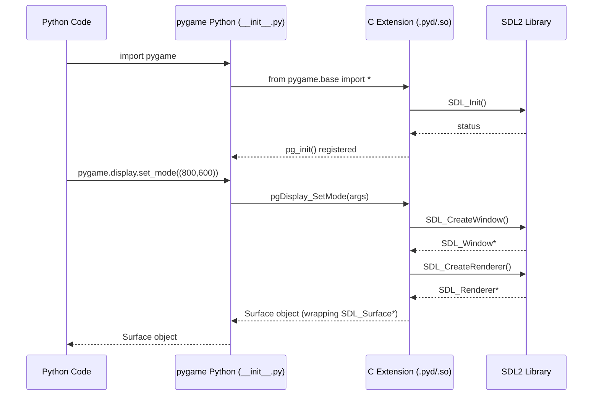

**Key boundary mechanisms:**

- **PyArg_ParseTuple / PyArg_ParseTupleAndKeywords** — parse Python args into C types
- **Py_BuildValue** — construct Python objects from C values
- **PyErr_SetString / PyErr_SetFromErrno** — set Python exceptions from C
- **PyObject_*** family — reference counting, type checking
- **Capsule API** — share C pointers between extension modules (the Slot API)

---

## 7. SDL2 Integration Layer

pygame wraps SDL2's C API. Understanding which SDL2 subsystems map to which pygame modules:

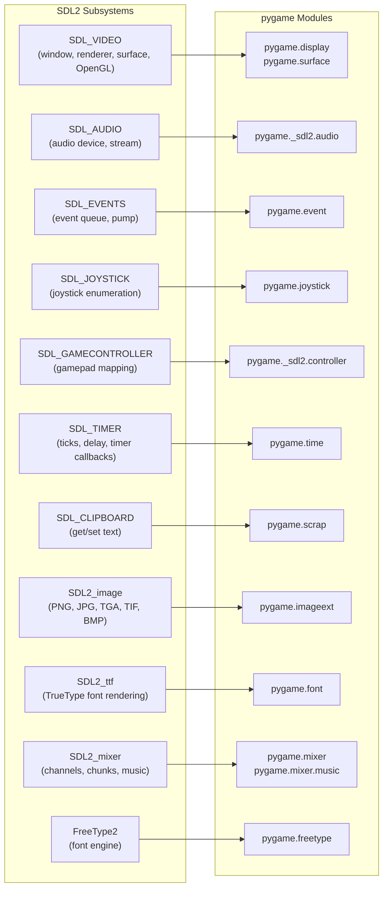

**SDL2 initialization flags used by pygame:**

| Flag | pygame module that triggers it |
|---|---|
| `SDL_INIT_VIDEO` | `pygame.display.init()` |
| `SDL_INIT_AUDIO` | `pygame.mixer.init()` |
| `SDL_INIT_JOYSTICK` | `pygame.joystick.init()` |
| `SDL_INIT_GAMECONTROLLER` | `pygame._sdl2.controller` |
| `SDL_INIT_TIMER` | `pygame.time` (implicitly with video) |
| `SDL_INIT_EVENTS` | always, part of video |

---

## 8. The Slot API

This is pygame's most important internal mechanism. Because C extension modules are separately compiled `.so`/`.pyd` files, they cannot directly `#include` each other's functions at link time. pygame solves this with a **slot table** system using Python's Capsule API.

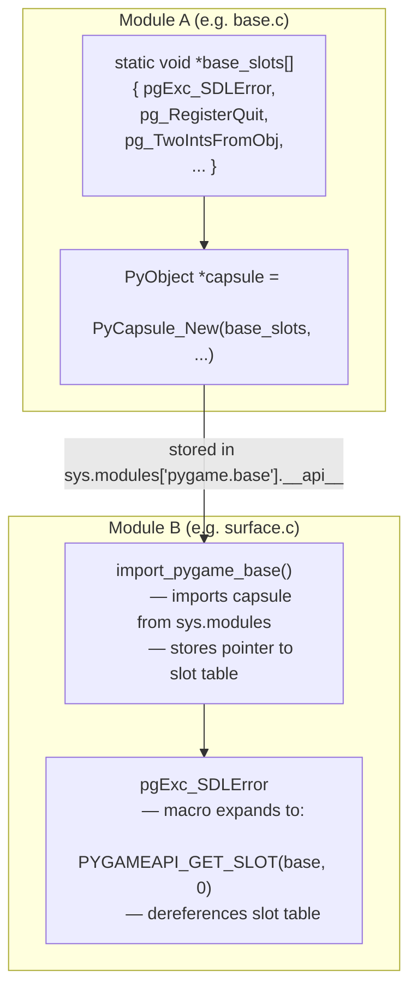

**How it works in practice:**
1. `base.c` populates a static `void *slots[]` array with function pointers and object pointers
2. It stores this array in a Python Capsule object attached to the module as `__api__`
3. Other C modules call `import_pygame_base()` which retrieves the Capsule and stores the slot pointer
4. Macros like `pgExc_SDLError` expand to `(PyObject *)PYGAMEAPI_GET_SLOT(base, 0)` — direct array indexing into the slot table
5. This is essentially manual dynamic linking, using Python as the runtime linker

**Key slot tables (one per module):**
- `base` — error exception, RegisterQuit, buffer protocol functions
- `surface` — Surface type object, pgSurface_New, pgSurface_Lock, pgSurface_Unlock
- `rect` — Rect type object, pgRect_New, pgRect_FromObject
- `color` — Color type object, pgColor_New, pgColor_FromObj
- `event` — Event type object, pgEvent_New, pgEvent_FillUserEvent
- `joystick` — Joystick type, pgJoystick_New
- `font` — Font type, pgFont_New
- `mixer` — Sound type, pgSound_New, pgMixer_AutoInit
- `mask` — Mask type, pgMask_New

---

## 9. Build System

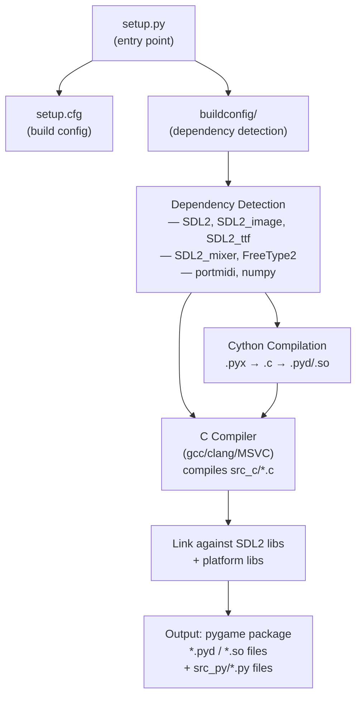

**buildconfig/ contents:**
- `config.py` — main dependency detection script
- `config_unix.py` / `config_win.py` / `config_darwin.py` — platform-specific dep finders
- `Setup` — distutils Setup file listing all C extension modules
- `Setup.in` — template for Setup generation
- `downloads/` — pre-built SDL2 binaries for Windows CI
- `manylinux-build/` — Docker images for Linux wheel builds

**Each C extension is defined as a `setuptools.Extension` with:**
- Source files (`.c`)
- Include directories
- Library names (e.g. `SDL2`, `SDL2_mixer`)
- Preprocessor defines

---

## 10. The Game Loop Flow

The canonical pygame game loop and what happens at each step:

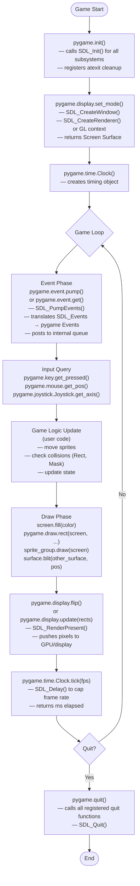

---

## 11. Surface System

The `Surface` object is pygame's central data type. Almost everything operates on or produces Surfaces.

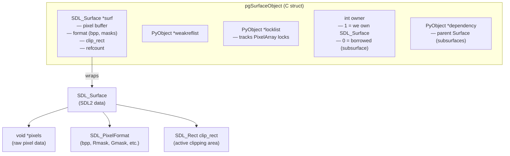

**Surface creation paths:**

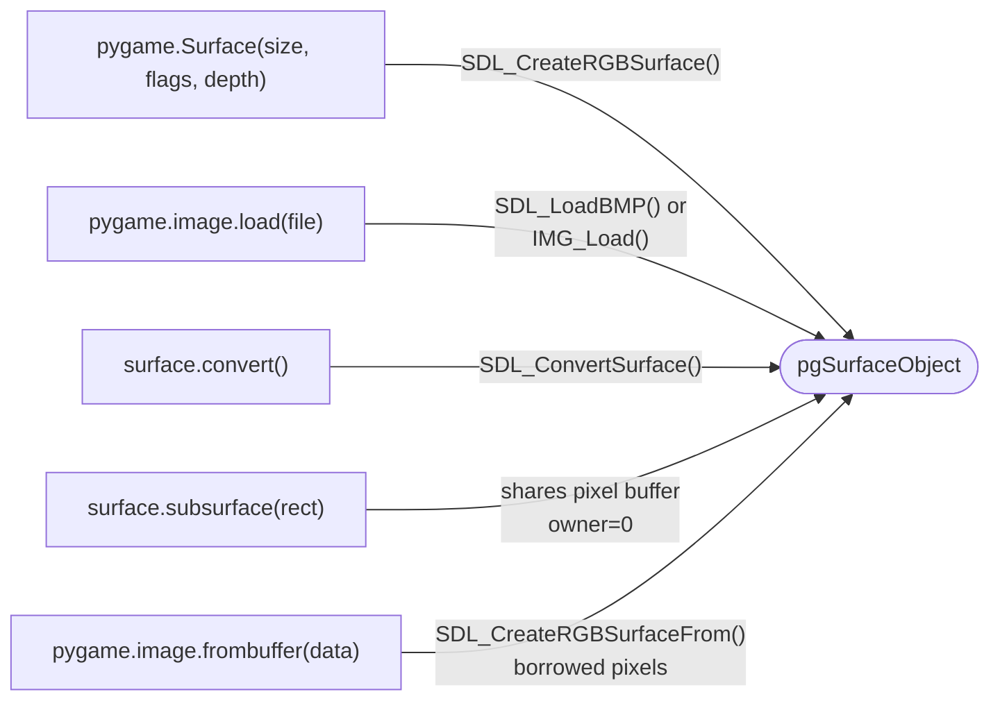

**Blit pipeline:**

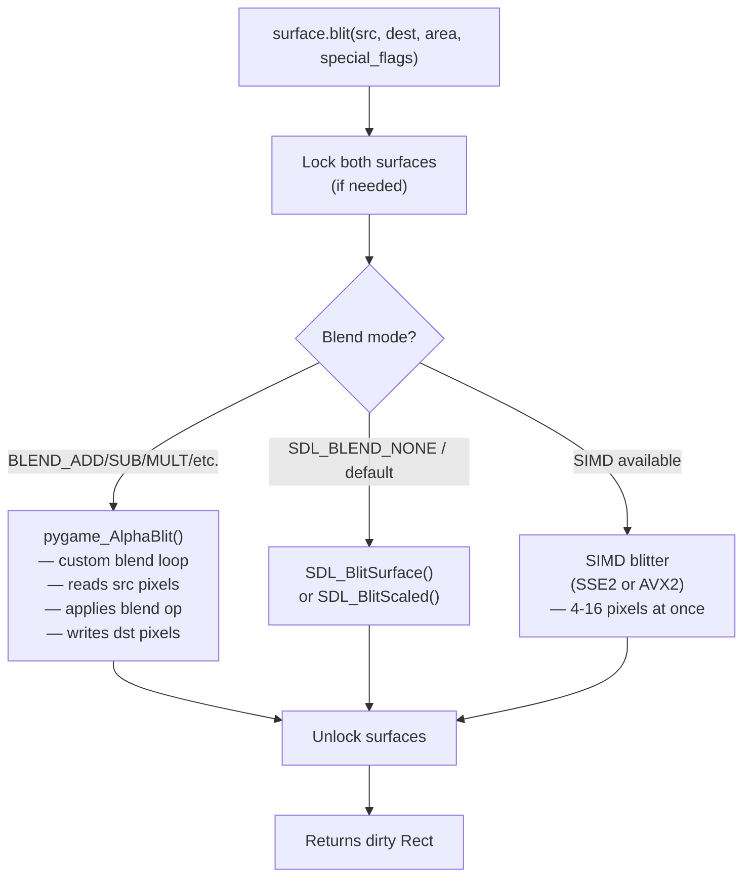

**Pixel formats supported:**
- 8-bit palettized
- 16-bit (RGB565, BGR565, RGBA5551, etc.)
- 24-bit (RGB888, BGR888)
- 32-bit (RGBA8888, BGRA8888, ARGB8888, ABGR8888)

---

## 12. Event System

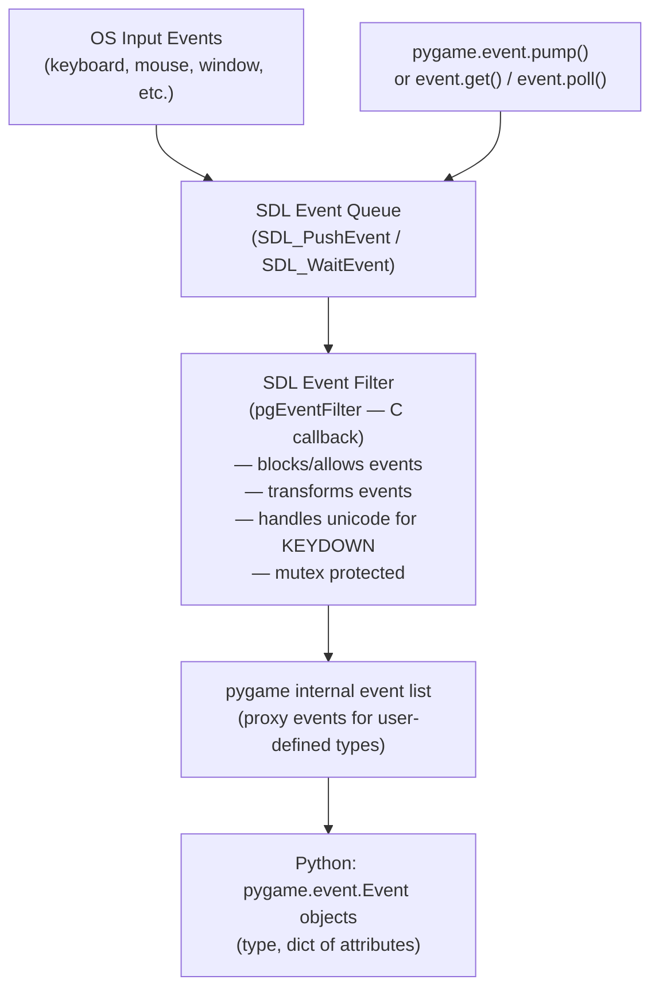

**Event types:**

| Category | SDL Events | pygame constant |
|---|---|---|
| Keyboard | SDL_KEYDOWN, SDL_KEYUP | KEYDOWN, KEYUP |
| Mouse | SDL_MOUSEMOTION, SDL_MOUSEBUTTONDOWN/UP, SDL_MOUSEWHEEL | MOUSEMOTION, MOUSEBUTTONDOWN/UP, MOUSEWHEEL |
| Joystick | SDL_JOYAXISMOTION, SDL_JOYBUTTONDOWN/UP, SDL_JOYHATMOTION | JOYAXISMOTION, JOYBUTTONDOWN/UP, JOYHATMOTION |
| Window | SDL_WINDOWEVENT | WINDOWEVENT, VIDEORESIZE, VIDEOEXPOSE, ACTIVEEVENT |
| Quit | SDL_QUIT | QUIT |
| User | SDL_USEREVENT | USEREVENT |
| Custom | SDL_RegisterEvents | pygame.event.custom_type() |
| Timer | SDL_TimerEvent | pygame.USEREVENT (with timer id) |

**Custom events:**
- `pygame.event.custom_type()` allocates from `PGE_USEREVENT + 1` upward
- Maximum ~32,000 custom types (SDL2 limit)
- User events carry a Python dict `{"attr": value}` serialized into SDL event's `data1`/`data2` via proxy objects

---

## 13. Display System

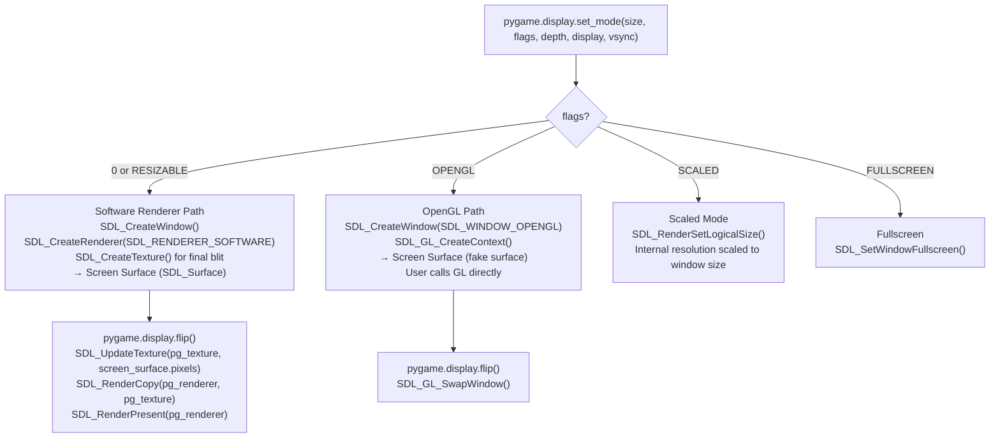

**Display state (internal `_DisplayState` struct):**
- `title` — window title string
- `icon` — window icon Surface
- `gamma_ramp` — 256-entry gamma correction table
- `gl_context` — SDL_GLContext (OpenGL mode only)
- `using_gl` — flag: OpenGL mode active
- `scaled_gl` — flag: scaled + GL mode
- `auto_resize` — flag: auto-handle window resize events
- `pg_renderer` — SDL_Renderer (software/scaled modes)
- `pg_texture` — SDL_Texture (final output texture)

---

## 14. Audio System

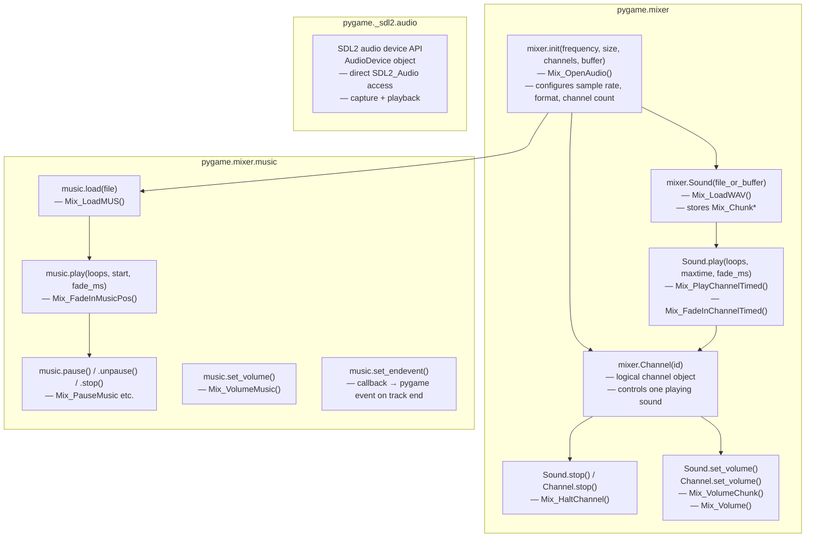

**Supported audio formats:**
- WAV (uncompressed, ADPCM)
- OGG Vorbis
- MP3 (via SDL2_mixer's built-in decoder)
- FLAC
- MOD/XM/IT (tracker music via libmodplug)
- MIDI (via timidity — platform dependent)

---

## 15. Input Systems

### Keyboard (`pygame.key`)

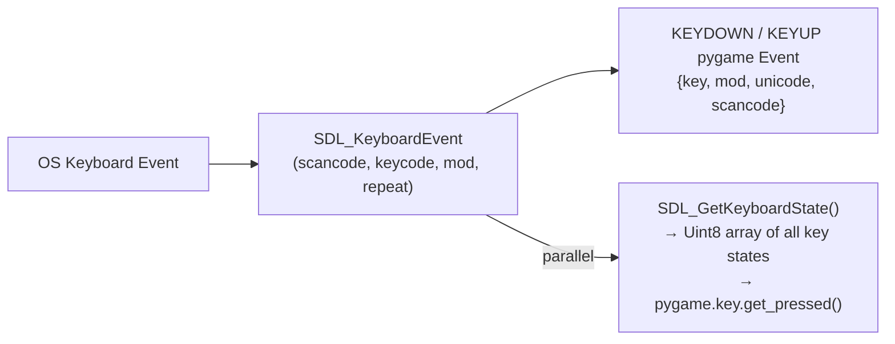

- `pygame.key.get_pressed()` → `SDL_GetKeyboardState()` — 512-element array, indexed by `pygame.K_*`
- `pygame.key.get_mods()` → `SDL_GetModState()` — bitmask of active modifier keys
- `pygame.key.set_repeat(delay, interval)` → `SDL_SetTextInputRect()` + manual repeat logic
- Key constants: `K_a` through `K_z`, `K_RETURN`, `K_ESCAPE`, `K_F1`–`K_F12`, etc.
- Scancode constants: `KSCAN_*` — physical key position, layout-independent

### Mouse (`pygame.mouse`)

- `pygame.mouse.get_pos()` → `SDL_GetMouseState()`
- `pygame.mouse.get_pressed()` → button bitmask from `SDL_GetMouseState()`
- `pygame.mouse.set_pos()` → `SDL_WarpMouseInWindow()`
- `pygame.mouse.set_visible()` → `SDL_ShowCursor()`
- `pygame.mouse.set_relative_mode()` → `SDL_SetRelativeMouseMode()` (raw delta mode)
- `pygame.Cursor` → custom cursor via `SDL_CreateColorCursor()` or `SDL_CreateSystemCursor()`

### Joystick (`pygame.joystick`)

- `pygame.joystick.get_count()` → `SDL_NumJoysticks()`
- `Joystick(id).init()` → `SDL_JoystickOpen()`
- Axes, buttons, hats, balls all mapped through SDL joystick API
- **Instance ID vs Device Index**: SDL2 uses instance IDs (persistent) vs device indexes (enumeration order). pygame maintains a `joy_instance_map` for backward compat.

### Controller (`pygame._sdl2.controller`)

- SDL2's gamepad API with standard Xbox-style layout mapping
- `Controller.get_axis()`, `.get_button()` with named constants (`AXIS_LEFTX`, `BUTTON_A`, etc.)
- Rumble/haptic: `Controller.rumble(low, high, duration)`

---

## 16. Font Systems

pygame has **two** font systems:

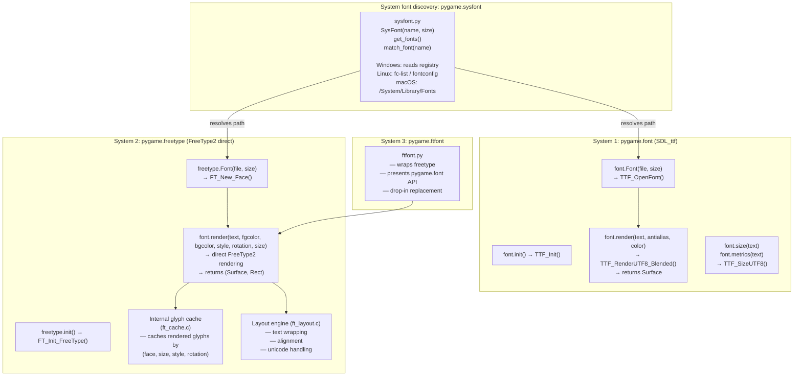

**When to use which:**
- `pygame.font` — simpler API, SDL_ttf, slightly faster for basic use
- `pygame.freetype` — full Unicode, rotation, styling, better quality, recommended
- `pygame.ftfont` — when you want freetype but with font-compatible API (set `PYGAME_FREETYPE=1`)

---

## 17. Drawing Subsystem

All drawing operates directly on Surface pixel buffers.

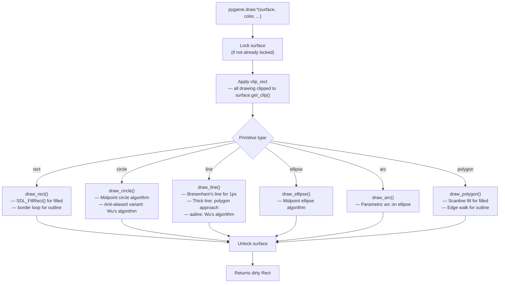

**`pygame.gfxdraw`** (bundled SDL_gfx):
- Anti-aliased primitives: `aacircle`, `aaline`, `aaellipse`
- Bezier curves: `bezier`
- Filled primitives with alpha: `filled_circle`, `filled_ellipse`, `filled_polygon`
- Pixel-level: `pixel`, `hline`, `vline`

---

## 18. Math Module

`pygame.math` provides `Vector2`, `Vector3`, `Vector4` — full-featured mathematical vector types.

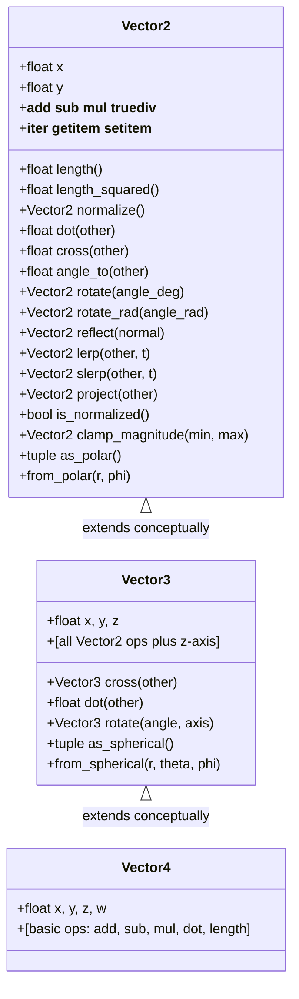

- All vectors support `epsilon` comparison (configurable float tolerance)
- Vectors are iterable, subscriptable, pickleable
- Swizzle access: `v.yx`, `v.xyz`, `v.xxyz` etc.
- C-implemented for performance

---

## 19. Pixel Systems

Three overlapping systems for raw pixel access:

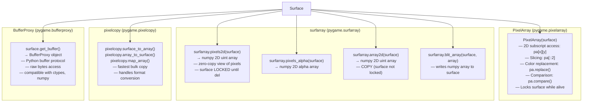

---

## 20. Platform Abstraction

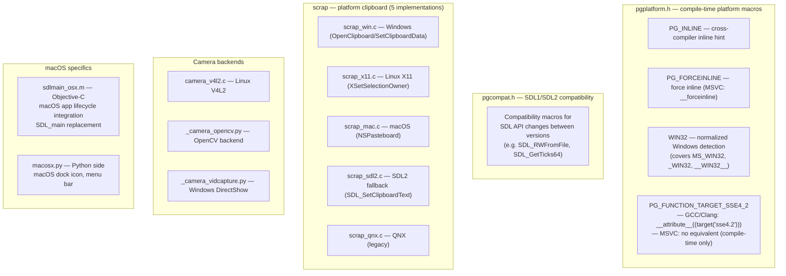

**Platform-specific `#ifdef` blocks found in the codebase:**
- `MS_WIN32` — Windows-specific SDL registration, DLL loading
- `macintosh` — legacy classic Mac OS remnants (mostly dead code)
- `__linux__` — V4L2 camera, X11 clipboard
- `SDL_BYTEORDER` — endianness, used extensively in pixel format handling
- `__GNUC__` / `_MSC_VER` / `__clang__` — compiler detection in pgplatform.h

---

## 21. SIMD Acceleration

pygame implements CPU-accelerated pixel operations using SIMD intrinsics:

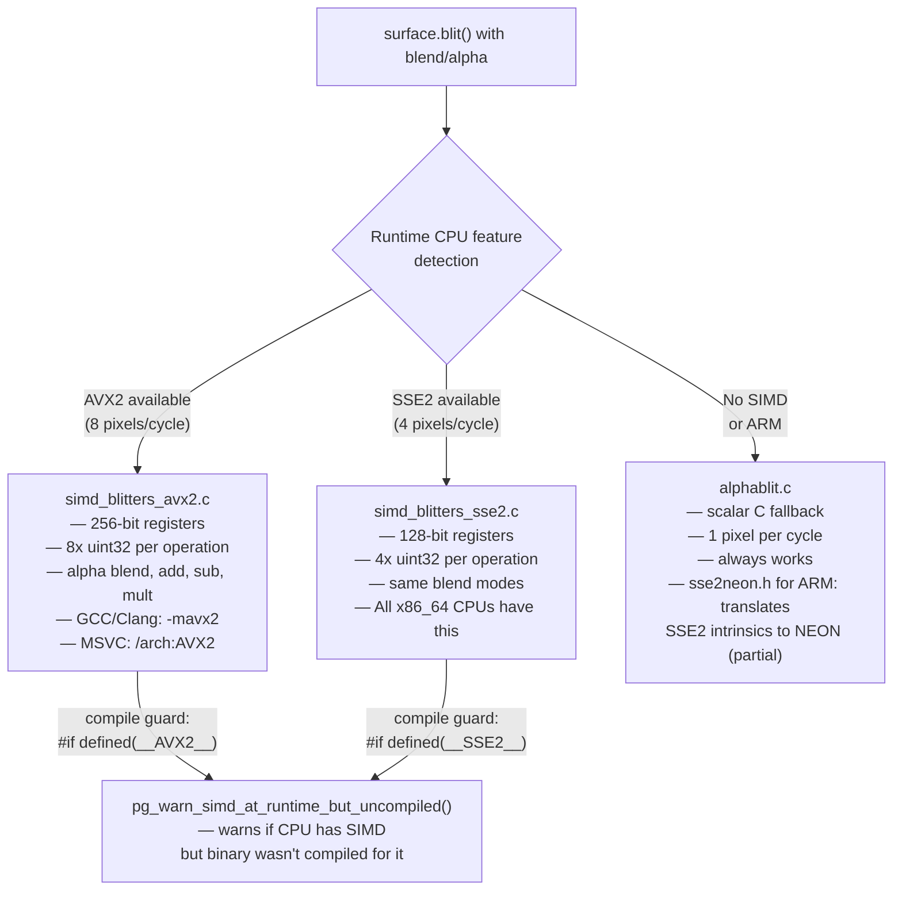

**Files:**
- `simd_blitters.h` — shared declarations
- `simd_blitters_sse2.c` — SSE2 implementations
- `simd_blitters_avx2.c` — AVX2 implementations
- `alphablit.c` — scalar fallback + blend loop implementations
- `sse2neon.h` — SSE2 → ARM NEON translation header (for ARM cross-compilation)
- `scale_mmx.c` / `scale_mmx32.c` / `scale_mmx64.c` / `scale_mmx64_gcc.c` / `scale_mmx64_msvc.c` — MMX scaling (legacy, x86 only)

---

## 22. Python-Side Modules

These live in `src_py/` and are pure Python — no compilation needed.

### `sprite.py` — Sprite System

```mermaid
classDiagram
    class Sprite {
        +image: Surface
        +rect: Rect
        +add(*groups)
        +remove(*groups)
        +kill()
        +alive() bool
        +groups() list
        +update(*args)
    }

    class Group {
        +add(*sprites)
        +remove(*sprites)
        +has(*sprites) bool
        +update(*args)
        +draw(surface)
        +clear(surface, background)
        +empty()
        +sprites() list
        +copy()
    }

    class RenderUpdates {
        +draw(surface) → list[Rect]
    }

    class OrderedUpdates {
        "preserves draw order"
    }

    class LayeredUpdates {
        +get_layer_of(sprite)
        +change_layer(sprite, layer)
        +layers() list
        +get_sprites_at(pos)
    }

    class GroupSingle {
        "holds exactly one sprite"
    }

    Sprite "many" -- "many" Group : member of
    Group <|-- RenderUpdates
    Group <|-- OrderedUpdates
    RenderUpdates <|-- LayeredUpdates
    Group <|-- GroupSingle
```

**Collision functions:**
- `spritecollide(sprite, group, dokill)` — Rect-based
- `groupcollide(group1, group2, dokill1, dokill2)` — Rect-based, two groups
- `spritecollideany(sprite, group)` — early exit on first hit
- `collide_rect_ratio(ratio)` — factory for scaled rect collision
- `collide_circle(s1, s2)` — circle collision using sprite radius
- `collide_mask(s1, s2)` — pixel-perfect via Mask

### `surfarray.py` — numpy Bridge

Thin wrapper around `pygame.pixelcopy` that presents numpy arrays. Requires numpy to be installed. All functions either create zero-copy views (locking the surface) or allocate copies.

### `camera.py` — Camera Abstraction

Selects backend based on platform:
- Linux: `_camera_opencv.py` (OpenCV) or `camera_v4l2.c` (V4L2 native)
- Windows: `_camera_vidcapture.py` (DirectShow via vidcapture)
- macOS: OpenCV backend

### `sysfont.py` — System Font Discovery

Platform-specific font search:
- **Windows**: Queries `HKLM\SOFTWARE\Microsoft\Windows NT\CurrentVersion\Fonts` registry key
- **Linux**: Runs `fc-list`, parses fontconfig output, falls back to scanning `/usr/share/fonts/`
- **macOS**: Scans `/System/Library/Fonts/`, `~/Library/Fonts/`, `/Library/Fonts/`

Normalizes font family names (strips spaces, lowercases) for cross-platform `SysFont()` calls.

---

## 23. SDL2 Cython Wrappers

`pygame._sdl2` exposes SDL2's newer APIs that weren't in pygame's original SDL1.2 era design:

```mermaid
graph TD
    subgraph "_sdl2.video (video.pyx)"
        WINDOW["Window\n— SDL_Window wrapper\n— title, size, position, fullscreen\n— grab, resizable, always_on_top\n— from_display_module()"]
        RENDERER["Renderer\n— SDL_Renderer wrapper\n— Hardware-accelerated 2D\n— draw_color, blend_mode\n— clear(), present()\n— draw_line(), draw_rect(), fill_rect()\n— blit(texture)"]
        TEXTURE["Texture\n— SDL_Texture wrapper\n— from_surface()\n— width, height, alpha, blend_mode\n— draw(srcrect, dstrect, angle, origin, flipX, flipY)"]
        IMAGE["Image\n— High-level texture wrapper\n— angle, origin, flip, color, alpha"]
    end

    subgraph "_sdl2.audio (audio.pyx)"
        AUDIODEVICE["AudioDevice\n— SDL_AudioDevice wrapper\n— capture + playback\n— pause(), play()"]
        AUDIOBUFFER["AudioBuffer\n— raw audio data wrapper"]
        SOUNDSTREAM["SoundStream\n— streaming audio output"]
    end

    subgraph "_sdl2.controller (controller.pyx)"
        CONTROLLER["Controller\n— SDL_GameController wrapper\n— get_axis(), get_button()\n— rumble()\n— name, attached, id"]
    end

    subgraph "_sdl2.mixer (mixer.pyx)"
        MIXER_CHANNEL["Channel\n— SDL2 mixer channel"]
        MIXER_SOUND["Sound\n— SDL2 chunk"]
    end

    WINDOW --> RENDERER
    RENDERER --> TEXTURE
    TEXTURE --> IMAGE
```

**Key difference from classic pygame.display:**
- `pygame.display.set_mode()` → SDL2 renderer + texture in software emulation mode
- `pygame._sdl2.video.Renderer` → *direct* hardware-accelerated SDL2 renderer, no Surface emulation
- The SDL2 video API is faster for texture-heavy games but not pixel-level mutable like Surface

---

## 24. Memory Model

```mermaid
graph TD
    subgraph "Python heap (CPython)"
        PY_OBJS["Python objects\n(int, str, list, dict, etc.)"]
        PG_OBJS["pygame Python objects\n(Surface, Rect, Color, Event, etc.)\n— PyObject header\n— C struct payload"]
    end

    subgraph "SDL heap (malloc)"
        SDL_SURF["SDL_Surface\n— pixel buffer (SDL_malloc)\n— format struct"]
        SDL_WINDOW["SDL_Window"]
        SDL_RENDERER["SDL_Renderer"]
        SDL_TEXTURE["SDL_Texture"]
        MIX_CHUNK["Mix_Chunk\n— audio buffer"]
        TTF_FONT["TTF_Font"]
    end

    PG_OBJS -->|"C struct holds pointer to"| SDL_SURF
    PG_OBJS -->|"C struct holds pointer to"| SDL_WINDOW
    PG_OBJS -->|"C struct holds pointer to"| SDL_RENDERER
    PG_OBJS -->|"C struct holds pointer to"| MIX_CHUNK
    PG_OBJS -->|"C struct holds pointer to"| TTF_FONT

    subgraph "Ownership rules"
        OWN1["Surface.owner=1 → frees SDL_Surface on GC"]
        OWN2["Surface.owner=0 → borrowed (subsurface)\nparent Surface kept alive by dependency ref"]
        OWN3["Most SDL objects: freed in tp_dealloc\n(PyObject destructor)"]
    end
```

**Reference counting patterns:**
- pygame objects use Python's normal refcount GC
- SDL objects are freed in `tp_dealloc` when Python object GC'd
- Subsurfaces hold a Python reference to parent → parent not freed while subsurface alive
- PixelArray locks the surface (increments lock count) until PixelArray deleted
- `pg_quit_functions` list holds Python callables called on `pygame.quit()` — ensures cleanup order

---

## 25. Thread Model

pygame is **mostly not thread-safe**. Design assumptions:

```mermaid
graph TD
    MAIN["Main Thread\n— runs game loop\n— calls pygame.event.pump()\n— calls pygame.display.flip()\n— ALL display/event ops"]

    AUDIO["Audio Thread (SDL2 internal)\n— SDL_mixer callback thread\n— calls Mix_Chunk data\n— DO NOT touch pygame objects here"]

    USER["Optional Worker Thread\n— can load images in background\n— can compute game logic\n— CANNOT blit to surfaces\n— CANNOT call event functions\n— use pygame.fastevent for cross-thread events"]

    MUTEX["Event Filter Mutex\n(SDL_mutex, immortalized)\n— protects event filter callback\n— held during filter modification"]

    MAIN -->|"exclusive access to"| DISPLAY["Display system"]
    MAIN -->|"exclusive access to"| EVENTSYS["Event system"]
    MAIN -->|"exclusive access to"| SURFACES["Shared Surfaces"]
    AUDIO -->|"read-only"| CHUNKS["Mix_Chunk buffers"]
    USER -->|"safe: cross-thread event posting"| FASTEVENT["pygame.fastevent\n— uses SDL_PushEvent()\n— SDL2 guarantees this is thread-safe"]
    MUTEX -->|"protects"| EVENTSYS
```

**Thread safety summary:**
- Safe from any thread: `pygame.fastevent.post()`, `pygame.time.get_ticks()`
- Unsafe from non-main thread: everything else
- SDL2's audio callback runs on its own thread — never call pygame functions from Mix callbacks

---

## 26. Init / Quit Lifecycle

```mermaid
sequenceDiagram
    participant USER as User Code
    participant PG as pygame.__init__
    participant BASE as pygame.base (C)
    participant SDL as SDL2
    participant MODULES as All Submodules

    USER->>PG: pygame.init()
    PG->>BASE: pg_init()
    BASE->>SDL: SDL_Init(SDL_INIT_VIDEO | SDL_INIT_AUDIO | ...)
    SDL-->>BASE: 0 (success)
    BASE->>MODULES: call each module's init if auto-init
    BASE-->>PG: (successes, failures) tuple
    PG-->>USER: (successes, failures)

    Note over USER: Game runs...

    USER->>PG: pygame.quit()
    PG->>BASE: pg_atexit_quit()
    BASE->>BASE: iterate pg_quit_functions list
    BASE->>MODULES: call each quit function (mixer.quit, font.quit, etc.)
    BASE->>SDL: SDL_Quit()
    SDL-->>BASE: done
    BASE-->>PG: done
    PG-->>USER: done
```

**`pygame.init()` return value:** `(success_count, fail_count)` — individual module failures don't abort init

**`pg_RegisterQuit(callback)`** — C API for modules to register cleanup callbacks called on `pygame.quit()`

**`MissingModule` pattern** (Python side) — if a C extension fails to import, a `MissingModule` placeholder is installed instead. Accessing any attribute raises `NotImplementedError` with a helpful message. This prevents import failures from crashing games that don't use that module.

---

## 27. Error Handling Patterns

**C layer:**
```c
// SDL errors → Python exceptions
if (!SDL_Init(SDL_INIT_VIDEO)) {
    return PyErr_Format(pgExc_SDLError, "%s", SDL_GetError());
}

// Null checks
SDL_Surface *surf = SDL_CreateRGBSurface(...);
if (!surf) {
    return RAISE(pgExc_SDLError, SDL_GetError());
}

// Type checks
if (!pgSurface_Check(surfobj)) {
    return RAISE(PyExc_TypeError, "argument must be a Surface");
}
```

**Exception types:**
- `pygame.error` (aka `pgExc_SDLError`) — all SDL-level errors
- `ValueError` — invalid Python arguments (wrong size, negative value, etc.)
- `TypeError` — wrong Python type passed
- `NotImplementedError` — feature not compiled in or platform unavailable
- `RuntimeError` — pygame not initialized, or internal state error

**Python layer:**
- `try: import pygame.X` → `except (ImportError, OSError): X = MissingModule("X")`
- No exceptions swallowed silently — all failures produce warnings or exceptions

---

## 28. Test Architecture

```
test/
├── util/               # Test utilities (display mock, random seed helpers)
├── pygame_test/        # Test support package
├── test_*.py           # Per-module test files (unittest.TestCase)
├── run_tests.py        # Test runner (parallel execution)
└── *.py                # Individual test files
```

**Test runner:** `python -m pytest test/` or `python test/run_tests.py`

**Coverage:**

| Test File | Module Covered |
|---|---|
| `surface_test.py` | `pygame.surface` |
| `display_test.py` | `pygame.display` |
| `event_test.py` | `pygame.event` |
| `draw_test.py` | `pygame.draw` |
| `transform_test.py` | `pygame.transform` |
| `rect_test.py` | `pygame.rect` |
| `color_test.py` | `pygame.color` |
| `image_test.py` | `pygame.image` |
| `font_test.py` | `pygame.font` |
| `freetype_test.py` | `pygame.freetype` |
| `mixer_test.py` | `pygame.mixer` |
| `key_test.py` | `pygame.key` |
| `mouse_test.py` | `pygame.mouse` |
| `math_test.py` | `pygame.math` |
| `mask_test.py` | `pygame.mask` |
| `sprite_test.py` | `pygame.sprite` |
| `surfarray_test.py` | `pygame.surfarray` |
| `pixelarray_test.py` | `pygame.pixelarray` |
| `time_test.py` | `pygame.time` |

---

## 29. Viking Edition Extension Points

These are the seams where new systems will be added in future phases:

| Phase | Where it Hooks In | Mechanism |
|---|---|---|
| **3A AI Agent** | New `src_py/ai.py` module + `pygame.event` | Python module + event type registration |
| **3B Neural Network** | `pygame.pixelcopy` / `surfarray` | numpy array pipeline already exists |
| **3D LLM Narrative** | New `src_py/narrative.py` + `pygame.event` | Custom event types, async wrapper |
| **3H WYRD Bridge** | New `src_py/wyrd.py` | Python module, WYRD Protocol IPC |
| **4A OpenGL Scene Graph** | `pygame.display` OPENGL flag + new `src_py/gl.py` | Builds on existing GL context support |
| **4C 3D Math** | Extend `src_c/math.c` | Add Matrix4x4, Quaternion C types |
| **5A OpenXR** | New `src_c/xr.c` + Cython wrapper | New C extension, alongside _sdl2 |
| **6A Module Bus** | New `src_py/bus.py` | Pure Python event bus |
| **6B Plugin System** | New `src_py/plugin.py` | Python importlib-based |
| **7A ECS** | New `src_py/ecs.py` (or WYRD bridge) | Python module, WYRD ECS compatible |
| **7C Shader System** | Extend `pygame.display` + new `src_py/shader.py` | Builds on OpenGL context |
| **7E Networking** | New `src_py/net.py` | Pure Python + optional C extension |

---

*This document is the ground truth for the pygame Viking Edition codebase.  
Update it whenever the architecture changes. Never let it go stale.*
