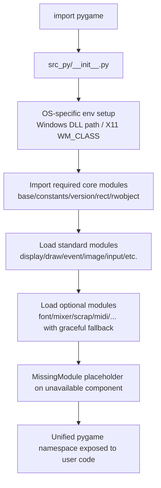
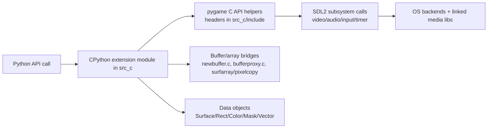

# Pygame Codebase Systems Deep-Dive Data File

_Generated on 2026-04-05 19:56:07 UTC. This document maps repository structure, build/runtime systems, and file inventory._

## 1) Executive Architecture Summary
- **Primary language layers**: Python API surface (`src_py`), C extension core (`src_c`), Cython bridge for selected SDL2 modules (`src_c/cython`).
- **Build orchestration**: `setup.py` + `buildconfig/*` generate a `Setup` config and compile extension modules against SDL2 and optional dependencies.
- **Docs system**: Sphinx sources in `docs/reST` (English) and `docs/es` (Spanish), plus generated C doc headers in `src_c/doc/*.h`.
- **Testing system**: test harness in `test/test_utils`, many module-focused tests in `test/*_test.py`, plus fixtures and fake test suites for harness validation.

## 2) Repository Statistics
- Total tracked files in working tree (excluding `.git` internals): **819**
- Top-level distribution:
  - `.github`: 13
  - `.gitignore`: 1
  - `.pre-commit-config.yaml`: 1
  - `README.rst`: 1
  - `buildconfig`: 160
  - `docs`: 249
  - `examples`: 88
  - `setup.cfg`: 1
  - `setup.py`: 1
  - `src_c`: 154
  - `src_py`: 28
  - `test`: 122
- Extension distribution:
  - `.py`: 202
  - `.rst`: 120
  - `.h`: 76
  - `.c`: 61
  - `.png`: 54
  - `.pyi`: 44
  - `.gif`: 41
  - `.sh`: 37
  - `.sha512`: 29
  - `.txt`: 28
  - `.jpg`: 13
  - `.yml`: 11
  - `.in`: 9
  - `.(no_ext)`: 7
  - `.pxd`: 7
  - `.pyx`: 7
  - `.md`: 6
  - `.wav`: 6
  - `.bmp`: 5
  - `.svg`: 4

## 3) Core System Flows (Mermaid)
### 3.1 Build & Packaging Pipeline
```mermaid
flowchart TD
    A[Developer / CI invokes setup.py] --> B{Setup file exists?}
    B -- No / Auto --> C[buildconfig/config.py chooses platform config]
    C --> D[Generate Setup from Setup.SDL2.in + platform fragments]
    B -- Yes --> E[read_setup_file\(Setup\)]
    D --> E
    E --> F[Configure Extension objects]
    F --> G[Optional Cython generation for src_c/cython]
    G --> H[Compile C extensions against SDL2 + deps]
    H --> I[Collect package data + stubs + examples/docs/test fixtures]
    I --> J[Write src_py/version.py from buildconfig/version.py.in]
    J --> K[setuptools/distutils setup\(\)]
    K --> L[Wheel/sdist/install artifacts]
```

### 3.2 Runtime Module Initialization Pipeline


### 3.3 C Core / SDL Interaction Overview


## 4) Subsystem Deep-Dive
### 4.1 Python API Layer (`src_py`)
- Python source files: **22**
- Responsibilities include namespace assembly, pure-Python helpers (`sprite.py`, `sysfont.py`, `camera.py`), package data loading, and `_sdl2` package facades.
- `src_py/__init__.py` is the import coordinator and resilience layer for optional modules.

### 4.2 C Extension Layer (`src_c`)
- C translation units: **61**
- Major module families: rendering (`surface.c`, `draw.c`, `transform.c`), IO (`image.c`, `mixer.c`, `music.c`), input/events (`event.c`, `key.c`, `mouse.c`, `joystick.c`), geometry/math (`rect.c`, `math.c`, `mask.c`), platform clipboard scrap backends (`scrap_*.c`), and initialization (`base.c`).
- SIMD/optimization paths include MMX/SSE2/AVX2-related files and scalers/blitters.

### 4.3 Cython SDL2 Bridge (`src_c/cython`)
- Cython interface files (`.pyx`/`.pxd`): **14**
- Provides `_sdl2` submodule bindings and sprite/mixer/audio/video/controller wrappers where generated C is checked into repository for build independence.

### 4.4 Build Configuration (`buildconfig`)
- Platform-specific dependency probing and Setup-file generation (`config_unix.py`, `config_win.py`, `config_darwin.py`, etc.).
- CI and manylinux scripts pin and build native third-party dependencies in reproducible containers.
- Type stubs live under `buildconfig/stubs/pygame` and are packaged with runtime.

### 4.5 Documentation System (`docs`)
- Main docs in reStructuredText under `docs/reST`; Spanish translation under `docs/es`.
- Custom Sphinx extensions in `docs/reST/ext` shape output and indexing.
- C API docs are mirrored through generated headers in `src_c/doc` for docstring embedding in extension modules.

### 4.6 Test System (`test`)
- Module-by-module tests validate API behavior across rendering, audio, events, IO, and utility layers.
- `test/test_utils/run_tests.py` and friends provide orchestration features like subprocess isolation, timeouts, randomization, and fake-suite validation.

## 5) Important Entry Points and Control Files
- `README.rst`
- `setup.py`
- `setup.cfg`
- `buildconfig/config.py`
- `src_py/__init__.py`
- `src_c/base.c`
- `test/__main__.py`
- `docs/reST/conf.py`

## 6) Directory Inventory (all files grouped)
### `.` (5 files)
- `.gitignore`
- `.pre-commit-config.yaml`
- `README.rst`
- `setup.cfg`
- `setup.py`

### `.github` (1 files)
- `.github/dependabot.yml`

### `.github/ISSUE_TEMPLATE` (4 files)
- `.github/ISSUE_TEMPLATE/blank_issue.md`
- `.github/ISSUE_TEMPLATE/bug_report.md`
- `.github/ISSUE_TEMPLATE/config.yml`
- `.github/ISSUE_TEMPLATE/enhancement.md`

### `.github/workflows` (8 files)
- `.github/workflows/build-debian-multiarch.yml`
- `.github/workflows/build-macos.yml`
- `.github/workflows/build-manylinux.yml`
- `.github/workflows/build-msys2.yml`
- `.github/workflows/build-ubuntu-sdist.yml`
- `.github/workflows/cppcheck.yml`
- `.github/workflows/format-lint.yml`
- `.github/workflows/stale.yml`

### `buildconfig` (27 files)
- `buildconfig/MANIFEST.in`
- `buildconfig/Makefile`
- `buildconfig/Setup.Android.SDL2.in`
- `buildconfig/Setup.Emscripten.SDL2.in`
- `buildconfig/Setup.SDL2.in`
- `buildconfig/Setup_Darwin.in`
- `buildconfig/Setup_Unix.in`
- `buildconfig/Setup_Win_Camera.in`
- `buildconfig/Setup_Win_Common.in`
- `buildconfig/__init__.py`
- `buildconfig/__main__.py`
- `buildconfig/appveyor.yml`
- `buildconfig/bundle_docs.py`
- `buildconfig/config.py`
- `buildconfig/config_conan.py`
- `buildconfig/config_darwin.py`
- `buildconfig/config_msys2.py`
- `buildconfig/config_unix.py`
- `buildconfig/config_win.py`
- `buildconfig/download_msys2_prebuilt.py`
- `buildconfig/download_win_prebuilt.py`
- `buildconfig/makeref.py`
- `buildconfig/msysio.py`
- `buildconfig/pip_config.ini`
- `buildconfig/setup_win_common.py`
- `buildconfig/version.py.in`
- `buildconfig/vstools.py`

### `buildconfig/ci/appveyor` (3 files)
- `buildconfig/ci/appveyor/README.rst`
- `buildconfig/ci/appveyor/download_pypy.ps1`
- `buildconfig/ci/appveyor/run_with_compiler.cmd`

### `buildconfig/ci/travis` (4 files)
- `buildconfig/ci/travis/.travis_linux_build_wheels.sh`
- `buildconfig/ci/travis/.travis_osx_rename_whl.py`
- `buildconfig/ci/travis/build_test_sdist.sh`
- `buildconfig/ci/travis/cibuildwheel_mac.sh`

### `buildconfig/conanconf` (2 files)
- `buildconfig/conanconf/README.md`
- `buildconfig/conanconf/conanfile.txt`

### `buildconfig/macdependencies` (6 files)
- `buildconfig/macdependencies/README.rst`
- `buildconfig/macdependencies/build_mac_deps.sh`
- `buildconfig/macdependencies/clean_usr_local.sh`
- `buildconfig/macdependencies/install_mac_deps.py`
- `buildconfig/macdependencies/install_mac_deps.sh`
- `buildconfig/macdependencies/macos-arm64.ini`

### `buildconfig/manylinux-build` (3 files)
- `buildconfig/manylinux-build/Makefile`
- `buildconfig/manylinux-build/README.rst`
- `buildconfig/manylinux-build/build-wheels.sh`

### `buildconfig/manylinux-build/docker_base` (6 files)
- `buildconfig/manylinux-build/docker_base/Dockerfile-aarch64`
- `buildconfig/manylinux-build/docker_base/Dockerfile-i686`
- `buildconfig/manylinux-build/docker_base/Dockerfile-ppc64le`
- `buildconfig/manylinux-build/docker_base/Dockerfile-x86_64`
- `buildconfig/manylinux-build/docker_base/RPM-GPG-KEY.dag.txt`
- `buildconfig/manylinux-build/docker_base/strip-lib-so-files.sh`

### `buildconfig/manylinux-build/docker_base/alsa` (2 files)
- `buildconfig/manylinux-build/docker_base/alsa/alsa.sha512`
- `buildconfig/manylinux-build/docker_base/alsa/build-alsa.sh`

### `buildconfig/manylinux-build/docker_base/brotli` (2 files)
- `buildconfig/manylinux-build/docker_base/brotli/brotli.sha512`
- `buildconfig/manylinux-build/docker_base/brotli/build-brotli.sh`

### `buildconfig/manylinux-build/docker_base/bzip2` (2 files)
- `buildconfig/manylinux-build/docker_base/bzip2/build-bzip2.sh`
- `buildconfig/manylinux-build/docker_base/bzip2/bzip2.sha512`

### `buildconfig/manylinux-build/docker_base/cmake` (2 files)
- `buildconfig/manylinux-build/docker_base/cmake/build-cmake.sh`
- `buildconfig/manylinux-build/docker_base/cmake/cmake.sha512`

### `buildconfig/manylinux-build/docker_base/flac` (2 files)
- `buildconfig/manylinux-build/docker_base/flac/build-flac.sh`
- `buildconfig/manylinux-build/docker_base/flac/flac.sha512`

### `buildconfig/manylinux-build/docker_base/fluidsynth` (2 files)
- `buildconfig/manylinux-build/docker_base/fluidsynth/build-fluidsynth.sh`
- `buildconfig/manylinux-build/docker_base/fluidsynth/fluidsynth.sha512`

### `buildconfig/manylinux-build/docker_base/freetype` (2 files)
- `buildconfig/manylinux-build/docker_base/freetype/build-freetype.sh`
- `buildconfig/manylinux-build/docker_base/freetype/freetype.sha512`

### `buildconfig/manylinux-build/docker_base/gettext` (2 files)
- `buildconfig/manylinux-build/docker_base/gettext/build-gettext.sh`
- `buildconfig/manylinux-build/docker_base/gettext/gettext.sha512`

### `buildconfig/manylinux-build/docker_base/glib` (3 files)
- `buildconfig/manylinux-build/docker_base/glib/build-glib.sh`
- `buildconfig/manylinux-build/docker_base/glib/glib.sha512`
- `buildconfig/manylinux-build/docker_base/glib/macos_arm64.cache`

### `buildconfig/manylinux-build/docker_base/libffi` (2 files)
- `buildconfig/manylinux-build/docker_base/libffi/build-libffi.sh`
- `buildconfig/manylinux-build/docker_base/libffi/libffi.sha512`

### `buildconfig/manylinux-build/docker_base/libjpeg` (2 files)
- `buildconfig/manylinux-build/docker_base/libjpeg/build-jpeg.sh`
- `buildconfig/manylinux-build/docker_base/libjpeg/jpeg.sha512`

### `buildconfig/manylinux-build/docker_base/libjpegturbo` (2 files)
- `buildconfig/manylinux-build/docker_base/libjpegturbo/build-jpeg-turbo.sh`
- `buildconfig/manylinux-build/docker_base/libjpegturbo/libjpegturbo.sha512`

### `buildconfig/manylinux-build/docker_base/libmodplug` (2 files)
- `buildconfig/manylinux-build/docker_base/libmodplug/build-libmodplug.sh`
- `buildconfig/manylinux-build/docker_base/libmodplug/libmodplug.sha512`

### `buildconfig/manylinux-build/docker_base/libpng` (2 files)
- `buildconfig/manylinux-build/docker_base/libpng/build-png.sh`
- `buildconfig/manylinux-build/docker_base/libpng/png.sha512`

### `buildconfig/manylinux-build/docker_base/libsamplerate` (2 files)
- `buildconfig/manylinux-build/docker_base/libsamplerate/build-samplerate.sh`
- `buildconfig/manylinux-build/docker_base/libsamplerate/samplerate.sha512`

### `buildconfig/manylinux-build/docker_base/libtiff` (2 files)
- `buildconfig/manylinux-build/docker_base/libtiff/build-tiff.sh`
- `buildconfig/manylinux-build/docker_base/libtiff/tiff.sha512`

### `buildconfig/manylinux-build/docker_base/libwebp` (2 files)
- `buildconfig/manylinux-build/docker_base/libwebp/build-webp.sh`
- `buildconfig/manylinux-build/docker_base/libwebp/webp.sha512`

### `buildconfig/manylinux-build/docker_base/libxml2` (2 files)
- `buildconfig/manylinux-build/docker_base/libxml2/build-libxml2.sh`
- `buildconfig/manylinux-build/docker_base/libxml2/libxml2.sha512`

### `buildconfig/manylinux-build/docker_base/mpg123` (2 files)
- `buildconfig/manylinux-build/docker_base/mpg123/build-mpg123.sh`
- `buildconfig/manylinux-build/docker_base/mpg123/mpg123.sha512`

### `buildconfig/manylinux-build/docker_base/ogg` (2 files)
- `buildconfig/manylinux-build/docker_base/ogg/build-ogg.sh`
- `buildconfig/manylinux-build/docker_base/ogg/ogg.sha512`

### `buildconfig/manylinux-build/docker_base/opus` (2 files)
- `buildconfig/manylinux-build/docker_base/opus/build-opus.sh`
- `buildconfig/manylinux-build/docker_base/opus/opus.sha512`

### `buildconfig/manylinux-build/docker_base/pkg-config` (2 files)
- `buildconfig/manylinux-build/docker_base/pkg-config/build-pkg-config.sh`
- `buildconfig/manylinux-build/docker_base/pkg-config/pkg-config.sha512`

### `buildconfig/manylinux-build/docker_base/portmidi` (2 files)
- `buildconfig/manylinux-build/docker_base/portmidi/build-portmidi.sh`
- `buildconfig/manylinux-build/docker_base/portmidi/portmidi.sha512`

### `buildconfig/manylinux-build/docker_base/pulseaudio` (2 files)
- `buildconfig/manylinux-build/docker_base/pulseaudio/build-pulseaudio.sh`
- `buildconfig/manylinux-build/docker_base/pulseaudio/pulseaudio.sha512`

### `buildconfig/manylinux-build/docker_base/sdl_libs` (2 files)
- `buildconfig/manylinux-build/docker_base/sdl_libs/build-sdl2-libs.sh`
- `buildconfig/manylinux-build/docker_base/sdl_libs/sdl2.sha512`

### `buildconfig/manylinux-build/docker_base/sndfile` (2 files)
- `buildconfig/manylinux-build/docker_base/sndfile/build-sndfile.sh`
- `buildconfig/manylinux-build/docker_base/sndfile/sndfile.sha512`

### `buildconfig/manylinux-build/docker_base/wayland_libs` (2 files)
- `buildconfig/manylinux-build/docker_base/wayland_libs/build-wayland-libs.sh`
- `buildconfig/manylinux-build/docker_base/wayland_libs/wayland.sha512`

### `buildconfig/manylinux-build/docker_base/zlib` (2 files)
- `buildconfig/manylinux-build/docker_base/zlib/build-zlib.sh`
- `buildconfig/manylinux-build/docker_base/zlib/zlib.sha512`

### `buildconfig/manylinux-build/docker_base/zlib-ng` (2 files)
- `buildconfig/manylinux-build/docker_base/zlib-ng/build-zlib-ng.sh`
- `buildconfig/manylinux-build/docker_base/zlib-ng/zlib-ng.sha512`

### `buildconfig/obj/win32` (1 files)
- `buildconfig/obj/win32/scale_mmx.obj`

### `buildconfig/obj/win64` (1 files)
- `buildconfig/obj/win64/scale_mmx.obj`

### `buildconfig/stubs` (2 files)
- `buildconfig/stubs/gen_stubs.py`
- `buildconfig/stubs/mypy_allow_list.txt`

### `buildconfig/stubs/pygame` (40 files)
- `buildconfig/stubs/pygame/.flake8`
- `buildconfig/stubs/pygame/__init__.pyi`
- `buildconfig/stubs/pygame/_common.pyi`
- `buildconfig/stubs/pygame/base.pyi`
- `buildconfig/stubs/pygame/bufferproxy.pyi`
- `buildconfig/stubs/pygame/camera.pyi`
- `buildconfig/stubs/pygame/color.pyi`
- `buildconfig/stubs/pygame/constants.pyi`
- `buildconfig/stubs/pygame/cursors.pyi`
- `buildconfig/stubs/pygame/display.pyi`
- `buildconfig/stubs/pygame/draw.pyi`
- `buildconfig/stubs/pygame/event.pyi`
- `buildconfig/stubs/pygame/fastevent.pyi`
- `buildconfig/stubs/pygame/font.pyi`
- `buildconfig/stubs/pygame/freetype.pyi`
- `buildconfig/stubs/pygame/gfxdraw.pyi`
- `buildconfig/stubs/pygame/image.pyi`
- `buildconfig/stubs/pygame/joystick.pyi`
- `buildconfig/stubs/pygame/key.pyi`
- `buildconfig/stubs/pygame/locals.pyi`
- `buildconfig/stubs/pygame/mask.pyi`
- `buildconfig/stubs/pygame/math.pyi`
- `buildconfig/stubs/pygame/midi.pyi`
- `buildconfig/stubs/pygame/mixer.pyi`
- `buildconfig/stubs/pygame/mixer_music.pyi`
- `buildconfig/stubs/pygame/mouse.pyi`
- `buildconfig/stubs/pygame/pixelarray.pyi`
- `buildconfig/stubs/pygame/pixelcopy.pyi`
- `buildconfig/stubs/pygame/py.typed`
- `buildconfig/stubs/pygame/rect.pyi`
- `buildconfig/stubs/pygame/rwobject.pyi`
- `buildconfig/stubs/pygame/scrap.pyi`
- `buildconfig/stubs/pygame/sndarray.pyi`
- `buildconfig/stubs/pygame/sprite.pyi`
- `buildconfig/stubs/pygame/surface.pyi`
- `buildconfig/stubs/pygame/surfarray.pyi`
- `buildconfig/stubs/pygame/surflock.pyi`
- `buildconfig/stubs/pygame/time.pyi`
- `buildconfig/stubs/pygame/transform.pyi`
- `buildconfig/stubs/pygame/version.pyi`

### `buildconfig/stubs/pygame/_sdl2` (6 files)
- `buildconfig/stubs/pygame/_sdl2/__init__.pyi`
- `buildconfig/stubs/pygame/_sdl2/audio.pyi`
- `buildconfig/stubs/pygame/_sdl2/controller.pyi`
- `buildconfig/stubs/pygame/_sdl2/sdl2.pyi`
- `buildconfig/stubs/pygame/_sdl2/touch.pyi`
- `buildconfig/stubs/pygame/_sdl2/video.pyi`

### `docs` (3 files)
- `docs/LGPL.txt`
- `docs/README.md`
- `docs/__main__.py`

### `docs/es` (5 files)
- `docs/es/README.md`
- `docs/es/color_list.rst`
- `docs/es/conf.py`
- `docs/es/index.rst`
- `docs/es/logos.rst`

### `docs/es/referencias` (6 files)
- `docs/es/referencias/.readme`
- `docs/es/referencias/bufferproxy.rst`
- `docs/es/referencias/camera.rst`
- `docs/es/referencias/cdrom.rst`
- `docs/es/referencias/color.rst`
- `docs/es/referencias/cursors.rst`

### `docs/es/tutorials` (17 files)
- `docs/es/tutorials/CamaraIntro.rst`
- `docs/es/tutorials/ChimpanceLineaporLinea.rst`
- `docs/es/tutorials/CrearJuegos.rst`
- `docs/es/tutorials/GuiaNewbie.rst`
- `docs/es/tutorials/IniciarImportar.rst`
- `docs/es/tutorials/ModosVisualizacion.rst`
- `docs/es/tutorials/MoverImagen.rst`
- `docs/es/tutorials/SpriteIntro.rst`
- `docs/es/tutorials/SurfarrayIntro.rst`
- `docs/es/tutorials/chimpance.py.rst`
- `docs/es/tutorials/chimpshot.gif`
- `docs/es/tutorials/common.txt`
- `docs/es/tutorials/tom_juegos2.rst`
- `docs/es/tutorials/tom_juegos3.rst`
- `docs/es/tutorials/tom_juegos4.rst`
- `docs/es/tutorials/tom_juegos5.rst`
- `docs/es/tutorials/tom_juegos6.rst`

### `docs/licenses` (20 files)
- `docs/licenses/LICENSE.FLAC.txt`
- `docs/licenses/LICENSE.fluidsynth.txt`
- `docs/licenses/LICENSE.freetype.txt`
- `docs/licenses/LICENSE.jpeg.txt`
- `docs/licenses/LICENSE.modplug.txt`
- `docs/licenses/LICENSE.mpg123.txt`
- `docs/licenses/LICENSE.numpy.txt`
- `docs/licenses/LICENSE.ogg-vorbis.txt`
- `docs/licenses/LICENSE.opus.txt`
- `docs/licenses/LICENSE.opusfile.txt`
- `docs/licenses/LICENSE.png.txt`
- `docs/licenses/LICENSE.portmidi.txt`
- `docs/licenses/LICENSE.sdl2.txt`
- `docs/licenses/LICENSE.sdl2_image.txt`
- `docs/licenses/LICENSE.sdl2_mixer.txt`
- `docs/licenses/LICENSE.sdl_gfx.txt`
- `docs/licenses/LICENSE.sse2neon-h.txt`
- `docs/licenses/LICENSE.tiff.txt`
- `docs/licenses/LICENSE.webp.txt`
- `docs/licenses/LICENSE.zlib.txt`

### `docs/reST` (6 files)
- `docs/reST/c_api.rst`
- `docs/reST/common.txt`
- `docs/reST/conf.py`
- `docs/reST/filepaths.rst`
- `docs/reST/index.rst`
- `docs/reST/logos.rst`

### `docs/reST/_static` (12 files)
- `docs/reST/_static/legacy_logos.zip`
- `docs/reST/_static/pygame.ico`
- `docs/reST/_static/pygame_lofi.png`
- `docs/reST/_static/pygame_lofi.svg`
- `docs/reST/_static/pygame_logo.png`
- `docs/reST/_static/pygame_logo.svg`
- `docs/reST/_static/pygame_powered.png`
- `docs/reST/_static/pygame_powered.svg`
- `docs/reST/_static/pygame_powered_lowres.png`
- `docs/reST/_static/pygame_tiny.png`
- `docs/reST/_static/reset.css`
- `docs/reST/_static/tooltip.css`

### `docs/reST/_templates` (1 files)
- `docs/reST/_templates/header.h`

### `docs/reST/c_api` (13 files)
- `docs/reST/c_api/base.rst`
- `docs/reST/c_api/bufferproxy.rst`
- `docs/reST/c_api/color.rst`
- `docs/reST/c_api/display.rst`
- `docs/reST/c_api/event.rst`
- `docs/reST/c_api/freetype.rst`
- `docs/reST/c_api/mixer.rst`
- `docs/reST/c_api/rect.rst`
- `docs/reST/c_api/rwobject.rst`
- `docs/reST/c_api/slots.rst`
- `docs/reST/c_api/surface.rst`
- `docs/reST/c_api/surflock.rst`
- `docs/reST/c_api/version.rst`

### `docs/reST/ext` (6 files)
- `docs/reST/ext/boilerplate.py`
- `docs/reST/ext/customversion.py`
- `docs/reST/ext/edit_on_github.py`
- `docs/reST/ext/headers.py`
- `docs/reST/ext/indexer.py`
- `docs/reST/ext/utils.py`

### `docs/reST/ref` (41 files)
- `docs/reST/ref/bufferproxy.rst`
- `docs/reST/ref/camera.rst`
- `docs/reST/ref/cdrom.rst`
- `docs/reST/ref/color.rst`
- `docs/reST/ref/color_list.rst`
- `docs/reST/ref/common.txt`
- `docs/reST/ref/cursors.rst`
- `docs/reST/ref/display.rst`
- `docs/reST/ref/draw.rst`
- `docs/reST/ref/event.rst`
- `docs/reST/ref/examples.rst`
- `docs/reST/ref/fastevent.rst`
- `docs/reST/ref/font.rst`
- `docs/reST/ref/freetype.rst`
- `docs/reST/ref/gfxdraw.rst`
- `docs/reST/ref/image.rst`
- `docs/reST/ref/joystick.rst`
- `docs/reST/ref/key.rst`
- `docs/reST/ref/locals.rst`
- `docs/reST/ref/mask.rst`
- `docs/reST/ref/math.rst`
- `docs/reST/ref/midi.rst`
- `docs/reST/ref/mixer.rst`
- `docs/reST/ref/mouse.rst`
- `docs/reST/ref/music.rst`
- `docs/reST/ref/overlay.rst`
- `docs/reST/ref/pixelarray.rst`
- `docs/reST/ref/pixelcopy.rst`
- `docs/reST/ref/pygame.rst`
- `docs/reST/ref/rect.rst`
- `docs/reST/ref/scrap.rst`
- `docs/reST/ref/sdl2_controller.rst`
- `docs/reST/ref/sdl2_video.rst`
- `docs/reST/ref/sndarray.rst`
- `docs/reST/ref/sprite.rst`
- `docs/reST/ref/surface.rst`
- `docs/reST/ref/surfarray.rst`
- `docs/reST/ref/tests.rst`
- `docs/reST/ref/time.rst`
- `docs/reST/ref/touch.rst`
- `docs/reST/ref/transform.rst`

### `docs/reST/ref/code_examples` (7 files)
- `docs/reST/ref/code_examples/angle_to.png`
- `docs/reST/ref/code_examples/base_script.py`
- `docs/reST/ref/code_examples/base_script_example.py`
- `docs/reST/ref/code_examples/cursors_module_example.py`
- `docs/reST/ref/code_examples/draw_module_example.png`
- `docs/reST/ref/code_examples/draw_module_example.py`
- `docs/reST/ref/code_examples/joystick_calls.png`

### `docs/reST/themes/classic` (3 files)
- `docs/reST/themes/classic/elements.html`
- `docs/reST/themes/classic/page.html`
- `docs/reST/themes/classic/theme.conf`

### `docs/reST/themes/classic/static` (1 files)
- `docs/reST/themes/classic/static/pygame.css_t`

### `docs/reST/tut` (45 files)
- `docs/reST/tut/CameraIntro.rst`
- `docs/reST/tut/ChimpLineByLine.rst`
- `docs/reST/tut/DisplayModes.rst`
- `docs/reST/tut/ImportInit.rst`
- `docs/reST/tut/MakeGames.rst`
- `docs/reST/tut/MoveIt.rst`
- `docs/reST/tut/PygameIntro.rst`
- `docs/reST/tut/SpriteIntro.rst`
- `docs/reST/tut/SurfarrayIntro-rest`
- `docs/reST/tut/SurfarrayIntro.rst`
- `docs/reST/tut/camera_average.jpg`
- `docs/reST/tut/camera_background.jpg`
- `docs/reST/tut/camera_green.jpg`
- `docs/reST/tut/camera_hsv.jpg`
- `docs/reST/tut/camera_mask.jpg`
- `docs/reST/tut/camera_rgb.jpg`
- `docs/reST/tut/camera_thresh.jpg`
- `docs/reST/tut/camera_thresholded.jpg`
- `docs/reST/tut/camera_yuv.jpg`
- `docs/reST/tut/chimp.py.rst`
- `docs/reST/tut/chimpshot.gif`
- `docs/reST/tut/common.txt`
- `docs/reST/tut/intro_ball.gif`
- `docs/reST/tut/intro_blade.jpg`
- `docs/reST/tut/intro_freedom.jpg`
- `docs/reST/tut/newbieguide.rst`
- `docs/reST/tut/surfarray.png`
- `docs/reST/tut/surfarray_allblack.png`
- `docs/reST/tut/surfarray_flipped.png`
- `docs/reST/tut/surfarray_redimg.png`
- `docs/reST/tut/surfarray_rgbarray.png`
- `docs/reST/tut/surfarray_scaledown.png`
- `docs/reST/tut/surfarray_scaleup.png`
- `docs/reST/tut/surfarray_soften.png`
- `docs/reST/tut/surfarray_striped.png`
- `docs/reST/tut/surfarray_xfade.png`
- `docs/reST/tut/tom_basic.png`
- `docs/reST/tut/tom_event-flowchart.png`
- `docs/reST/tut/tom_formulae.png`
- `docs/reST/tut/tom_games2.rst`
- `docs/reST/tut/tom_games3.rst`
- `docs/reST/tut/tom_games4.rst`
- `docs/reST/tut/tom_games5.rst`
- `docs/reST/tut/tom_games6.rst`
- `docs/reST/tut/tom_radians.png`

### `docs/reST/tut/en/Red_or_Black/1.Prolog` (4 files)
- `docs/reST/tut/en/Red_or_Black/1.Prolog/introduction-Battleship.png`
- `docs/reST/tut/en/Red_or_Black/1.Prolog/introduction-PuyoPuyo.png`
- `docs/reST/tut/en/Red_or_Black/1.Prolog/introduction-TPS.png`
- `docs/reST/tut/en/Red_or_Black/1.Prolog/introduction.rst`

### `docs/reST/tut/en/Red_or_Black/2.Print_text` (3 files)
- `docs/reST/tut/en/Red_or_Black/2.Print_text/Bagic-ouput-result-screen.png`
- `docs/reST/tut/en/Red_or_Black/2.Print_text/Basic TEMPLATE and OUTPUT.rst`
- `docs/reST/tut/en/Red_or_Black/2.Print_text/Basic-ouput-sourcecode.png`

### `docs/reST/tut/en/Red_or_Black/3.Move_text` (3 files)
- `docs/reST/tut/en/Red_or_Black/3.Move_text/Bagic-PROCESS-resultscreen.png`
- `docs/reST/tut/en/Red_or_Black/3.Move_text/Bagic-PROCESS-sourcecode.png`
- `docs/reST/tut/en/Red_or_Black/3.Move_text/Basic PROCESS.rst`

### `docs/reST/tut/en/Red_or_Black/4.Control_text` (3 files)
- `docs/reST/tut/en/Red_or_Black/4.Control_text/Bagic-INPUT-resultscreen.png`
- `docs/reST/tut/en/Red_or_Black/4.Control_text/Bagic-INPUT-sourcecode.png`
- `docs/reST/tut/en/Red_or_Black/4.Control_text/Basic INPUT.rst`

### `docs/reST/tut/en/Red_or_Black/5.HP_bar` (7 files)
- `docs/reST/tut/en/Red_or_Black/5.HP_bar/Advanced OUTPUT with Advanced PROCESS.rst`
- `docs/reST/tut/en/Red_or_Black/5.HP_bar/AdvancedOutputProcess1.gif`
- `docs/reST/tut/en/Red_or_Black/5.HP_bar/AdvancedOutputProcess2.gif`
- `docs/reST/tut/en/Red_or_Black/5.HP_bar/AdvancedOutputProcess3.gif`
- `docs/reST/tut/en/Red_or_Black/5.HP_bar/AdvancedOutputProcess4.gif`
- `docs/reST/tut/en/Red_or_Black/5.HP_bar/AdvancedOutputProcess5.gif`
- `docs/reST/tut/en/Red_or_Black/5.HP_bar/AdvancedOutputProcess6.gif`

### `docs/reST/tut/en/Red_or_Black/6.Buttons` (6 files)
- `docs/reST/tut/en/Red_or_Black/6.Buttons/Advanced INPUT with Advanced OUTPUT.rst`
- `docs/reST/tut/en/Red_or_Black/6.Buttons/AdvancedInputOutput1.gif`
- `docs/reST/tut/en/Red_or_Black/6.Buttons/AdvancedInputOutput2.gif`
- `docs/reST/tut/en/Red_or_Black/6.Buttons/AdvancedInputOutput3.gif`
- `docs/reST/tut/en/Red_or_Black/6.Buttons/AdvancedInputOutput4.gif`
- `docs/reST/tut/en/Red_or_Black/6.Buttons/AdvancedInputOutput5.gif`

### `docs/reST/tut/en/Red_or_Black/7.Game_board` (4 files)
- `docs/reST/tut/en/Red_or_Black/7.Game_board/Advanced OUTPUT and plus alpha.rst`
- `docs/reST/tut/en/Red_or_Black/7.Game_board/AdvancedOutputAlpha1.gif`
- `docs/reST/tut/en/Red_or_Black/7.Game_board/AdvancedOutputAlpha2.gif`
- `docs/reST/tut/en/Red_or_Black/7.Game_board/AdvancedOutputAlpha3.gif`

### `docs/reST/tut/en/Red_or_Black/8.Epilog` (1 files)
- `docs/reST/tut/en/Red_or_Black/8.Epilog/Epilog.rst`

### `docs/reST/tut/ko/빨간블록 검은블록` (1 files)
- `docs/reST/tut/ko/빨간블록 검은블록/개요.rst`

### `docs/reST/tut/ko/빨간블록 검은블록/1.프롤로그` (4 files)
- `docs/reST/tut/ko/빨간블록 검은블록/1.프롤로그/introduction-Battleship.png`
- `docs/reST/tut/ko/빨간블록 검은블록/1.프롤로그/introduction-PuyoPuyo.png`
- `docs/reST/tut/ko/빨간블록 검은블록/1.프롤로그/introduction-TPS.png`
- `docs/reST/tut/ko/빨간블록 검은블록/1.프롤로그/소개.rst`

### `docs/reST/tut/ko/빨간블록 검은블록/2.텍스트 출력` (3 files)
- `docs/reST/tut/ko/빨간블록 검은블록/2.텍스트 출력/Bagic-ouput-result-screen.png`
- `docs/reST/tut/ko/빨간블록 검은블록/2.텍스트 출력/Basic-ouput-sourcecode.png`
- `docs/reST/tut/ko/빨간블록 검은블록/2.텍스트 출력/기초 템플릿과 출력.rst`

### `docs/reST/tut/ko/빨간블록 검은블록/3.텍스트 이동` (3 files)
- `docs/reST/tut/ko/빨간블록 검은블록/3.텍스트 이동/Bagic-PROCESS-resultscreen.png`
- `docs/reST/tut/ko/빨간블록 검은블록/3.텍스트 이동/Bagic-PROCESS-sourcecode.png`
- `docs/reST/tut/ko/빨간블록 검은블록/3.텍스트 이동/기초 처리.rst`

### `docs/reST/tut/ko/빨간블록 검은블록/4.텍스트 조종` (3 files)
- `docs/reST/tut/ko/빨간블록 검은블록/4.텍스트 조종/Bagic-INPUT-resultscreen.png`
- `docs/reST/tut/ko/빨간블록 검은블록/4.텍스트 조종/Bagic-INPUT-sourcecode.png`
- `docs/reST/tut/ko/빨간블록 검은블록/4.텍스트 조종/기초 입력.rst`

### `docs/reST/tut/ko/빨간블록 검은블록/5.HP바` (7 files)
- `docs/reST/tut/ko/빨간블록 검은블록/5.HP바/AdvancedOutputProcess1.gif`
- `docs/reST/tut/ko/빨간블록 검은블록/5.HP바/AdvancedOutputProcess2.gif`
- `docs/reST/tut/ko/빨간블록 검은블록/5.HP바/AdvancedOutputProcess3.gif`
- `docs/reST/tut/ko/빨간블록 검은블록/5.HP바/AdvancedOutputProcess4.gif`
- `docs/reST/tut/ko/빨간블록 검은블록/5.HP바/AdvancedOutputProcess5.gif`
- `docs/reST/tut/ko/빨간블록 검은블록/5.HP바/AdvancedOutputProcess6.gif`
- `docs/reST/tut/ko/빨간블록 검은블록/5.HP바/심화 출력 그리고 심화 처리.rst`

### `docs/reST/tut/ko/빨간블록 검은블록/6.버튼들` (6 files)
- `docs/reST/tut/ko/빨간블록 검은블록/6.버튼들/AdvancedInputOutput1.gif`
- `docs/reST/tut/ko/빨간블록 검은블록/6.버튼들/AdvancedInputOutput2.gif`
- `docs/reST/tut/ko/빨간블록 검은블록/6.버튼들/AdvancedInputOutput3.gif`
- `docs/reST/tut/ko/빨간블록 검은블록/6.버튼들/AdvancedInputOutput4.gif`
- `docs/reST/tut/ko/빨간블록 검은블록/6.버튼들/AdvancedInputOutput5.gif`
- `docs/reST/tut/ko/빨간블록 검은블록/6.버튼들/심화 입력 그리고 심화 출력.rst`

### `docs/reST/tut/ko/빨간블록 검은블록/7.게임판` (4 files)
- `docs/reST/tut/ko/빨간블록 검은블록/7.게임판/AdvancedOutputAlpha1.gif`
- `docs/reST/tut/ko/빨간블록 검은블록/7.게임판/AdvancedOutputAlpha2.gif`
- `docs/reST/tut/ko/빨간블록 검은블록/7.게임판/AdvancedOutputAlpha3.gif`
- `docs/reST/tut/ko/빨간블록 검은블록/7.게임판/심화 출력 그리고 조금 더.rst`

### `docs/reST/tut/ko/빨간블록 검은블록/8.에필로그` (1 files)
- `docs/reST/tut/ko/빨간블록 검은블록/8.에필로그/에필로그.rst`

### `examples` (42 files)
- `examples/.editorconfig`
- `examples/README.rst`
- `examples/__init__.py`
- `examples/aacircle.py`
- `examples/aliens.py`
- `examples/arraydemo.py`
- `examples/audiocapture.py`
- `examples/blend_fill.py`
- `examples/blit_blends.py`
- `examples/camera.py`
- `examples/chimp.py`
- `examples/cursors.py`
- `examples/dropevent.py`
- `examples/eventlist.py`
- `examples/font_viewer.py`
- `examples/fonty.py`
- `examples/freetype_misc.py`
- `examples/glcube.py`
- `examples/go_over_there.py`
- `examples/grid.py`
- `examples/headless_no_windows_needed.py`
- `examples/joystick.py`
- `examples/liquid.py`
- `examples/mask.py`
- `examples/midi.py`
- `examples/moveit.py`
- `examples/music_drop_fade.py`
- `examples/pixelarray.py`
- `examples/playmus.py`
- `examples/resizing_new.py`
- `examples/scaletest.py`
- `examples/scrap_clipboard.py`
- `examples/scroll.py`
- `examples/setmodescale.py`
- `examples/sound.py`
- `examples/sound_array_demos.py`
- `examples/sprite_texture.py`
- `examples/stars.py`
- `examples/testsprite.py`
- `examples/textinput.py`
- `examples/vgrade.py`
- `examples/video.py`

### `examples/data` (46 files)
- `examples/data/BGR.png`
- `examples/data/alien1.gif`
- `examples/data/alien1.jpg`
- `examples/data/alien1.png`
- `examples/data/alien2.gif`
- `examples/data/alien2.png`
- `examples/data/alien3.gif`
- `examples/data/alien3.png`
- `examples/data/arraydemo.bmp`
- `examples/data/asprite.bmp`
- `examples/data/background.gif`
- `examples/data/black.ppm`
- `examples/data/blue.gif`
- `examples/data/blue.mpg`
- `examples/data/bomb.gif`
- `examples/data/boom.wav`
- `examples/data/brick.png`
- `examples/data/car_door.wav`
- `examples/data/chimp.png`
- `examples/data/city.png`
- `examples/data/crimson.pnm`
- `examples/data/cursor.png`
- `examples/data/danger.gif`
- `examples/data/explosion1.gif`
- `examples/data/fist.png`
- `examples/data/green.pcx`
- `examples/data/grey.pgm`
- `examples/data/house_lo.mp3`
- `examples/data/house_lo.ogg`
- `examples/data/house_lo.wav`
- `examples/data/laplacian.png`
- `examples/data/liquid.bmp`
- `examples/data/midikeys.png`
- `examples/data/player1.gif`
- `examples/data/punch.wav`
- `examples/data/purple.xpm`
- `examples/data/red.jpg`
- `examples/data/sans.ttf`
- `examples/data/scarlet.webp`
- `examples/data/secosmic_lo.wav`
- `examples/data/shot.gif`
- `examples/data/static.png`
- `examples/data/teal.svg`
- `examples/data/turquoise.tif`
- `examples/data/whiff.wav`
- `examples/data/yellow.tga`

### `src_c` (76 files)
- `src_c/.clang-format`
- `src_c/.editorconfig`
- `src_c/_blit_info.h`
- `src_c/_camera.c`
- `src_c/_camera.h`
- `src_c/_freetype.c`
- `src_c/_pygame.h`
- `src_c/_surface.h`
- `src_c/alphablit.c`
- `src_c/base.c`
- `src_c/bitmask.c`
- `src_c/bufferproxy.c`
- `src_c/camera.h`
- `src_c/camera_v4l2.c`
- `src_c/color.c`
- `src_c/constants.c`
- `src_c/controllercompat.c`
- `src_c/display.c`
- `src_c/draw.c`
- `src_c/event.c`
- `src_c/font.c`
- `src_c/font.h`
- `src_c/freetype.h`
- `src_c/gfxdraw.c`
- `src_c/image.c`
- `src_c/imageext.c`
- `src_c/joystick.c`
- `src_c/key.c`
- `src_c/mask.c`
- `src_c/mask.h`
- `src_c/math.c`
- `src_c/mixer.c`
- `src_c/mixer.h`
- `src_c/mouse.c`
- `src_c/music.c`
- `src_c/newbuffer.c`
- `src_c/palette.h`
- `src_c/pgarrinter.h`
- `src_c/pgbufferproxy.h`
- `src_c/pgcompat.c`
- `src_c/pgcompat.h`
- `src_c/pgopengl.h`
- `src_c/pgplatform.h`
- `src_c/pixelarray.c`
- `src_c/pixelarray_methods.c`
- `src_c/pixelcopy.c`
- `src_c/pygame.h`
- `src_c/rect.c`
- `src_c/rotozoom.c`
- `src_c/rwobject.c`
- `src_c/scale.h`
- `src_c/scale2x.c`
- `src_c/scale_mmx.c`
- `src_c/scale_mmx32.c`
- `src_c/scale_mmx64.c`
- `src_c/scale_mmx64_gcc.c`
- `src_c/scale_mmx64_msvc.c`
- `src_c/scrap.c`
- `src_c/scrap.h`
- `src_c/scrap_mac.c`
- `src_c/scrap_qnx.c`
- `src_c/scrap_sdl2.c`
- `src_c/scrap_win.c`
- `src_c/scrap_x11.c`
- `src_c/sdlmain_osx.m`
- `src_c/simd_blitters.h`
- `src_c/simd_blitters_avx2.c`
- `src_c/simd_blitters_sse2.c`
- `src_c/static.c`
- `src_c/surface.c`
- `src_c/surface.h`
- `src_c/surface_fill.c`
- `src_c/surflock.c`
- `src_c/time.c`
- `src_c/transform.c`
- `src_c/void.c`

### `src_c/SDL_gfx` (3 files)
- `src_c/SDL_gfx/SDL_gfxPrimitives.c`
- `src_c/SDL_gfx/SDL_gfxPrimitives.h`
- `src_c/SDL_gfx/SDL_gfxPrimitives_font.h`

### `src_c/_sdl2` (1 files)
- `src_c/_sdl2/touch.c`

### `src_c/cython/pygame` (3 files)
- `src_c/cython/pygame/__init__.pxd`
- `src_c/cython/pygame/_sprite.pyx`
- `src_c/cython/pygame/pypm.pyx`

### `src_c/cython/pygame/_sdl2` (11 files)
- `src_c/cython/pygame/_sdl2/__init__.pxd`
- `src_c/cython/pygame/_sdl2/audio.pxd`
- `src_c/cython/pygame/_sdl2/audio.pyx`
- `src_c/cython/pygame/_sdl2/controller.pxd`
- `src_c/cython/pygame/_sdl2/controller.pyx`
- `src_c/cython/pygame/_sdl2/mixer.pxd`
- `src_c/cython/pygame/_sdl2/mixer.pyx`
- `src_c/cython/pygame/_sdl2/sdl2.pxd`
- `src_c/cython/pygame/_sdl2/sdl2.pyx`
- `src_c/cython/pygame/_sdl2/video.pxd`
- `src_c/cython/pygame/_sdl2/video.pyx`

### `src_c/doc` (40 files)
- `src_c/doc/README.rst`
- `src_c/doc/bufferproxy_doc.h`
- `src_c/doc/camera_doc.h`
- `src_c/doc/cdrom_doc.h`
- `src_c/doc/color_doc.h`
- `src_c/doc/cursors_doc.h`
- `src_c/doc/display_doc.h`
- `src_c/doc/draw_doc.h`
- `src_c/doc/event_doc.h`
- `src_c/doc/examples_doc.h`
- `src_c/doc/fastevent_doc.h`
- `src_c/doc/font_doc.h`
- `src_c/doc/freetype_doc.h`
- `src_c/doc/gfxdraw_doc.h`
- `src_c/doc/image_doc.h`
- `src_c/doc/joystick_doc.h`
- `src_c/doc/key_doc.h`
- `src_c/doc/locals_doc.h`
- `src_c/doc/mask_doc.h`
- `src_c/doc/math_doc.h`
- `src_c/doc/midi_doc.h`
- `src_c/doc/mixer_doc.h`
- `src_c/doc/mouse_doc.h`
- `src_c/doc/music_doc.h`
- `src_c/doc/overlay_doc.h`
- `src_c/doc/pixelarray_doc.h`
- `src_c/doc/pixelcopy_doc.h`
- `src_c/doc/pygame_doc.h`
- `src_c/doc/rect_doc.h`
- `src_c/doc/scrap_doc.h`
- `src_c/doc/sdl2_controller_doc.h`
- `src_c/doc/sdl2_video_doc.h`
- `src_c/doc/sndarray_doc.h`
- `src_c/doc/sprite_doc.h`
- `src_c/doc/surface_doc.h`
- `src_c/doc/surfarray_doc.h`
- `src_c/doc/tests_doc.h`
- `src_c/doc/time_doc.h`
- `src_c/doc/touch_doc.h`
- `src_c/doc/transform_doc.h`

### `src_c/freetype` (8 files)
- `src_c/freetype/ft_cache.c`
- `src_c/freetype/ft_layout.c`
- `src_c/freetype/ft_pixel.h`
- `src_c/freetype/ft_render.c`
- `src_c/freetype/ft_render_cb.c`
- `src_c/freetype/ft_unicode.c`
- `src_c/freetype/ft_wrap.c`
- `src_c/freetype/ft_wrap.h`

### `src_c/include` (12 files)
- `src_c/include/_pygame.h`
- `src_c/include/bitmask.h`
- `src_c/include/pgcompat.h`
- `src_c/include/pgimport.h`
- `src_c/include/pgplatform.h`
- `src_c/include/pygame.h`
- `src_c/include/pygame_bufferproxy.h`
- `src_c/include/pygame_font.h`
- `src_c/include/pygame_freetype.h`
- `src_c/include/pygame_mask.h`
- `src_c/include/pygame_mixer.h`
- `src_c/include/sse2neon.h`

### `src_py` (24 files)
- `src_py/.editorconfig`
- `src_py/__init__.py`
- `src_py/_camera_opencv.py`
- `src_py/_camera_vidcapture.py`
- `src_py/camera.py`
- `src_py/colordict.py`
- `src_py/cursors.py`
- `src_py/draw_py.py`
- `src_py/fastevent.py`
- `src_py/freesansbold.ttf`
- `src_py/freetype.py`
- `src_py/ftfont.py`
- `src_py/locals.py`
- `src_py/macosx.py`
- `src_py/midi.py`
- `src_py/pkgdata.py`
- `src_py/pygame.ico`
- `src_py/pygame_icon.bmp`
- `src_py/pygame_icon.icns`
- `src_py/pygame_icon_mac.bmp`
- `src_py/sndarray.py`
- `src_py/sprite.py`
- `src_py/surfarray.py`
- `src_py/sysfont.py`

### `src_py/__pyinstaller` (2 files)
- `src_py/__pyinstaller/__init__.py`
- `src_py/__pyinstaller/hook-pygame.py`

### `src_py/_sdl2` (1 files)
- `src_py/_sdl2/__init__.py`

### `src_py/threads` (1 files)
- `src_py/threads/__init__.py`

### `test` (58 files)
- `test/.editorconfig`
- `test/README.rst`
- `test/__init__.py`
- `test/__main__.py`
- `test/base_test.py`
- `test/blit_test.py`
- `test/bufferproxy_test.py`
- `test/camera_test.py`
- `test/color_test.py`
- `test/constants_test.py`
- `test/controller_test.py`
- `test/cursors_test.py`
- `test/display_test.py`
- `test/docs_test.py`
- `test/draw_test.py`
- `test/event_test.py`
- `test/font_test.py`
- `test/freetype_tags.py`
- `test/freetype_test.py`
- `test/ftfont_tags.py`
- `test/ftfont_test.py`
- `test/gfxdraw_test.py`
- `test/image__save_gl_surface_test.py`
- `test/image_tags.py`
- `test/image_test.py`
- `test/imageext_tags.py`
- `test/imageext_test.py`
- `test/joystick_test.py`
- `test/key_test.py`
- `test/locals_test.py`
- `test/mask_test.py`
- `test/math_test.py`
- `test/midi_test.py`
- `test/mixer_music_tags.py`
- `test/mixer_music_test.py`
- `test/mixer_tags.py`
- `test/mixer_test.py`
- `test/mouse_test.py`
- `test/pixelarray_test.py`
- `test/pixelcopy_test.py`
- `test/rect_test.py`
- `test/rwobject_test.py`
- `test/scrap_tags.py`
- `test/scrap_test.py`
- `test/sndarray_tags.py`
- `test/sndarray_test.py`
- `test/sprite_test.py`
- `test/surface_test.py`
- `test/surfarray_tags.py`
- `test/surfarray_test.py`
- `test/surflock_test.py`
- `test/sysfont_test.py`
- `test/threads_test.py`
- `test/time_test.py`
- `test/touch_test.py`
- `test/transform_test.py`
- `test/version_test.py`
- `test/video_test.py`

### `test/fixtures/fonts` (10 files)
- `test/fixtures/fonts/A_PyGameMono-8.png`
- `test/fixtures/fonts/PlayfairDisplaySemibold.ttf`
- `test/fixtures/fonts/PyGameMono-18-100dpi.bdf`
- `test/fixtures/fonts/PyGameMono-18-75dpi.bdf`
- `test/fixtures/fonts/PyGameMono-8.bdf`
- `test/fixtures/fonts/PyGameMono.otf`
- `test/fixtures/fonts/PyGameMono.sfd`
- `test/fixtures/fonts/test_fixed.otf`
- `test/fixtures/fonts/test_sans.ttf`
- `test/fixtures/fonts/u13079_PyGameMono-8.png`

### `test/fixtures/xbm_cursors` (2 files)
- `test/fixtures/xbm_cursors/white_sizing.xbm`
- `test/fixtures/xbm_cursors/white_sizing_mask.xbm`

### `test/run_tests__tests` (2 files)
- `test/run_tests__tests/__init__.py`
- `test/run_tests__tests/run_tests__test.py`

### `test/run_tests__tests/all_ok` (8 files)
- `test/run_tests__tests/all_ok/__init__.py`
- `test/run_tests__tests/all_ok/fake_2_test.py`
- `test/run_tests__tests/all_ok/fake_3_test.py`
- `test/run_tests__tests/all_ok/fake_4_test.py`
- `test/run_tests__tests/all_ok/fake_5_test.py`
- `test/run_tests__tests/all_ok/fake_6_test.py`
- `test/run_tests__tests/all_ok/no_assertions__ret_code_of_1__test.py`
- `test/run_tests__tests/all_ok/zero_tests_test.py`

### `test/run_tests__tests/everything` (5 files)
- `test/run_tests__tests/everything/__init__.py`
- `test/run_tests__tests/everything/fake_2_test.py`
- `test/run_tests__tests/everything/incomplete_todo_test.py`
- `test/run_tests__tests/everything/magic_tag_test.py`
- `test/run_tests__tests/everything/sleep_test.py`

### `test/run_tests__tests/exclude` (4 files)
- `test/run_tests__tests/exclude/__init__.py`
- `test/run_tests__tests/exclude/fake_2_test.py`
- `test/run_tests__tests/exclude/invisible_tag_test.py`
- `test/run_tests__tests/exclude/magic_tag_test.py`

### `test/run_tests__tests/failures1` (4 files)
- `test/run_tests__tests/failures1/__init__.py`
- `test/run_tests__tests/failures1/fake_2_test.py`
- `test/run_tests__tests/failures1/fake_3_test.py`
- `test/run_tests__tests/failures1/fake_4_test.py`

### `test/run_tests__tests/incomplete` (3 files)
- `test/run_tests__tests/incomplete/__init__.py`
- `test/run_tests__tests/incomplete/fake_2_test.py`
- `test/run_tests__tests/incomplete/fake_3_test.py`

### `test/run_tests__tests/incomplete_todo` (3 files)
- `test/run_tests__tests/incomplete_todo/__init__.py`
- `test/run_tests__tests/incomplete_todo/fake_2_test.py`
- `test/run_tests__tests/incomplete_todo/fake_3_test.py`

### `test/run_tests__tests/infinite_loop` (3 files)
- `test/run_tests__tests/infinite_loop/__init__.py`
- `test/run_tests__tests/infinite_loop/fake_1_test.py`
- `test/run_tests__tests/infinite_loop/fake_2_test.py`

### `test/run_tests__tests/print_stderr` (4 files)
- `test/run_tests__tests/print_stderr/__init__.py`
- `test/run_tests__tests/print_stderr/fake_2_test.py`
- `test/run_tests__tests/print_stderr/fake_3_test.py`
- `test/run_tests__tests/print_stderr/fake_4_test.py`

### `test/run_tests__tests/print_stdout` (4 files)
- `test/run_tests__tests/print_stdout/__init__.py`
- `test/run_tests__tests/print_stdout/fake_2_test.py`
- `test/run_tests__tests/print_stdout/fake_3_test.py`
- `test/run_tests__tests/print_stdout/fake_4_test.py`

### `test/run_tests__tests/timeout` (3 files)
- `test/run_tests__tests/timeout/__init__.py`
- `test/run_tests__tests/timeout/fake_2_test.py`
- `test/run_tests__tests/timeout/sleep_test.py`

### `test/test_utils` (9 files)
- `test/test_utils/__init__.py`
- `test/test_utils/arrinter.py`
- `test/test_utils/async_sub.py`
- `test/test_utils/buftools.py`
- `test/test_utils/endian.py`
- `test/test_utils/png.py`
- `test/test_utils/run_tests.py`
- `test/test_utils/test_machinery.py`
- `test/test_utils/test_runner.py`
