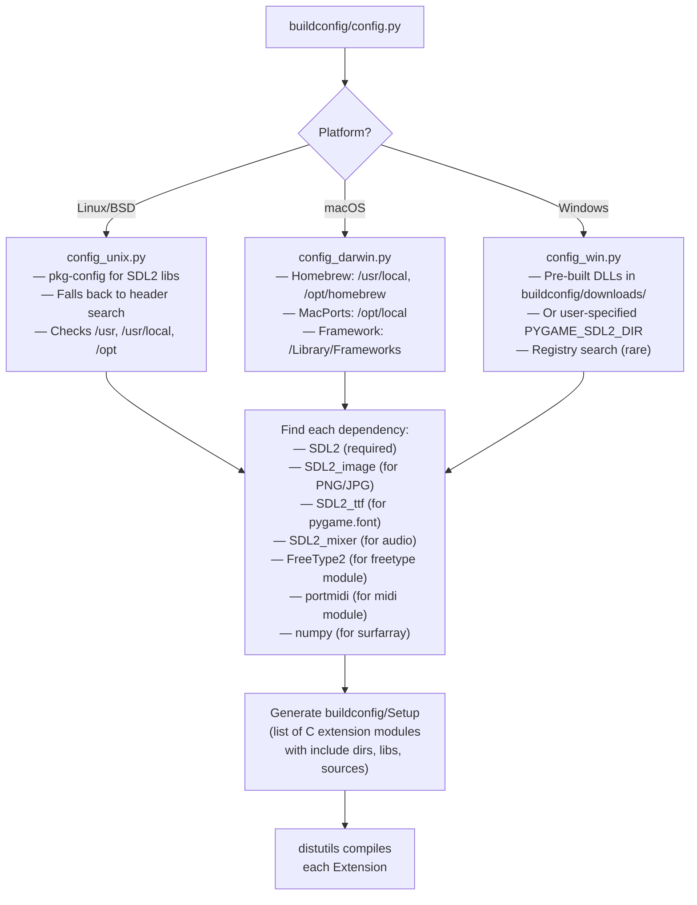

# pygame Viking Edition — Build System Documentation

**Last Updated:** 2026-04-05  

---

## Overview

pygame uses a **setuptools/distutils**-based build system with custom dependency detection scripts. The build compiles C extensions, Cython files, and packages Python modules together.

---

## Entry Points

```
setup.py           # Main build entry point
setup.cfg          # Package metadata and build options
buildconfig/       # All dependency detection and platform scripts
```

---

## Build Commands

```bash
# Install (compile + install to Python environment):
python setup.py install

# Build in-place (for development):
python setup.py build_ext --inplace

# Build Cython files first, then compile:
cython src_c/cython/pygame/_sdl2/video.pyx  # Then build_ext

# Create wheel:
python -m build

# With pip (modern approach):
pip install -e .   # Editable install (development)
pip install .      # Regular install
```

---

## Dependency Detection — `buildconfig/`

```
buildconfig/
├── config.py              # Main detection script
├── config_unix.py         # Linux/Mac dependency finder
├── config_win.py          # Windows dependency finder  
├── config_darwin.py       # macOS-specific paths
├── Setup                  # Distutils Setup file (extension definitions)
├── Setup.in               # Template for Setup generation
├── downloads/             # Pre-built SDL2 Windows DLLs (for CI)
│   └── SDL2-*.zip         # SDL2, SDL2_mixer, SDL2_image, SDL2_ttf binaries
├── manylinux-build/       # Docker files for Linux wheel builds
│   ├── Dockerfile         # manylinux2014 base
│   └── build.sh           # Build script
└── prebuilt-*.tar.gz      # Platform-specific pre-built libraries
```

### Dependency Detection Flow



---

## Extension Module Definitions

Each pygame C extension is defined in `buildconfig/Setup` (or generated from `Setup.in`):

```
# Format: extension_name sources [libraries] [include_dirs] ...
base src_c/base.c -lSDL2 -I/usr/include/SDL2
display src_c/display.c -lSDL2 -I/usr/include/SDL2
surface src_c/surface.c src_c/alphablit.c src_c/surface_fill.c src_c/simd_blitters_sse2.c src_c/simd_blitters_avx2.c -lSDL2
draw src_c/draw.c src_c/gfxdraw.c src_c/SDL_gfx/SDL_gfxPrimitives.c -lSDL2
# ... etc
```

---

## Adding a New C Module (for Viking Edition phases)

To add a new C extension module (e.g., `pygame.ai` for Phase 3A):

1. **Create source file:** `src_c/ai.c`
2. **Create doc header:** `src_c/doc/ai_doc.h` (with `DOC_PYGAMEAI*` strings)
3. **Register quit:** Call `pg_RegisterQuit(ai_quit)` in module init
4. **Add to Setup.in:** 
   ```
   ai src_c/ai.c -lSDL2
   ```
5. **Add Python import** in `src_py/__init__.py`:
   ```python
   try:
       import pygame.ai
   except (ImportError, OSError):
       ai = MissingModule("ai", urgent=0)
   ```
6. **Write tests:** `test/ai_test.py`
7. **Write structure doc:** `docs/structure/ai_c.md`

---

## Cython Extension Build

Cython files (`.pyx`) need an extra step:

```bash
# Step 1: Cython compile .pyx → .c
cython --cplus src_c/cython/pygame/_sdl2/video.pyx -o src_c/cython/pygame/_sdl2/video.c

# Step 2: Normal C compile
python setup.py build_ext --inplace
```

In practice, the build system (or Makefile) handles this automatically. When adding new Cython files:
1. Create `module.pyx` + `module.pxd` (type declarations for other Cython to use)
2. Add Cython compilation step to build scripts
3. Add to `buildconfig/Setup.in`

---

## SIMD Compilation Flags

```makefile
# SSE2 (default on x86_64, explicit flag ensures it):
simd_blitters_sse2.c: CFLAGS += -msse2

# AVX2 (modern Intel/AMD CPUs):
simd_blitters_avx2.c: CFLAGS += -mavx2

# These are set per-file in setup.py via extra_compile_args:
Extension("surface", sources=[..., "simd_blitters_avx2.c"],
          extra_compile_args=[..., "-mavx2"])
```

GCC/Clang: Use `__attribute__((target("avx2")))` on individual functions rather than global `-mavx2` to avoid accidentally using AVX2 everywhere.

---

## Platform-Specific Build Notes

### Windows

- Uses pre-built SDL2 DLLs from `buildconfig/downloads/`
- DLLs must be copied alongside the `.pyd` files
- `__init__.py` adds pygame package dir to `PATH` and calls `os.add_dll_directory()` (Python 3.8+)
- MSVC compiler used in CI; MinGW also works but less tested
- `scale_mmx64_msvc.c` vs `scale_mmx64_gcc.c` — separate files for MSVC inline assembly syntax vs GCC

### macOS

- Universal binaries (x86_64 + arm64) built with `--archs="x86_64 arm64"`
- `sdlmain_osx.m` compiled as Objective-C (requires `-x objective-c` flag)
- Framework SDL2 path: `/Library/Frameworks/SDL2.framework`
- M1/M2 native: arm64 build uses NEON (via sse2neon.h translation currently)

### Linux

- pkg-config is the primary dependency finder:
  ```bash
  pkg-config --cflags --libs sdl2
  pkg-config --cflags --libs SDL2_mixer
  ```
- manylinux wheels built in Docker with older glibc for broad compatibility
- V4L2 camera (`camera_v4l2.c`) only compiled when `<linux/videodev2.h>` is found

### Raspberry Pi

- Same as Linux but ARM architecture
- SSE2/AVX2 SIMD not available (ARM NEON instead)
- `PG_COMPILE_SSE4_2 = 0` on ARM — scalar fallbacks used
- OpenGL ES 2.0/3.0 available via Mesa/videocore driver
- Phase 2C work: add proper NEON blitters

---

## CI Build Matrix

`.github/workflows/` defines CI builds:
- **Ubuntu**: GCC, Python 3.9-3.12, SDL2 from apt
- **macOS**: Clang, Python 3.9-3.12, SDL2 from Homebrew, universal binary
- **Windows**: MSVC, Python 3.9-3.12, pre-built SDL2 DLLs
- **Cython**: Builds and tests Cython extensions
- **manylinux**: Docker-based, creates installable wheels

---

## Common Build Issues

| Issue | Cause | Fix |
|---|---|---|
| `SDL.h not found` | SDL2 development headers not installed | `sudo apt install libsdl2-dev` |
| `SDL2_mixer not found` | SDL2_mixer not installed | `sudo apt install libsdl2-mixer-dev` |
| `No module named pygame` after build | Build not installed | Run `python setup.py install` or `pip install -e .` |
| Cython version mismatch | Wrong Cython installed | `pip install cython>=3.0` |
| AVX2 compile error | Old compiler | Disable: remove `-mavx2` flag or use `PG_COMPILE_AVX2=0` |
| Segfault on import | SDL compiled/linked version mismatch | Check `pg_CheckSDLVersions()` — ensure same SDL2 version |
