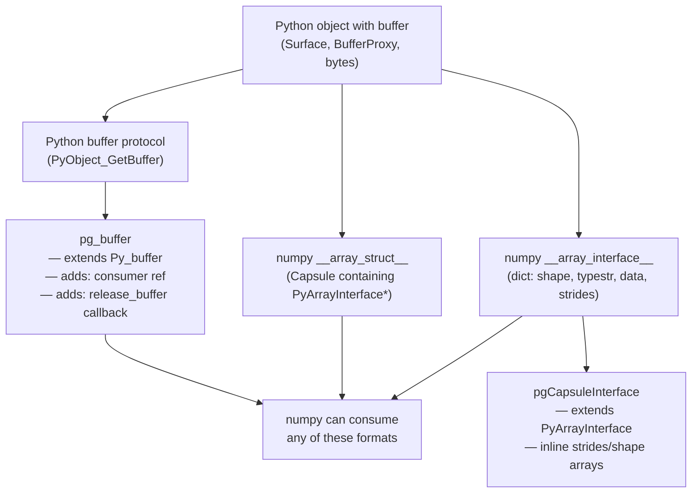
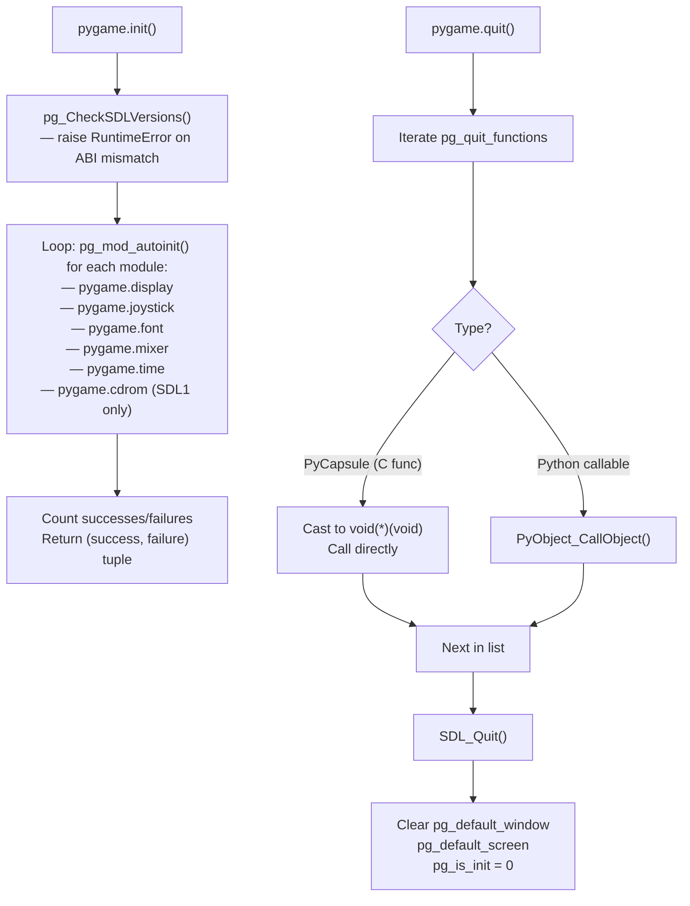

# Structure: `src_c/base.c`

**Type:** C Extension Module  
**Compiled to:** `pygame.base` (exported as `pygame.*` via wildcard import)  
**Lines:** ~2500  
**Last reviewed:** 2026-04-05  

---

## Purpose

`base.c` is the **foundation of all pygame**. It implements:

1. **`pygame.init()` / `pygame.quit()`** — master lifecycle management
2. **`pg_RegisterQuit()`** — quit callback registration system used by all other modules
3. **The Slot API publication** — exports pygame's C API (as a Capsule) so other C extensions can share pointers
4. **Buffer protocol implementation** — `pygame.BufferProxy` and numpy array interface (`__array_interface__`, `__array_struct__`)
5. **SDL version checking** — ABI compatibility guard
6. **Global default window/screen state** — `pg_default_window`, `pg_default_screen`
7. **`pygame.error` exception type** — `pgExc_SDLError`

---

## Public Python API (exported via `from pygame.base import *`)

| Symbol | Type | Description |
|---|---|---|
| `pygame.init()` | function | Initialize all pygame modules. Returns `(successes, failures)` |
| `pygame.quit()` | function | Uninitialize all pygame modules, clean up SDL |
| `pygame.get_init()` | function | Returns True if `pygame.init()` has been called |
| `pygame.error` | exception | `pygame.error` exception class (subclass of `RuntimeError`) |
| `pygame.get_error()` | function | Returns current SDL error string (`SDL_GetError()`) |
| `pygame.set_error(msg)` | function | Sets SDL error string (`SDL_SetError()`) |
| `pygame.get_sdl_version()` | function | Returns `(major, minor, patch)` tuple of linked SDL2 |
| `pygame.get_sdl_byteorder()` | function | Returns `SDL_BYTEORDER` constant (LIL or BIG) |
| `pygame.register_quit(callable)` | function | Register a Python callable to be called on `pygame.quit()` |
| `pygame.encode_string(obj, encoding, errors, etype)` | function | Encode Python str/bytes to C string for file paths |
| `pygame.encode_file_path(obj, etype)` | function | Encode a file path object for C use |
| `pygame.get_array_interface(obj)` | function | Return numpy `__array_interface__` dict for buffer objects |

---

## Internal State (file-level statics)

| Variable | Type | Description |
|---|---|---|
| `pg_quit_functions` | `PyObject *` (list) | Python callables + C function capsules called on quit |
| `pg_is_init` | `int` | 0 or 1, whether `pygame.init()` was called |
| `pg_sdl_was_init` | `int` | SDL subsystem bitmask that was initialized |
| `pg_default_window` | `SDL_Window *` | The current display window |
| `pg_default_screen` | `pgSurfaceObject *` | The current display Surface |
| `pgExc_SDLError` | `PyObject *` | The `pygame.error` exception object |
| `pg_env_blend_alpha_SDL2` | `char *` | Cached `PYGAME_BLEND_ALPHA_SDL2` env var value |

---

## Key Internal Functions

| Function | Signature | Purpose |
|---|---|---|
| `pg_CheckSDLVersions()` | `int ()` | Validates compiled vs linked SDL2 ABI compatibility |
| `pg_RegisterQuit()` | `void (void (*func)(void))` | C API: register a C callback for cleanup |
| `pg_register_quit()` | `PyObject *(self, value)` | Python API wrapper for above |
| `pg_mod_autoinit()` | `int (const char *modname)` | Import a submodule and call its `init()` |
| `pg_mod_autoquit()` | `void (const char *modname)` | Import a submodule and call its `quit()` |
| `pg_init()` | `PyObject *(self, args)` | `pygame.init()` — calls autoinit on all standard submodules |
| `pg_atexit_quit()` | `void ()` | Called at interpreter exit — iterates `pg_quit_functions` |
| `pgBuffer_Release()` | `void (pg_buffer *)` | Release a pg_buffer (calls release_buffer callback) |
| `pgObject_GetBuffer()` | `int (obj, pg_buffer *, flags)` | Get buffer from any buffer-protocol object |
| `pgGetArrayInterface()` | `int (PyObject **, PyObject *)` | Extract numpy array interface from object |

---

## Buffer Protocol Implementation

`base.c` implements pygame's integration with Python's buffer protocol and numpy's array interface. This is what enables `surfarray.pixels2d()` to return zero-copy numpy views of Surface pixels.

---

## Init / Quit Flow

---

## Slot API — What base.c Exports

`base.c` populates the `pygame_base_slots` array and stores it as a Capsule at `sys.modules['pygame.base'].__api__`. Other C modules retrieve this via `import_pygame_base()`.

| Slot Index | Symbol | Type |
|---|---|---|
| 0 | `pgExc_SDLError` | `PyObject *` |
| 1 | `pg_RegisterQuit` | `void (*)(void (*)(void))` |
| 2 | `pgBuffer_AsArrayInterface` | `PyObject *(*)(Py_buffer *)` |
| 3 | `pgBuffer_AsArrayStruct` | `PyObject *(*)(Py_buffer *)` |
| 4 | `pgObject_GetBuffer` | `int (*)(PyObject *, pg_buffer *, int)` |
| 5 | `pgBuffer_Release` | `void (*)(pg_buffer *)` |
| 6 | `pgGetArrayInterface` | `int (*)(PyObject **, PyObject *)` |
| 7 | `pgGetDefaultWindow` | `SDL_Window *(*)(void)` |
| 8 | `pgSetDefaultWindow` | `void (*)(SDL_Window *)` |
| 9 | `pgGetDefaultWindowSurface` | `pgSurfaceObject *(*)(void)` |
| 10 | `pgSetDefaultWindowSurface` | `void (*)(pgSurfaceObject *)` |
| 11 | `pg_EnvShouldBlendAlphaSDL2` | `char *(*)(void)` |

---

## Dependencies

- **Depends on:** `pygame.h` / `_pygame.h`, `pgcompat.h`, `pgarrinter.h`, SDL2
- **Depended on by:** Every other pygame C module (all call `import_pygame_base()`)
- **No dependency on:** Any other pygame module (it IS the base)

---

## Known Quirks / Notes

- `pg_quit_functions` is intentionally **not** cleared between `quit()`/`init()` cycles — modules re-register on init. This means calling `init()` → `quit()` → `init()` accumulates quit entries. Not a memory leak in practice since entries are deduped by the module re-registration pattern, but worth auditing.
- The SDL version check only validates **major version** equality, and rejects when **compiled > linked patch**. It does NOT reject when linked > compiled (newer SDL than expected is OK).
- `pg_env_blend_alpha_SDL2` caches the environment variable at first access. If the env var changes after `pygame.init()`, the cached value is used. This is intentional for performance but could surprise tooling that modifies env vars dynamically.
- `pgExc_SDLError` is a subclass of `RuntimeError`, not `Exception` — so bare `except Exception` will catch it, but the class hierarchy is `pygame.error → RuntimeError → Exception`.
