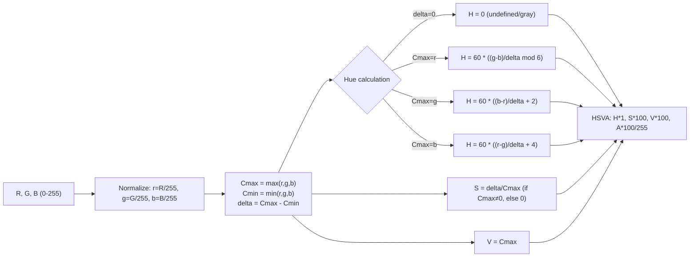

# Structure: `src_c/color.c`

**Type:** C Extension Module  
**Compiled to:** `pygame.color` — exports `Color` type  
**Lines:** ~1200  
**Last reviewed:** 2026-04-05  

---

## Purpose

`color.c` defines the **`Color` Python type** — an RGBA color object that supports multiple color space representations (RGBA, HSVA, HSLA, I1I2I3, CMY), arithmetic operations, comparison, pickling, and named color lookup.

---

## Public Python API — `pygame.Color`

### Constructor

```python
Color(r, g, b, a=255)
Color((r, g, b))
Color((r, g, b, a))
Color("red")              # named color string lookup
Color("#RRGGBB")          # hex string
Color("#RRGGBBAA")        # hex string with alpha
Color(0xRRGGBBAA)         # integer
```

### Attributes

| Attribute | Type | Range | Description |
|---|---|---|---|
| `r` | int | 0–255 | Red channel |
| `g` | int | 0–255 | Green channel |
| `b` | int | 0–255 | Blue channel |
| `a` | int | 0–255 | Alpha channel |
| `hsva` | tuple | H:0-360, S:0-100, V:0-100, A:0-100 | Hue-Saturation-Value-Alpha |
| `hsla` | tuple | H:0-360, S:0-100, L:0-100, A:0-100 | Hue-Saturation-Lightness-Alpha |
| `i1i2i3` | tuple | I1:0-1, I2:-0.5-0.5, I3:-0.5-0.5 | Ohta color space |
| `cmy` | tuple | C:0-1, M:0-1, Y:0-1 | Cyan-Magenta-Yellow |

All color space attributes are read-write — setting `color.hsva = (180, 100, 100, 100)` updates the RGBA values accordingly.

### Methods

| Method | Description |
|---|---|
| `normalize()` | Return `(r/255, g/255, b/255, a/255)` as floats |
| `correct_gamma(gamma)` | Apply gamma correction, return new Color |
| `set_length(n)` | Change iteration length (1-4). Default=4, allows 3 for RGB-only iteration |
| `lerp(color, t)` | Linear interpolation between self and color by factor t (0.0-1.0) |
| `premul_alpha()` | Return new Color with RGB premultiplied by alpha |
| `update(r, g, b, a)` | Update values in-place |
| `grayscale()` | Return new Color converted to grayscale |

### Operators

- **Arithmetic:** `+`, `-`, `*`, `//`, `%` (per-channel, clamped to 0-255)
- **Comparison:** `==`, `!=`, `<`, `<=`, `>`, `>=` (compares as 4-tuples)
- **Indexing:** `color[0]` = r, `color[1]` = g, `color[2]` = b, `color[3]` = a
- **Iteration:** `r, g, b, a = color` (or `r, g, b = color` after `set_length(3)`)
- **Bool:** `bool(color)` → True if any channel non-zero
- **Repr:** `Color(r, g, b, a)`
- **Pickle:** Full pickle support

---

## Color Space Conversions

### RGB ↔ HSV



### RGB ↔ HSL

Similar to HSV but Lightness = (Cmax + Cmin) / 2 and Saturation formula differs.

### RGB ↔ CMY

Trivial: `C = 1 - R/255`, `M = 1 - G/255`, `Y = 1 - B/255`

### RGB ↔ I1I2I3 (Ohta Color Space)

```
I1 = (R + G + B) / 3
I2 = (R - B) / 2
I3 = (2G - R - B) / 4
```

Used for image analysis, skin detection, color-based segmentation.

---

## Named Color Lookup

`Color("red")` uses `colordict.py` — a Python dict of ~600 color names (CSS/X11 colors). The lookup:
1. Strips whitespace, lowercases, removes spaces
2. Checks `colordict.THECOLORS` dict
3. If found, constructs Color from `(r, g, b)` or `(r, g, b, a)` tuple

Hex strings: `"#RRGGBB"` or `"0xRRGGBB"` parsed directly in C.

---

## Internal C Struct

```c
typedef struct {
    PyObject_HEAD
    Uint8 r, g, b, a;  // 4 bytes
    Uint8 len;          // iteration length (1-4), default 4
} pgColorObject;
```

Extremely compact — 5 bytes of data + Python object overhead.

---

## Slot API — What color.c Exports

| Slot | Symbol | Description |
|---|---|---|
| 0 | `pgColor_Type` | The Color Python type object |
| 1 | `pgColor_New` | Create new Color from (r,g,b,a) |
| 2 | `pgColor_NewLength` | Create Color with specific iteration length |
| 3 | `pg_RGBAFromObj` | Parse any color-like Python object into (r,g,b,a) |
| 4 | `pgColor_FromObj` | Parse any color-like Python object into pgColorObject* |

---

## `pgColor_FromObj` — Universal Color Parsing

Accepts any of:
- `pygame.Color` instance (direct)
- `(r, g, b)` or `(r, g, b, a)` integer tuple
- Single integer `0xRRGGBBAA`
- String `"red"`, `"#FF0000"`, `"#FF0000FF"`
- Named color in colordict

---

## Dependencies

- **Imports from:** `base.c` (error handling)
- **Uses:** `src_py/colordict.py` for named color strings (via PyImport)
- **Depended on by:** `draw.c`, `surface.c`, `transform.c`, `gfxdraw.c`, `_freetype.c`, `sprite.py`

---

## Known Quirks / Notes

- `Color` arithmetic is clamped: `Color(200,200,200) + Color(100,100,100)` = `Color(255,255,255)` — not `Color(300,300,300)`.
- `Color("grey")` and `Color("gray")` both work — colordict includes both spellings.
- `color.hsva` returns floats, but setting `color.hsva` requires exact float ranges (H: 0-360, S: 0-100, V: 0-100, A: 0-100). Values outside range raise ValueError.
- `Color(255,255,255) == (255,255,255,255)` → True (comparison with 4-tuple). But `Color(255,255,255) == (255,255,255)` → False (3-tuple, different length).
- `color.set_length(3)` affects `len()` and iteration but NOT indexing — `color[3]` still returns alpha even after `set_length(3)`.
- `Color.lerp(other, 0.0)` = self, `lerp(other, 1.0)` = other. Intermediate values are linearly interpolated per-channel, then rounded to int (not clamped — stays in 0-255 since both inputs are in range).
- `premul_alpha()` returns `Color(r*a//255, g*a//255, b*a//255, a)` — useful for premultiplied alpha compositing.
