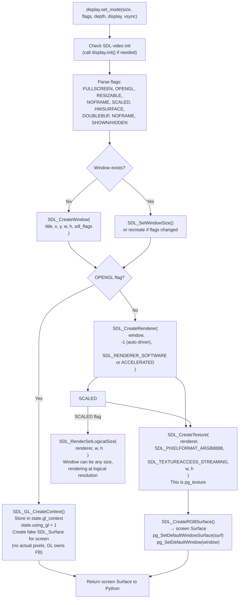
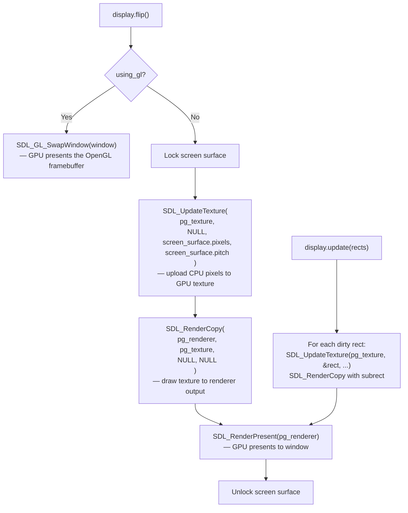

# Structure: `src_c/display.c`

**Type:** C Extension Module  
**Compiled to:** `pygame.display`  
**Lines:** ~1800  
**Last reviewed:** 2026-04-05  

---

## Purpose

`display.c` manages the game **window** and the **rendering pipeline** that gets pixels to the screen. It is the bridge between the pygame Surface system (CPU-side pixel buffers) and SDL2's display/renderer subsystem (GPU/OS window).

Key responsibilities:
- Create and manage the SDL2 window (`SDL_Window`)
- Create and manage the SDL2 renderer (`SDL_Renderer`) or OpenGL context
- Implement `pygame.display.set_mode()` — the entry point for all display setup
- Implement `pygame.display.flip()` / `pygame.display.update()` — presenting frames
- Expose video info, display modes, gamma, window properties

---

## Public Python API

| Function | Description |
|---|---|
| `pygame.display.init()` | Initialize SDL2 video subsystem |
| `pygame.display.quit()` | Quit SDL2 video subsystem |
| `pygame.display.get_init()` | Returns True if video subsystem initialized |
| `pygame.display.set_mode(size, flags, depth, display, vsync)` | Create/resize the display window. Returns Screen Surface |
| `pygame.display.get_surface()` | Returns the current Screen Surface (or None) |
| `pygame.display.flip()` | Update the full display — push pixels to screen |
| `pygame.display.update(rects)` | Update only specified dirty rectangles |
| `pygame.display.set_caption(title, icontitle)` | Set window title bar text |
| `pygame.display.get_caption()` | Returns `(title, icontitle)` tuple |
| `pygame.display.set_icon(surface)` | Set window icon (32x32 recommended) |
| `pygame.display.Info()` | Returns VidInfo object with display capabilities |
| `pygame.display.get_wm_info()` | Returns OS-specific window manager info dict |
| `pygame.display.list_modes(depth, flags, display)` | List available fullscreen resolutions |
| `pygame.display.mode_ok(size, flags, depth, display)` | Check if a video mode is valid |
| `pygame.display.toggle_fullscreen()` | Switch between fullscreen and windowed |
| `pygame.display.iconify()` | Minimize the window |
| `pygame.display.set_gamma(r, g, b)` | Set display gamma correction |
| `pygame.display.set_gamma_ramp(r, g, b)` | Set full gamma ramp (256 entries each channel) |
| `pygame.display.get_gamma_ramp()` | Get current gamma ramp |
| `pygame.display.gl_set_attribute(flag, value)` | Set OpenGL context attribute before `set_mode` |
| `pygame.display.gl_get_attribute(flag)` | Get OpenGL context attribute |
| `pygame.display.get_num_displays()` | Number of connected monitors |
| `pygame.display.get_desktop_sizes()` | Returns list of desktop sizes per monitor |
| `pygame.display.get_display_sizes(display)` | Available modes for a specific display |
| `pygame.display.get_allow_screensaver()` | Returns screensaver-allowed state |
| `pygame.display.set_allow_screensaver(bool)` | Allow or block the OS screensaver |

---

## Internal State (`_DisplayState` struct)

```c
typedef struct _display_state_s {
    char *title;               // Window title (heap-allocated C string)
    PyObject *icon;            // Python Surface reference for window icon
    Uint16 *gamma_ramp;        // 3×256 Uint16 gamma correction table
    SDL_GLContext gl_context;  // OpenGL context handle (GL mode only)
    int toggle_windowed_w;     // Saved windowed width for fullscreen toggle
    int toggle_windowed_h;     // Saved windowed height for fullscreen toggle
    Uint8 using_gl;            // Flag: OpenGL mode active (no renderer)
    Uint8 scaled_gl;           // Flag: scaled + OpenGL combined
    int scaled_gl_w;           // Logical width in scaled GL mode
    int scaled_gl_h;           // Logical height in scaled GL mode
    int fullscreen_backup_x;   // Saved window X before entering fullscreen
    int fullscreen_backup_y;   // Saved window Y before entering fullscreen
    SDL_bool auto_resize;      // Auto-handle SDL_WINDOWEVENT_SIZE_CHANGED
} _DisplayState;
```

**Module-level globals:**
- `pg_renderer` (`SDL_Renderer *`) — the SDL2 renderer (software/scaled modes)
- `pg_texture` (`SDL_Texture *`) — the output texture (blit target for screen surface)
- `pgVidInfo_Type` — VidInfo Python type

---

## `set_mode()` Flow



---

## `flip()` / `update()` Flow



---

## Display Flags

| Python Flag | SDL2 Equivalent | Effect |
|---|---|---|
| `FULLSCREEN` | `SDL_WINDOW_FULLSCREEN_DESKTOP` | True fullscreen (desktop resolution) |
| `OPENGL` | `SDL_WINDOW_OPENGL` | OpenGL context, no renderer |
| `RESIZABLE` | `SDL_WINDOW_RESIZABLE` | User can resize window |
| `NOFRAME` | `SDL_WINDOW_BORDERLESS` | No title bar or borders |
| `SCALED` | (renderer logical size) | Internal resolution scaled to window |
| `HWSURFACE` | (ignored in SDL2) | Legacy SDL1.2 flag, accepted but no-op |
| `DOUBLEBUF` | (ignored in SDL2) | Legacy SDL1.2 flag, accepted but no-op |
| `SHOWN` | `SDL_WINDOW_SHOWN` | Window starts visible (default) |
| `HIDDEN` | `SDL_WINDOW_HIDDEN` | Window starts hidden |

---

## VidInfo Object

`pygame.display.Info()` returns a `VidInfo` object exposing hardware capabilities. In SDL2 this is partially emulated since SDL2 doesn't expose the same hardware flags SDL1.2 did.

Fields: `hw`, `wm`, `video_mem`, `bitsize`, `bytesize`, `masks` (RGBA), `shifts` (RGBA), `losses` (RGBA), `blit_hw`, `blit_hw_CC`, `blit_hw_A`, `blit_sw`, `blit_sw_CC`, `blit_sw_A`, `current_w`, `current_h`

---

## OpenGL Integration

When `OPENGL` flag is set:
- A real OpenGL context is created via `SDL_GL_CreateContext()`
- pygame creates a **fake screen Surface** — a Surface object that exists in Python but has no actual pixel buffer used for rendering (OpenGL owns the framebuffer)
- User code calls `pygame.display.gl_set_attribute()` BEFORE `set_mode()` to configure: `GL_DEPTH_SIZE`, `GL_STENCIL_SIZE`, `GL_MULTISAMPLESAMPLES`, `GL_CONTEXT_MAJOR_VERSION`, `GL_CONTEXT_MINOR_VERSION`, `GL_CONTEXT_PROFILE_MASK` (Core/ES/Compat), etc.
- `pygame.display.flip()` in GL mode calls `SDL_GL_SwapWindow()`
- Actual rendering is done entirely by user OpenGL calls (PyOpenGL etc.)

---

## Dependencies

- **Imports from base.c:** `pgExc_SDLError`, `pg_RegisterQuit`, `pgGetDefaultWindow`, `pgSetDefaultWindow`, `pgGetDefaultWindowSurface`, `pgSetDefaultWindowSurface`
- **Imports from surface.c:** `pgSurface_New`, `pgSurface_Check`, `pgSurface_Type`
- **SDL2:** `SDL_VIDEO` subsystem, `SDL_syswm.h` for WM info
- **Headers:** `pgopengl.h` for GL attribute constants

---

## Known Quirks / Notes

- `HWSURFACE` and `DOUBLEBUF` flags are **silently accepted but ignored** in SDL2 builds for backward compatibility with old SDL1.2 game code.
- `display.update(rects)` with an empty list or `None` is equivalent to `flip()`.
- In `SCALED` mode, mouse coordinates from events are automatically translated by SDL2 to the logical resolution coordinate space — game code doesn't need to handle this.
- `toggle_fullscreen()` saves/restores window size. In some edge cases on multi-monitor setups with DPI scaling, the restored size may be slightly off (known SDL2 issue).
- The `pg_renderer` is `SDL_RENDERER_SOFTWARE` on systems where hardware acceleration fails. The game may run but will be significantly slower.
- `gl_context` is stored in `_DisplayState` but is thread-local from OpenGL's perspective — only valid on the thread where `set_mode()` was called.
