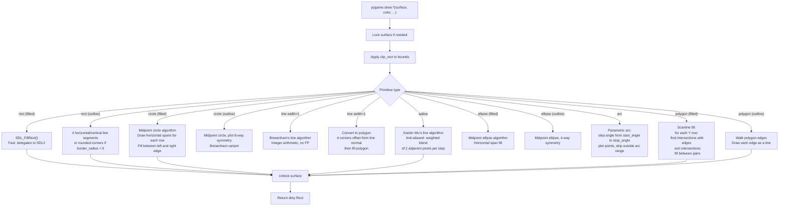
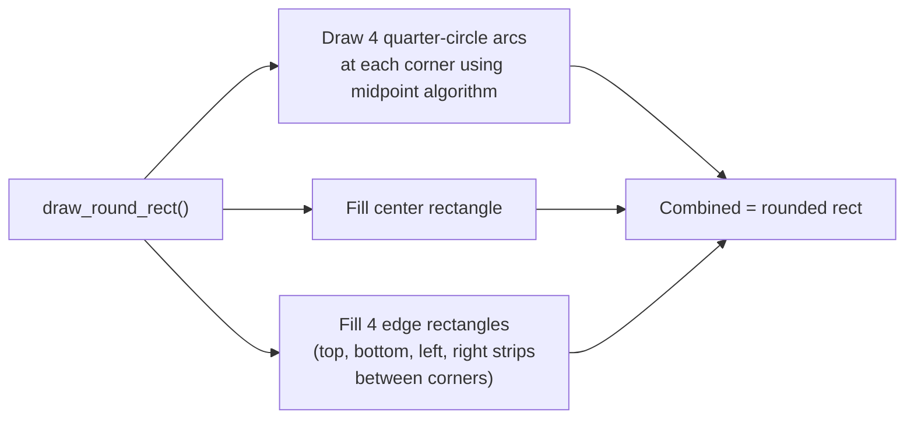

# Structure: `src_c/draw.c`

**Type:** C Extension Module  
**Compiled to:** `pygame.draw`  
**Lines:** ~2200  
**Last reviewed:** 2026-04-05  

---

## Purpose

`draw.c` implements all **2D primitive drawing** operations directly onto Surface pixel buffers. Every function writes pixels into a Surface's raw memory — no SDL renderer involved. All drawing respects the destination surface's clip rect.

---

## Public Python API — `pygame.draw`

| Function | Signature | Description |
|---|---|---|
| `rect` | `rect(surface, color, rect, width=0, border_radius=0, ...)` | Draw a rectangle (filled or outline) |
| `polygon` | `polygon(surface, color, points, width=0)` | Draw a polygon (filled or outline) |
| `circle` | `circle(surface, color, center, radius, width=0, ...)` | Draw a circle |
| `ellipse` | `ellipse(surface, color, rect, width=0)` | Draw an ellipse |
| `arc` | `arc(surface, color, rect, start_angle, stop_angle, width=1)` | Draw an arc |
| `line` | `line(surface, color, start_pos, end_pos, width=1)` | Draw a single line |
| `lines` | `lines(surface, color, closed, points, width=1)` | Draw connected line segments |
| `aaline` | `aaline(surface, color, start_pos, end_pos, blend=1)` | Draw anti-aliased line |
| `aalines` | `aalines(surface, color, closed, points, blend=1)` | Draw connected anti-aliased lines |

All functions return the **bounding Rect** of the area modified.

---

## Drawing Algorithms



---

## Anti-Aliasing (Xiaolin Wu's Algorithm)

Used by `aaline` and `aalines`:

```
For each step along the major axis:
  fractional_y = exact_y - floor(exact_y)
  Plot pixel at (x, floor(y)) with intensity = 1 - fractional_y
  Plot pixel at (x, floor(y)+1) with intensity = fractional_y
```

The anti-aliased color is blended with the existing surface pixel using the blend formula:
```c
// blend=True: alpha blend with existing pixel
// blend=False: overwrite (no blend)
new_color = (aa_intensity * draw_color + (255 - aa_intensity) * existing_color) / 255
```

---

## Rounded Rect

`pygame.draw.rect()` with `border_radius > 0` and/or individual corner radii (`border_top_left_radius`, `border_top_right_radius`, `border_bottom_left_radius`, `border_bottom_right_radius`):



---

## Color Handling

Colors are accepted as:
- `pygame.Color` object
- `(r, g, b)` or `(r, g, b, a)` tuple
- Hex integer `0xRRGGBB` or `0xAARRGGBB`
- Named color strings like `"red"`

Before drawing, colors are mapped to the surface's pixel format using `SDL_MapRGBA()`.

---

## Dependencies

- **Imports from:** `base.c` (error), `surface.c` (Surface type, lock/unlock), `color.c` (color parsing), `rect.c` (rect parsing)
- **Math:** `<math.h>` for `cos()`, `sin()`, `sqrt()` in arc/circle/aaline
- **No SDL2 drawing:** All drawing is custom pixel-level C code except filled rects (SDL_FillRect)

---

## `pygame.gfxdraw` (src_c/gfxdraw.c + SDL_gfx/)

Separate module using bundled SDL_gfx library. Provides:
- `pixel(surface, x, y, color)` — single pixel
- `hline(surface, x1, x2, y, color)` / `vline`
- `rectangle(surface, rect, color)` — outline rect
- `box(surface, rect, color)` — filled rect
- `circle(surface, x, y, r, color)` / `aacircle` / `filled_circle`
- `ellipse(surface, x, y, rx, ry, color)` / `aaellipse` / `filled_ellipse`
- `arc(surface, x, y, r, startangle, stopangle, color)`
- `pie(surface, x, y, r, startangle, stopangle, color)`
- `trigon(surface, x1, y1, x2, y2, x3, y3, color)` / `aatrigon` / `filled_trigon`
- `polygon(surface, points, color)` / `aapolygon` / `filled_polygon`
- `bezier(surface, points, steps, color)` — Bezier curve
- `textured_polygon(surface, points, texture, tx, ty)`

SDL_gfx uses different anti-aliasing (Wu's algorithm variant) and slightly different rendering than `pygame.draw.aaline`.

---

## Known Quirks / Notes

- `pygame.draw.line()` with `width=1` uses Bresenham's integer algorithm. With `width > 1` it converts to a rotated rectangle (polygon), which gives visually different results — specifically, thick lines have flat (not rounded) ends.
- `aaline()` blends with existing surface pixels only when `blend=True` (default). With `blend=False` it overwrites, which gives crisper results on dark backgrounds.
- `polygon()` scanline fill has a known edge case: polygons with horizontal edges along the bottom of the polygon may have inconsistent fill (one pixel off). This is a classic scanline parity issue.
- `arc()` angles are in **radians**, measured counter-clockwise from the positive x-axis (mathematical convention, not clockwise from top like compass bearings).
- Drawing to a 8-bit palettized surface doesn't support anti-aliasing — `aaline` on a palette surface falls back to non-AA.
- All `pygame.draw` functions are CPU-only. For GPU-accelerated drawing, use `pygame._sdl2.video.Renderer.draw_line()` etc.
