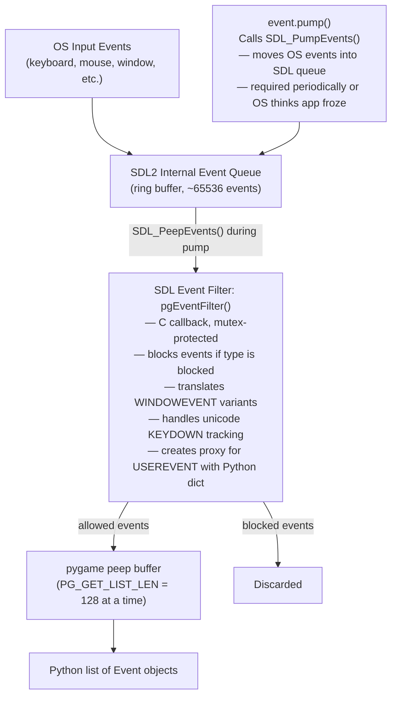
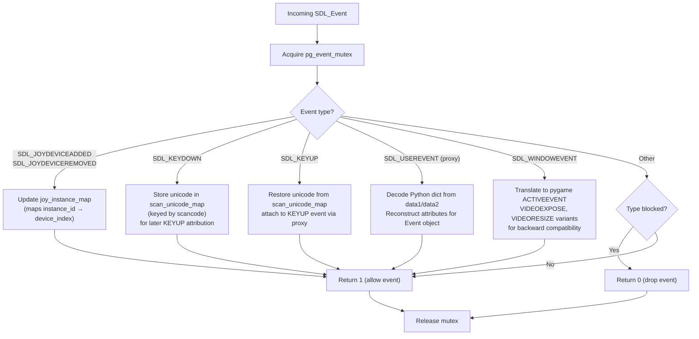
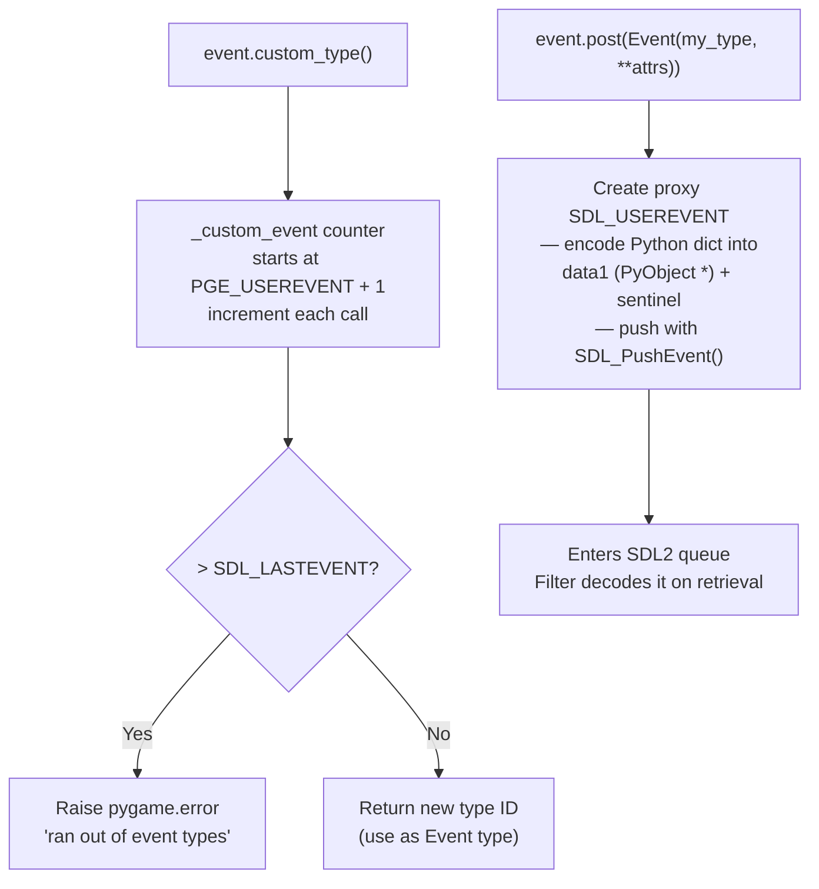

# Structure: `src_c/event.c`

**Type:** C Extension Module  
**Compiled to:** `pygame.event`  
**Lines:** ~1600  
**Last reviewed:** 2026-04-05  

---

## Purpose

`event.c` implements pygame's **event system** — the pipeline that translates OS input events and SDL2 messages into Python-accessible `pygame.event.Event` objects. It manages:

- The SDL2 event queue (`SDL_PumpEvents`, `SDL_PeepEvents`, `SDL_PushEvent`)
- Translation of SDL2 event structs into Python objects with attribute dicts
- Custom user-defined event types (`pygame.event.custom_type()`)
- Event blocking/allowing filters
- A mutex-protected event filter callback for thread-safe event modification
- Joystick instance ID → device index mapping for backward compatibility
- Unicode tracking for `KEYUP` events

---

## Public Python API

| Function | Description |
|---|---|
| `pygame.event.pump()` | Process SDL event queue without returning events (keeps OS alive) |
| `pygame.event.get(eventtype, pump, exclude)` | Return all events from queue, optionally filtered by type |
| `pygame.event.poll()` | Return next event from queue (NOEVENT if empty) |
| `pygame.event.wait(timeout)` | Block until an event is in queue, return it |
| `pygame.event.peek(eventtype, pump)` | Check if events of given type are in queue (non-destructive) |
| `pygame.event.clear(eventtype, pump)` | Remove events of given type from queue |
| `pygame.event.event_name(type)` | Return string name for event type constant |
| `pygame.event.set_blocked(typelist)` | Block events of given types from entering queue |
| `pygame.event.set_allowed(typelist)` | Allow only listed types (block all others) |
| `pygame.event.get_blocked(type)` | Check if a specific event type is blocked |
| `pygame.event.post(Event)` | Post an event to the queue |
| `pygame.event.custom_type()` | Allocate a new custom event type ID |
| `pygame.event.Event(type, **attrs)` | Create an Event object |

---

## `Event` Object

```python
event = pygame.event.Event(pygame.KEYDOWN, key=pygame.K_a, mod=0, unicode='a')
event.type    # int — event type constant
event.dict    # dict — all attributes
event.key     # attribute access via __getattr__
```

Internally `pgEventObject`:
```c
typedef struct {
    PyObject_HEAD
    int type;       // SDL event type constant
    PyObject *dict; // Python dict of event attributes
} pgEventObject;
```

---

## Event Queue Architecture



---

## Event Filter (`pgEventFilter`)

The event filter is a C callback registered with SDL2 via `SDL_SetEventFilter()`. It runs on **every event before it enters the SDL2 queue**.



---

## Custom Events



---

## Joystick ID Mapping

SDL2 uses **instance IDs** (stable per-session, not per-enumeration) while SDL1.2 used **device indexes** (0, 1, 2... in enumeration order). pygame maintains a `joy_instance_map` dict mapping `instance_id → device_index` for backward compatibility with old game code that used device indexes in events.

---

## Unicode Tracking (`scan_unicode_map`)

Problem: SDL2 sends `KEYDOWN` with unicode but `KEYUP` without unicode. pygame game code often wants unicode on KEYUP too. Solution: `scan_unicode_map[scancode] = unicode_str` is stored on KEYDOWN and retrieved on KEYUP.

- Size: `MAX_SCAN_UNICODE = 15` simultaneous keys tracked
- Each entry stores 4 bytes (`UNICODE_LEN = 4`) for UTF-8 unicode value
- LRU-like: oldest entry overwritten when full

---

## Event Type Constants

| pygame Constant | Value Range | SDL2 Origin |
|---|---|---|
| `NOEVENT` | 0 | No event |
| `ACTIVEEVENT` | 1 | SDL_WINDOWEVENT (focus/iconify) |
| `KEYDOWN` | 2 | SDL_KEYDOWN |
| `KEYUP` | 3 | SDL_KEYUP |
| `MOUSEMOTION` | 4 | SDL_MOUSEMOTION |
| `MOUSEBUTTONDOWN` | 5 | SDL_MOUSEBUTTONDOWN |
| `MOUSEBUTTONUP` | 6 | SDL_MOUSEBUTTONUP |
| `JOYAXISMOTION` | 7 | SDL_JOYAXISMOTION |
| `JOYBALLMOTION` | 8 | SDL_JOYBALLMOTION |
| `JOYHATMOTION` | 9 | SDL_JOYHATMOTION |
| `JOYBUTTONDOWN` | 10 | SDL_JOYBUTTONDOWN |
| `JOYBUTTONUP` | 11 | SDL_JOYBUTTONUP |
| `QUIT` | 12 | SDL_QUIT |
| `SYSWMEVENT` | 13 | SDL_SYSWMEVENT |
| `VIDEORESIZE` | 16 | SDL_WINDOWEVENT_RESIZED |
| `VIDEOEXPOSE` | 17 | SDL_WINDOWEVENT_EXPOSED |
| `USEREVENT` | 32868 | SDL_USEREVENT |
| `WINDOWEVENT` | SDL_WINDOWEVENT | SDL_WINDOWEVENT (new direct passthrough) |
| Custom | PGE_USEREVENT+1 → SDL_LASTEVENT | pygame.event.custom_type() |

---

## Event Attributes by Type

| Event Type | Attributes |
|---|---|
| `KEYDOWN` / `KEYUP` | `key`, `mod`, `unicode`, `scancode` |
| `MOUSEMOTION` | `pos`, `rel`, `buttons`, `touch` |
| `MOUSEBUTTONDOWN` / `UP` | `pos`, `button`, `touch` |
| `MOUSEWHEEL` | `x`, `y`, `flipped`, `precise_x`, `precise_y`, `touch` |
| `JOYAXISMOTION` | `instance_id`, `joy` (device_index), `axis`, `value` |
| `JOYBUTTONDOWN` / `UP` | `instance_id`, `joy`, `button` |
| `JOYHATMOTION` | `instance_id`, `joy`, `hat`, `value` |
| `JOYDEVICEADDED` | `device_index` |
| `JOYDEVICEREMOVED` | `instance_id` |
| `QUIT` | _(no attributes)_ |
| `ACTIVEEVENT` | `gain`, `state` |
| `VIDEORESIZE` | `size`, `w`, `h` |
| `WINDOWEVENT` | `event` (SDL subevent type) |
| `USEREVENT` / Custom | Whatever dict was passed to `Event(type, **kwargs)` |

---

## Dependencies

- **Imports from:** `base.c` (error, RegisterQuit), `rect.c`
- **Uses:** `SDL_syswm.h` for system window manager events
- **Depended on by:** `fastevent.py`, `joystick.c`, `key.c`, `mouse.c`, higher-level Python code

---

## Known Quirks / Notes

- The event mutex (`pg_event_mutex`) is **immortalized** — it is never freed for the lifetime of the process. This is intentional to avoid race conditions during interpreter shutdown.
- `event.pump()` must be called regularly (typically once per frame) or the OS will consider the application unresponsive and may show a "not responding" dialog or freeze input.
- `event.get()` is **destructive** — events are removed from the queue when retrieved. Use `event.peek()` to check without removing.
- `event.post()` with a custom type uses the SDL2 proxy mechanism — the Python dict is stored in a global dict keyed by a unique ID, and that ID is passed in the SDL event. If `pygame.quit()` is called before the event is consumed, the proxy dict entry leaks. This is a known minor issue.
- `set_blocked()` with `QUIT` is dangerous — blocking `QUIT` means the user cannot close the window via the OS "X" button and the app can only be killed by the OS.
- `event.wait(timeout=0)` does NOT return immediately — timeout=0 means no timeout (waits forever). Use `event.poll()` for non-blocking event checking.
