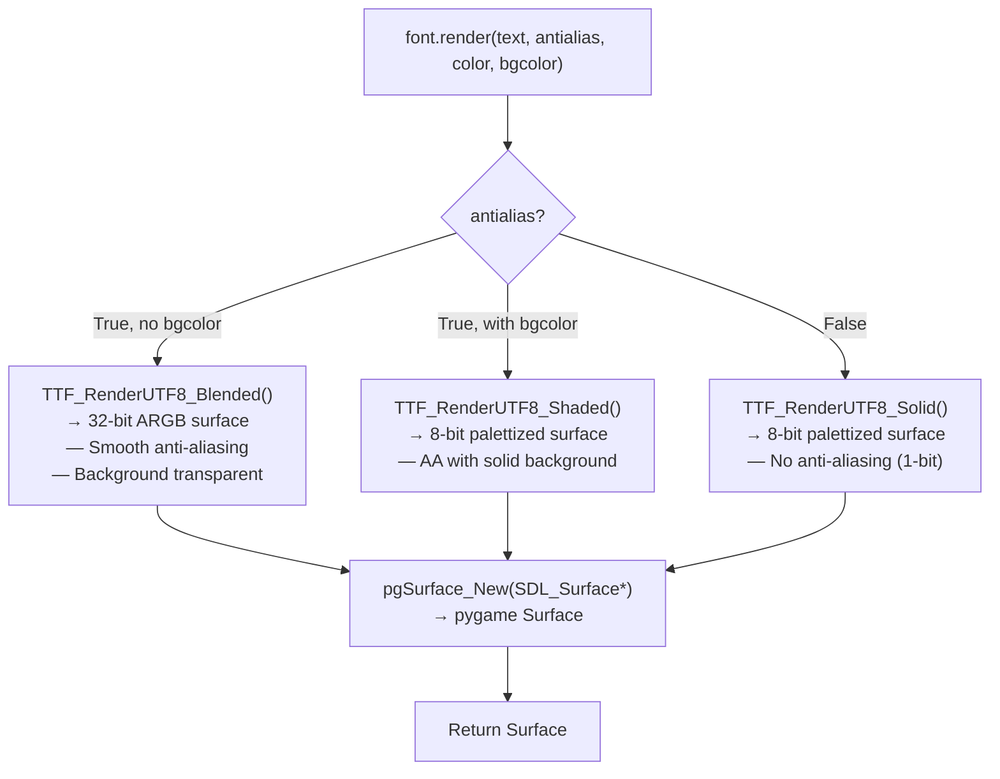
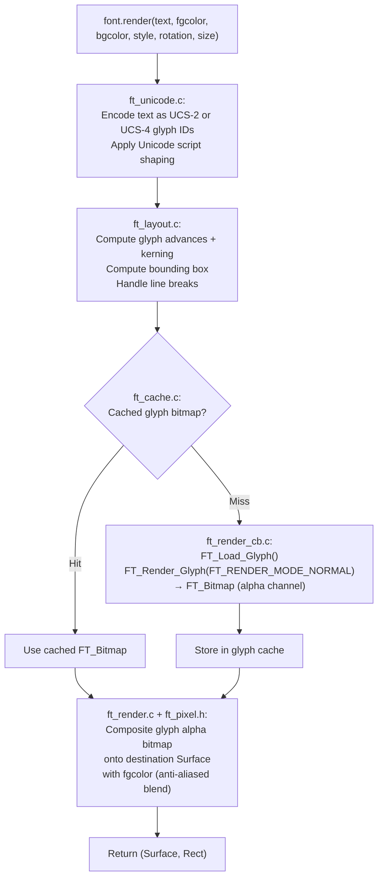

# Structure: `src_c/font.c` + `src_c/font.h` + `src_c/_freetype.c` + `src_c/freetype/`

**Type:** C Extension Modules  
**Compiled to:** `pygame.font` (SDL_ttf) + `pygame.freetype` (FreeType2 direct)  
**Last reviewed:** 2026-04-05  

---

## Purpose

pygame provides **two independent font rendering systems**:

1. **`pygame.font`** (`font.c`) — wraps SDL2_ttf. Simpler API, lower quality, no rotation.
2. **`pygame.freetype`** (`_freetype.c` + `freetype/`) — direct FreeType2 integration. Full Unicode, rotation, styling, better quality. **The recommended system.**

Both produce Surface objects containing rendered text.

---

## `pygame.font` — SDL_ttf Backend

### Public API

```python
pygame.font.init()
pygame.font.quit()
pygame.font.get_init()
pygame.font.get_default_font()     # returns "freesansbold.ttf" (bundled)
pygame.font.get_fonts()            # delegates to sysfont.get_fonts()
pygame.font.match_font(name, bold, italic)  # delegates to sysfont.match_font()
pygame.font.SysFont(name, size, bold, italic)   # delegates to sysfont.SysFont()

font = pygame.font.Font(filename_or_None, size)
font = pygame.font.Font(fileobj, size)
```

### `pygame.font.Font` methods

| Method | Description |
|---|---|
| `render(text, antialias, color, bgcolor)` | Render text → Surface |
| `size(text)` | Returns `(width, height)` of rendered text (no Surface created) |
| `set_underline(bool)` | Enable/disable underline |
| `get_underline()` | Get underline state |
| `set_bold(bool)` | Enable/disable bold (software bold — thickens strokes) |
| `get_bold()` | Get bold state |
| `set_italic(bool)` | Enable/disable italic (software shear) |
| `get_italic()` | Get italic state |
| `set_strikethrough(bool)` | Enable/disable strikethrough |
| `get_strikethrough()` | Get strikethrough state |
| `metrics(text)` | Returns per-glyph metrics list: `[(minx, maxx, miny, maxy, advance), ...]` |
| `get_height()` | Font line height in pixels |
| `get_ascent()` | Distance from baseline to top of tallest glyph |
| `get_descent()` | Distance from baseline to bottom of lowest glyph |
| `get_linesize()` | Recommended line spacing |

### Render Pipeline (pygame.font)



---

## `pygame.freetype` — Direct FreeType2 Backend

More capable. Lives in `_freetype.c` plus 6 subsystem files in `freetype/`:

| File | Purpose |
|---|---|
| `_freetype.c` | Module init, Font class Python bindings |
| `freetype/ft_wrap.c` / `ft_wrap.h` | FreeType2 library initialization, face management |
| `freetype/ft_cache.c` | Glyph render cache (keyed by face+size+style+rotation) |
| `freetype/ft_layout.c` | Text layout: line breaking, glyph advance, kerning |
| `freetype/ft_render.c` | Render glyphs to Surface pixel buffer |
| `freetype/ft_render_cb.c` | Render callbacks (bitmap, outline, mono rendering modes) |
| `freetype/ft_unicode.c` | Unicode text encoding + script detection |
| `freetype/ft_pixel.h` | Pixel blend utilities for anti-aliased glyph compositing |

### Public API

```python
pygame.freetype.init(cache_size, resolution)
pygame.freetype.quit()
pygame.freetype.get_init()
pygame.freetype.get_default_font()
pygame.freetype.get_cache_size()
pygame.freetype.get_resolution()

font = pygame.freetype.Font(filename_or_fileobj_or_None, size)
```

### `pygame.freetype.Font` methods

| Method | Description |
|---|---|
| `render(text, fgcolor, bgcolor, style, rotation, size)` | Returns `(Surface, Rect)` |
| `render_to(surface, dest, text, fgcolor, bgcolor, style, rotation, size)` | Render directly to existing surface. Returns `Rect` |
| `render_raw(text, style, rotation, size, invert)` | Returns `(bytes, size)` — raw alpha bitmap, no color |
| `render_raw_to(array, text, dest, style, rotation, size, invert)` | Render into existing numpy array |
| `size(text, style, rotation, size)` | Returns `(width, height)` without rendering |
| `get_rect(text, style, rotation, size)` | Returns bounding Rect |
| `get_metrics(text, size)` | Per-glyph metrics |
| `get_sized_ascender(size)` | Ascender at given size |
| `get_sized_descender(size)` | Descender at given size |
| `get_sized_height(size)` | Full height at given size |
| `get_sized_glyph_height(size)` | Glyph height at given size |
| `set_script(script)` | Set Unicode script (e.g., `"latn"`, `"arab"`) |

### Attributes (freetype.Font)

| Attribute | Description |
|---|---|
| `name` | Font family name |
| `path` | File path |
| `size` | Default point size |
| `style` | Bitmask: `STYLE_NORMAL`, `STYLE_BOLD`, `STYLE_ITALIC`, `STYLE_UNDERLINE`, `STYLE_STRIKETHROUGH`, `STYLE_WIDE` |
| `antialiased` | True/False |
| `kerning` | Enable/disable kerning |
| `vertical` | Vertical layout mode |
| `rotation` | Default rotation in degrees (0-360) |
| `resolution` | DPI for size calculations |
| `pad` | Add padding so glyphs don't clip descenders |
| `ucs4` | Use UCS-4 encoding (enables wide Unicode) |
| `origin` | Use font metrics origin (not top-left) |
| `fixed_width` | Force monospace spacing |

### FreeType Render Pipeline



---

## Bundled Font: freesansbold.ttf

Located at `src_py/freesansbold.ttf`. Used when `pygame.font.Font(None, size)` is called — `None` means "use default font". This ensures every pygame installation can render text without any system fonts.

---

## `pygame.ftfont` (src_py/ftfont.py)

A Python compatibility shim: wraps `pygame.freetype.Font` to present the same API as `pygame.font.Font`. Activated by:
```python
os.environ["PYGAME_FREETYPE"] = "1"
import pygame  # Now pygame.font uses FreeType backend
```
Or directly: `import pygame.ftfont as font`

---

## Dependencies

- **font.c imports from:** `base.c`, `surface.c`, SDL2_ttf (`TTF_*.h`)
- **_freetype.c imports from:** `base.c`, `surface.c`, FreeType2 headers
- **Depended on by:** `sysfont.py` (resolves paths used by both), `ftfont.py`

---

## Known Quirks / Notes

- `pygame.font.Font.render()` with `antialias=True` and no `bgcolor` returns a 32-bit ARGB surface with transparent background. With `bgcolor` it returns an 8-bit palettized surface (faster but limited to 256 colors). This inconsistency can cause unexpected behavior when blitting onto colorful backgrounds.
- `pygame.freetype` is strictly better in almost every way. Use it for new code.
- Font size is in **points** (1/72 inch), rendered at the current resolution (default 72 DPI = 1 point = 1 pixel). At 96 DPI (common on Windows), sizes look ~33% larger. Use `freetype.Font.resolution` to match system DPI.
- FreeType glyph cache (`ft_cache.c`) is per-font-object and bounded by `cache_size` parameter of `freetype.init()`. If cache overflows, oldest entries are evicted (LRU). For large text UIs with many sizes, increase cache size.
- `font.render_to()` in freetype avoids the Surface creation overhead — significantly faster for HUDs that update every frame.
