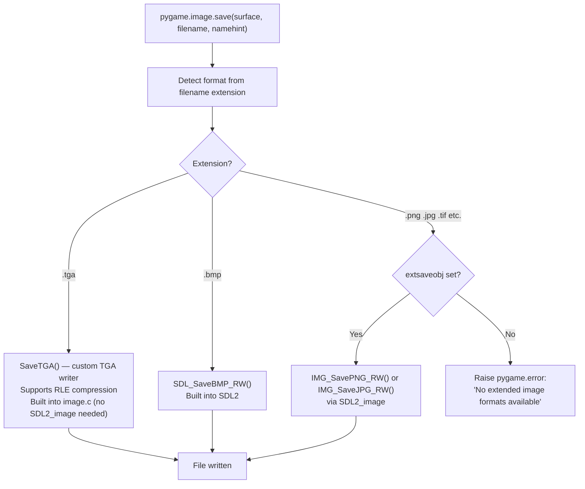

# Structure: `src_c/image.c` + `src_c/imageext.c`

**Type:** C Extension Modules  
**Compiled to:** `pygame.image` (basic) + `pygame.imageext` (extended formats)  
**Lines:** image.c ~750, imageext.c ~400  
**Last reviewed:** 2026-04-05  

---

## Purpose

`image.c` handles **loading and saving image files** to/from pygame Surfaces. It provides two tiers:

- **`pygame.image`** (`image.c`) — baseline: BMP load/save, raw pixel data from/to strings/buffers, TGA save. No external dependencies beyond SDL2.
- **`pygame.imageext`** (`imageext.c`) — extended: PNG, JPG, GIF, TIF, PCX, XPM, and more via **SDL2_image** library. Optional — game still runs if SDL2_image is missing (falls back to BMP only).

At import time, `image.c` checks if `pygame.imageext` is available and binds its `load` and `save` functions to `extloadobj` / `extsaveobj`. This means user-facing `pygame.image.load()` automatically uses extended formats if available.

---

## Public Python API — `pygame.image`

| Function | Description |
|---|---|
| `load(filename_or_fileobj, namehint)` | Load image file → Surface. Extended formats if SDL2_image available |
| `load_basic(filename_or_fileobj)` | Load BMP only (no SDL2_image, always available) |
| `load_sized_svg(filename, size)` | Load SVG at specific pixel size (SDL2_image 2.6+) |
| `save(surface, filename_or_fileobj, namehint)` | Save Surface to file. TGA or BMP (basic), PNG/JPG (extended) |
| `save_extended(surface, filename_or_fileobj, namehint)` | Force extended save (PNG/JPG via SDL2_image) |
| `get_extended()` | Returns True if SDL2_image is available |
| `get_sdl_image_version(linked)` | Returns SDL2_image version tuple |
| `frombuffer(bytes, size, format)` | Create Surface from raw pixel bytes |
| `frombytes(bytes, size, format, flipped)` | Create Surface from raw bytes (alias, adds flip option) |
| `fromstring(string, size, format, flipped)` | Deprecated alias for frombytes |
| `tobuffer(surface, format)` | Export Surface pixels to bytes |
| `tobytes(surface, format, flipped)` | Export Surface pixels to bytes (with flip option) |
| `tostring(surface, format, flipped)` | Deprecated alias for tobytes |

---

## Load Pipeline

```mermaid
flowchart TD
    LOAD["pygame.image.load(filename_or_fileobj, namehint)"]
    LOAD --> IS_EXTENDED{extloadobj set?\n(pygame.imageext loaded)}
    IS_EXTENDED -->|Yes| EXT_LOAD["imageext load path:\nIMG_Load(filename)\nor IMG_Load_RW(rwops) for file objects\n→ SDL_Surface*"]
    IS_EXTENDED -->|No| BASIC_LOAD["image.c basic path:\nSDL_LoadBMP_RW(rwops)\n→ BMP only"]

    EXT_LOAD --> FORMAT_DETECT["SDL2_image format detection:\n— File extension: .png, .jpg, .gif, .tif, .bmp, .pcx, .xpm, .webp, .svg\n— Magic bytes fallback (no extension needed)"]
    FORMAT_DETECT --> DECODE["SDL2_image decode\n→ SDL_Surface* (raw pixels)"]
    DECODE --> WRAP["pgSurface_New(SDL_Surface*)\n→ pygame Surface"]

    BASIC_LOAD --> BMP_DECODE["SDL2 BMP decoder\n→ SDL_Surface*"]
    BMP_DECODE --> WRAP
    WRAP --> RETURN["Return Surface to Python"]
```

---

## Save Pipeline



---

## `frombuffer` / `frombytes`

Creates a Surface that **borrows** (zero-copy) from an existing Python bytes/bytearray/buffer:

```python
surface = pygame.image.frombuffer(pixel_bytes, (width, height), "RGBA")
```

Supported format strings:
| Format | Bytes/pixel | Description |
|---|---|---|
| `"P"` | 1 | 8-bit palettized |
| `"RGB"` | 3 | 24-bit RGB |
| `"BGR"` | 3 | 24-bit BGR |
| `"RGBX"` | 4 | 32-bit RGB + padding |
| `"RGBA"` | 4 | 32-bit RGBA |
| `"ARGB"` | 4 | 32-bit ARGB |
| `"BGRA"` | 4 | 32-bit BGRA |
| `"RGBA_PREMULT"` | 4 | 32-bit premultiplied RGBA |
| `"ARGB_PREMULT"` | 4 | 32-bit premultiplied ARGB |

`frombuffer` creates a Surface with `owner=0` — the buffer object is held alive by the Surface's `dependency` ref. The buffer must not be modified while the Surface is in use.

`frombytes` creates a Surface with its own pixel copy (not zero-copy). `flipped=True` flips vertically (OpenGL framebuffer convention uses bottom-to-top rows).

---

## SSE4.2 Optimization in image.c

`image.c` includes `<emmintrin.h>` (SSE2) and `<tmmintrin.h>` (SSSE3) when `PG_COMPILE_SSE4_2=1`. This accelerates the pixel format conversion in `frombuffer`/`tobytes` for large images by processing multiple pixels simultaneously using SIMD shuffles.

---

## `imageext.c` — Extended Formats

Compiled separately, loaded by `image.c` at runtime:
- Wraps `IMG_Load()`, `IMG_Load_RW()`, `IMG_SavePNG_RW()`, `IMG_SaveJPG_RW()`
- Exposes `pygame.imageext.load`, `pygame.imageext.save`, `pygame.imageext.get_extended`
- Checks `IMG_Init()` for which codecs are compiled into SDL2_image (PNG, JPG, TIF, etc.)

---

## File Object Support

Both `load()` and `save()` accept file-like objects (anything with `.read()`/`.write()` methods). Internally they are wrapped in a `SDL_RWops` structure via `pgRWopsFromPython()` (from `rwobject.c`), which provides SDL2's I/O abstraction layer.

---

## Dependencies

- **image.c imports from:** `base.c`, `surface.c`, `rwobject.c`
- **imageext.c imports from:** `base.c`, `surface.c`, `rwobject.c`, SDL2_image (`IMG_*.h`)
- **Depended on by:** essentially all game code that loads assets

---

## Known Quirks / Notes

- `image.load()` returns a Surface in the source file's pixel format, which may not match the display format. Call `.convert()` or `.convert_alpha()` after loading for optimal blit performance.
- PNG files with transparency are loaded as RGBA (32-bit with per-pixel alpha). Calling `.convert()` instead of `.convert_alpha()` on these will **lose the transparency**.
- JPEG does not support transparency. Loading a JPEG always gives an RGB surface (no alpha).
- `frombuffer()` is zero-copy but dangerous: if the buffer object is garbage-collected or modified while the Surface is alive, you get undefined behavior (and likely a crash).
- `tobytes(surface, "RGB", False)` packs pixels in top-to-bottom row order. `flipped=True` gives bottom-to-top (OpenGL convention). This matters for `glTexImage2D()` uploads.
- The TGA saver in `image.c` supports RLE compression. The built-in `SaveTGA()` handles both RLE and raw TGA. Note: SDL2's `IMG_SaveJPG_RW()` has a quality parameter defaulting to 85; there's currently no Python-accessible way to change JPEG quality (known limitation).
- `get_extended()` returns True even if only some extended formats are available. Trying to load an unsupported format raises `pygame.error` from SDL2_image.
