# Structure: `src_py/__init__.py`

**Type:** Pure Python — package entry point  
**Lines:** ~345  
**Last reviewed:** 2026-04-05  

---

## Purpose

`__init__.py` is the **bootstrap file** for the entire pygame package. When you `import pygame`, this runs. It:

1. Handles platform-specific DLL/shared library setup
2. Imports all C extensions and Python submodules in the correct order
3. Implements the `MissingModule` graceful degradation pattern
4. Exports the top-level pygame namespace (Vector2, Surface, Rect, Color, etc.)
5. Registers `Rect` and `Color` for pickling
6. Prints the startup banner

---

## Import Order (Critical)

```mermaid
flowchart TD
    IMPORT["import pygame"]

    subgraph "Phase 1: DLL/Path Setup"
        WIN_DLL["Windows: add pygame_dir to PATH\nos.add_dll_directory() for Python 3.8+"]
        X11_WM["X11/Linux: set SDL_VIDEO_X11_WMCLASS\n= argv[0] basename"]
    end

    subgraph "Phase 2: Required Modules (no try/except)"
        BASE["from pygame.base import *\n— Must succeed or import fails\n— Provides: init, quit, error, get_sdl_version"]
        CONST["from pygame.constants import *\n— All K_*, HWSURFACE, etc. constants"]
        VER["from pygame.version import *\n— ver, vernum"]
        RECT["from pygame.rect import Rect"]
        RWOBJT["from pygame.rwobject import encode_string, encode_file_path"]
        SURFLOCK["import pygame.surflock"]
        COLOR["import pygame.color — Color = pygame.color.Color"]
        BUFPROXY["import pygame.bufferproxy — BufferProxy = ..."]
        MATH["import pygame.math — Vector2, Vector3 = ..."]
    end

    subgraph "Phase 3: Standard Modules (try/except → MissingModule)"
        DISPLAY["import pygame.display"]
        DRAW["import pygame.draw"]
        EVENT["import pygame.event"]
        IMAGE["import pygame.image"]
        JOY["import pygame.joystick"]
        KEY["import pygame.key"]
        MOUSE["import pygame.mouse"]
        CURSORS["import pygame.cursors"]
        SPRITE["import pygame.sprite"]
        THREADS["import pygame.threads"]
        PIXCOPY["import pygame.pixelcopy"]
        SURFACE["from pygame.surface import Surface, SurfaceType"]
        MASK["import pygame.mask"]
        PIXARR["from pygame.pixelarray import PixelArray"]
        OVERLAY["from pygame.overlay import Overlay"]
        TIME["import pygame.time"]
        TRANSFORM["import pygame.transform"]
    end

    subgraph "Phase 4: Optional Modules (try/except → MissingModule)"
        FONT["import pygame.font + pygame.sysfont\n(PYGAME_FREETYPE env → use ftfont)"]
        MIXER_MUSIC["import pygame.mixer_music"]
        MIXER["import pygame.mixer"]
        SCRAP["import pygame.scrap"]
        SURFARRAY["import pygame.surfarray"]
        SNDARRAY["import pygame.sndarray"]
        FASTEVENT["import pygame.fastevent"]
        IMAGEEXT["import pygame.imageext"]
        PKGDATA["import pygame.pkgdata"]
    end

    subgraph "Phase 5: Cleanup + Utilities"
        PICKLE["Register Rect + Color for copyreg.pickle()"]
        BANNER["Print: 'pygame 2.6.1 (SDL 2.x.x, Python 3.x.x)'\n(unless PYGAME_HIDE_SUPPORT_PROMPT set)"]
        CLEANUP["del pygame, os, sys, MissingModule, copyreg, packager_imports"]
    end

    IMPORT --> WIN_DLL
    WIN_DLL --> BASE
    BASE --> CONST
    CONST --> VER
    VER --> RECT
    RECT --> RWOBJT
    RWOBJT --> SURFLOCK
    SURFLOCK --> COLOR
    COLOR --> BUFPROXY
    BUFPROXY --> MATH
    MATH --> DISPLAY
    DISPLAY --> DRAW
    DRAW --> EVENT
    EVENT --> IMAGE
    IMAGE --> JOY
    JOY --> KEY
    KEY --> MOUSE
    MOUSE --> CURSORS
    CURSORS --> SPRITE
    SPRITE --> THREADS
    THREADS --> PIXCOPY
    PIXCOPY --> SURFACE
    SURFACE --> MASK
    MASK --> PIXARR
    PIXARR --> OVERLAY
    OVERLAY --> TIME
    TIME --> TRANSFORM
    TRANSFORM --> FONT
    FONT --> MIXER_MUSIC
    MIXER_MUSIC --> MIXER
    MIXER --> SCRAP
    SCRAP --> SURFARRAY
    SURFARRAY --> SNDARRAY
    SNDARRAY --> FASTEVENT
    FASTEVENT --> IMAGEEXT
    IMAGEEXT --> PKGDATA
    PKGDATA --> PICKLE
    PICKLE --> BANNER
    BANNER --> CLEANUP
```



---

## `MissingModule` Class

The graceful degradation mechanism. When a C extension fails to import, a `MissingModule` object is installed in its place:

```python
class MissingModule:
    _NOT_IMPLEMENTED_ = True

    def __init__(self, name, urgent=0):
        self.name = name
        # Capture the import exception info:
        exc_type, exc_msg = sys.exc_info()[:2]
        self.info = str(exc_msg)
        self.reason = f"{exc_type.__name__}: {self.info}"
        self.urgent = urgent
        if urgent:
            self.warn()   # Warn immediately if urgent=1

    def __getattr__(self, var):
        # Accessing any attribute triggers a warning then raises:
        if not self.urgent:
            self.warn()
            self.urgent = 1
        raise NotImplementedError(
            f"{self.name} module not available ({self.reason})"
        )

    def __bool__(self):
        return False  # MissingModule is falsy: `if pygame.mixer:` works
```

**`urgent=1`** (used for required modules like `display`, `event`): warns immediately at import time.  
**`urgent=0`** (optional modules like `surfarray`, `midi`): warns only when first attribute is accessed.

---

## Namespace Cleanup

At the end of `__init__.py`:
```python
del pygame, os, sys, MissingModule, copyreg, packager_imports
```

This removes names from the `pygame` namespace that were only needed during initialization. After import, `pygame.os` doesn't exist — just the module's intended public API.

---

## Environment Variables That Affect Import

| Variable | Effect |
|---|---|
| `PYGAME_FREETYPE` | If set, uses `pygame.ftfont` as `pygame.font` (FreeType backend) |
| `PYGAME_HIDE_SUPPORT_PROMPT` | If set, suppresses the startup banner |
| `SDL_VIDEO_X11_WMCLASS` | If not set on X11, pygame sets it to `argv[0]` basename |
| `SDL_VIDEODRIVER` | SDL2 respects this — `"dummy"` for headless, `"offscreen"` for off-screen |
| `SDL_AUDIODRIVER` | SDL2 audio driver selection — `"dummy"` for silent testing |

---

## `packager_imports()` Function

```python
def packager_imports():
    """some additional imports that py2app/py2exe will want to see"""
    import atexit
    import numpy
    import OpenGL.GL
    import pygame.macosx
    import pygame.colordict
```

This function is never called at runtime — it exists purely so that dependency analysis tools (py2exe, py2app, PyInstaller) can discover these implicit runtime dependencies by scanning the source. The imports here ensure the bundled executable includes all necessary files.

---

## Pickle Registration

```python
import copyreg

def __rect_constructor(x, y, w, h):
    return Rect(x, y, w, h)

def __rect_reduce(r):
    assert isinstance(r, Rect)
    return __rect_constructor, (r.x, r.y, r.w, r.h)

copyreg.pickle(Rect, __rect_reduce, __rect_constructor)
# Same pattern for Color
```

Enables `pickle.dumps(pygame.Rect(0,0,10,10))` to work correctly — important for game state serialization.

---

## Known Quirks / Notes

- Import order matters: `base` must come before everything else (provides `pgExc_SDLError` that all other C modules reference). `surflock` and `color` must come before `surface` (Surface depends on them via Slot API).
- `pygame.display` being a `MissingModule` (urgent=1) means any game that calls `pygame.display.set_mode()` will get an informative error instead of a cryptic `AttributeError`.
- The `del pygame` at the end does not delete the `pygame` module from `sys.modules` — it just removes the local name `pygame` from the `pygame` package namespace. The module itself persists in `sys.modules["pygame"]`.
- `PYGAME_HIDE_SUPPORT_PROMPT` is useful for deployment — production games don't want pygame's banner appearing in stdout.
