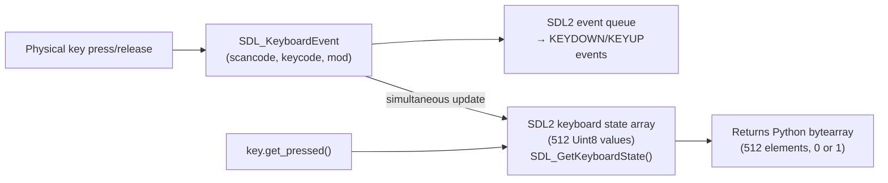
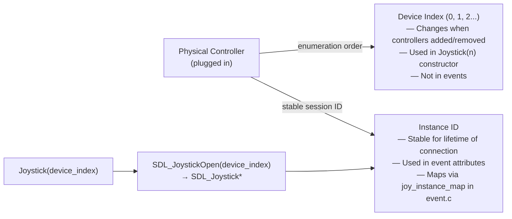

# Structure: `src_c/key.c` + `src_c/mouse.c` + `src_c/joystick.c`

**Type:** C Extension Modules  
**Compiled to:** `pygame.key`, `pygame.mouse`, `pygame.joystick`  
**Last reviewed:** 2026-04-05  

---

## `pygame.key` — Keyboard Input

### Purpose
Provides keyboard state querying and configuration. Works both via event polling and direct state reading.

### Public API

| Function | Description |
|---|---|
| `pygame.key.get_pressed()` | Returns array of 512 booleans, one per key. Index with `K_*` constants |
| `pygame.key.get_mods()` | Returns bitmask of currently held modifier keys |
| `pygame.key.set_mods(mods)` | Override modifier key state |
| `pygame.key.set_repeat(delay, interval)` | Configure key repeat: delay ms before first repeat, interval ms between repeats |
| `pygame.key.get_repeat()` | Returns `(delay, interval)` |
| `pygame.key.name(key)` | Returns string name for key constant (e.g., `"space"`, `"left shift"`) |
| `pygame.key.key_code(name)` | Returns key constant from string name |
| `pygame.key.start_text_input()` | Enable SDL2 text input mode (IME support) |
| `pygame.key.stop_text_input()` | Disable text input mode |
| `pygame.key.textinput_enabled()` | Returns True if text input mode is active |
| `pygame.key.set_text_input_rect(rect)` | Set IME composition box position |
| `pygame.key.get_focused()` | Returns True if pygame window has keyboard focus |

### Internal Architecture



**`get_pressed()` returns a snapshot** — it reflects the state at the moment of the call, not accumulated since last check. Must call `event.pump()` or `event.get()` periodically to update the state array.

### Key Constants

- **Keycode constants** (`K_*`): `K_a` through `K_z`, `K_0`-`K_9`, `K_RETURN`, `K_ESCAPE`, `K_SPACE`, `K_LEFT`, `K_RIGHT`, `K_UP`, `K_DOWN`, `K_F1`-`K_F12`, `K_LSHIFT`, `K_RSHIFT`, `K_LCTRL`, `K_RCTRL`, `K_LALT`, `K_RALT`, etc.
- **Scancode constants** (`KSCAN_*`): Physical key position, layout-independent. `KSCAN_A` is always the "A" physical position regardless of keyboard layout (AZERTY/QWERTY/etc.)
- **Modifier bitmask** (`KMOD_*`): `KMOD_SHIFT`, `KMOD_CTRL`, `KMOD_ALT`, `KMOD_META`, `KMOD_CAPS`, `KMOD_NUM`

### Text Input vs Key Events

- **`KEYDOWN` events**: Report physical key presses with a `key` code. Poor for text input (doesn't handle IME, dead keys, compose sequences).
- **`TEXTINPUT` events**: SDL2 text input events — report final committed Unicode characters after IME processing. Use these for text fields.
- Enable with `key.start_text_input()`. Disable when not needed (reduces IME overhead).

---

## `pygame.mouse` — Mouse Input

### Public API

| Function | Description |
|---|---|
| `pygame.mouse.get_pos()` | Returns `(x, y)` tuple of current mouse position |
| `pygame.mouse.get_rel()` | Returns `(dx, dy)` relative motion since last call |
| `pygame.mouse.get_pressed(num_buttons)` | Returns tuple of button states (default 3 buttons) |
| `pygame.mouse.set_pos(pos)` | Warp mouse cursor to position |
| `pygame.mouse.set_visible(bool)` | Show/hide mouse cursor |
| `pygame.mouse.get_visible()` | Returns cursor visibility |
| `pygame.mouse.get_focused()` | Returns True if window has mouse focus |
| `pygame.mouse.set_cursor(cursor)` | Set cursor appearance |
| `pygame.mouse.get_cursor()` | Get current cursor |
| `pygame.mouse.set_relative_mode(bool)` | Enable raw delta mode (mouse locked to window) |
| `pygame.mouse.get_relative_mode()` | Get relative mode state |

### Relative Mode

`set_relative_mode(True)` → `SDL_SetRelativeMouseMode(SDL_TRUE)`:
- Mouse cursor is hidden and locked to window center
- `MOUSEMOTION` events report raw delta (no bounds clamping)
- Ideal for FPS-style games with unlimited mouse movement
- `get_rel()` returns accumulated delta since last call

### `pygame.Cursor`

```python
# System cursor
cursor = pygame.Cursor(pygame.SYSTEM_CURSOR_ARROW)
cursor = pygame.Cursor(pygame.SYSTEM_CURSOR_HAND)

# Custom bitmap cursor (XBM format)
cursor = pygame.Cursor(size, hotspot, xormasks, andmasks)

# Custom color cursor from Surface
cursor = pygame.Cursor(hotspot, surface)
```

System cursor constants: `SYSTEM_CURSOR_ARROW`, `SYSTEM_CURSOR_IBEAM`, `SYSTEM_CURSOR_WAIT`, `SYSTEM_CURSOR_CROSSHAIR`, `SYSTEM_CURSOR_HAND`, `SYSTEM_CURSOR_NO`, etc.

### Mouse Button Constants

| Button ID | Physical Button |
|---|---|
| 1 | Left |
| 2 | Middle (scroll wheel click) |
| 3 | Right |
| 4 | X1 (back button) |
| 5 | X2 (forward button) |

`MOUSEWHEEL` events: `x` (horizontal scroll), `y` (vertical scroll). `y > 0` = scroll up, `y < 0` = scroll down.

---

## `pygame.joystick` — Gamepad / Joystick

### Purpose
Enumerate joysticks/gamepads and read their axes, buttons, hats, and balls. Works via events or direct state reading.

### Public API

```python
pygame.joystick.init()
pygame.joystick.quit()
pygame.joystick.get_init()
pygame.joystick.get_count()          # Number of connected joysticks

joy = pygame.joystick.Joystick(device_index)
```

### `pygame.joystick.Joystick` methods

| Method | Description |
|---|---|
| `init()` | Open this joystick |
| `quit()` | Close this joystick |
| `get_init()` | True if initialized |
| `get_id()` | Device index (0-based) |
| `get_instance_id()` | SDL2 instance ID (stable per-session) |
| `get_name()` | String name of the controller |
| `get_guid()` | Controller GUID string (unique per controller model) |
| `get_numaxes()` | Number of analog axes |
| `get_axis(axis_id)` | Axis value: float -1.0 to 1.0 |
| `get_numbuttons()` | Number of buttons |
| `get_button(button_id)` | Button state: 0 or 1 |
| `get_numhats()` | Number of POV hats |
| `get_hat(hat_id)` | Hat direction: `(x, y)` where x,y ∈ {-1, 0, 1} |
| `get_numballs()` | Number of trackballs |
| `get_ball(ball_id)` | Ball relative motion: `(dx, dy)` |
| `rumble(low_frequency, high_frequency, duration)` | Vibration feedback |
| `stop_rumble()` | Stop vibration |

### Instance ID vs Device Index



### Joystick Events

| Event | Key Attributes |
|---|---|
| `JOYAXISMOTION` | `instance_id`, `joy` (device_index), `axis`, `value` (-1.0 to 1.0) |
| `JOYBUTTONDOWN` | `instance_id`, `joy`, `button` |
| `JOYBUTTONUP` | `instance_id`, `joy`, `button` |
| `JOYHATMOTION` | `instance_id`, `joy`, `hat`, `value` (tuple) |
| `JOYBALLMOTION` | `instance_id`, `joy`, `ball`, `rel` (delta tuple) |
| `JOYDEVICEADDED` | `device_index` (use to create new Joystick) |
| `JOYDEVICEREMOVED` | `instance_id` |

### SDL2 Game Controller API

For standardized Xbox-layout mapping, use `pygame._sdl2.controller.Controller` instead of `Joystick`. It provides named axes (`AXIS_LEFTX`, `AXIS_RIGHTY`, etc.) and buttons (`BUTTON_A`, `BUTTON_B`, `BUTTON_X`, `BUTTON_Y`, `BUTTON_LEFTSHOULDER`, etc.) regardless of underlying hardware.

---

## Shared Notes

- All three modules (`key`, `mouse`, `joystick`) read from the **SDL2 event state** — they require `event.pump()` or `event.get()` to be called regularly to keep the state current.
- `key.get_focused()`, `mouse.get_focused()` return False when the window is minimized or another window is in front.
- On Wayland (Linux), `mouse.set_pos()` may not work as expected — Wayland restricts cursor warping from applications.
- Joystick axis values include **dead zones** from the hardware — tiny values (noise) even when the stick is centered. Game code should apply its own dead zone (e.g., `if abs(value) < 0.1: value = 0`).
