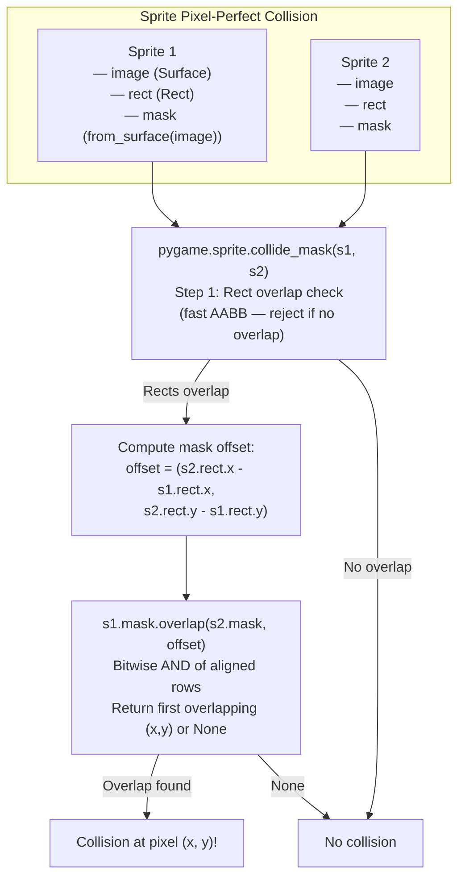
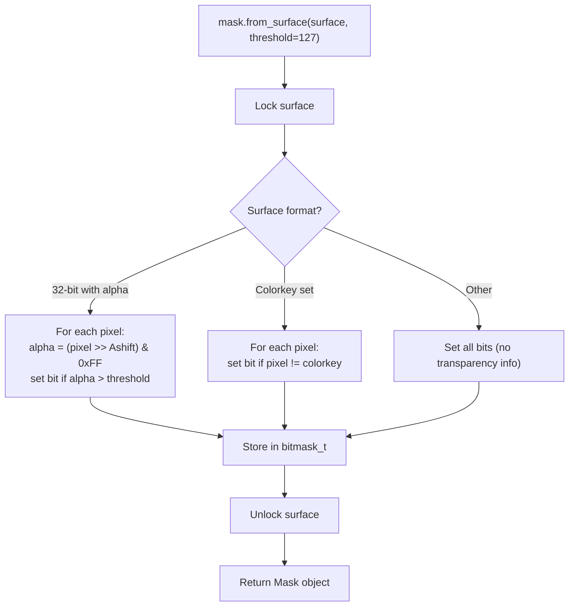
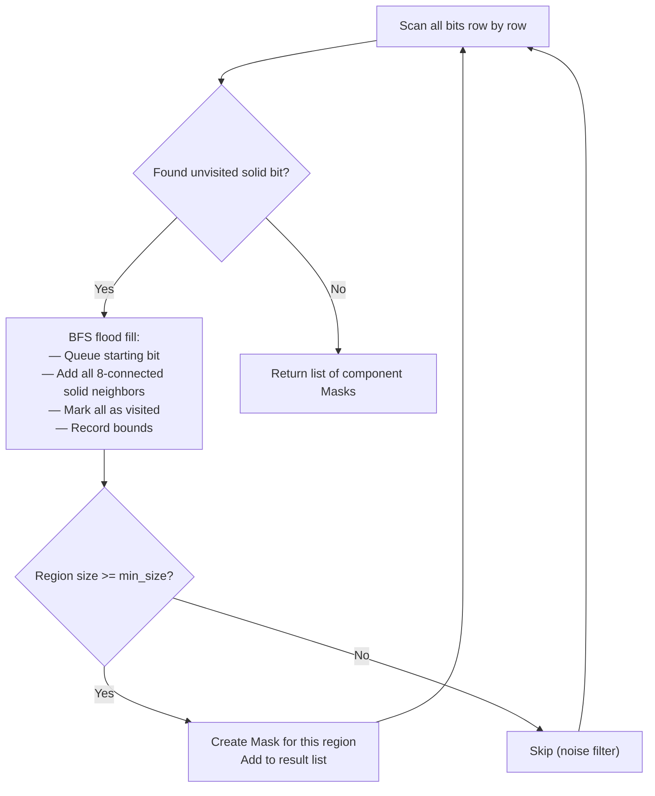

# Structure: `src_c/mask.c` + `src_c/bitmask.c` + `src_c/include/bitmask.h`

**Type:** C Extension Modules  
**Compiled to:** `pygame.mask` — exports `Mask` type  
**Lines:** mask.c ~2200, bitmask.c ~400  
**Last reviewed:** 2026-04-05  

---

## Purpose

`mask.c` implements **pixel-perfect collision detection** via bitmasks. A `Mask` is a 2D boolean grid where each bit represents whether the corresponding pixel is "solid" (1) or "empty" (0). Mask-to-mask overlap detection is extremely fast because it operates at the CPU word level (64 bits per operation).

`bitmask.c` implements the low-level bitmask operations — the actual bit manipulation layer used by mask.c.

---

## Public Python API — `pygame.mask`

### Module Functions

| Function | Description |
|---|---|
| `from_surface(surface, threshold)` | Create Mask from Surface: pixels with alpha > threshold are solid |
| `from_threshold(surface, color, threshold, other_surface, inverse)` | Create Mask based on color proximity |

### `pygame.mask.Mask`

```python
mask = pygame.mask.Mask((width, height), fill=False)
mask = pygame.mask.from_surface(surface)
```

| Method | Description |
|---|---|
| `get_size()` | Returns `(width, height)` |
| `get_rect(**kwargs)` | Returns bounding Rect (like Surface.get_rect) |
| `get_at(pos)` | Returns bit value at `(x, y)`: 1 or 0 |
| `set_at(pos, value)` | Set bit at `(x, y)` |
| `fill()` | Set all bits to 1 |
| `clear()` | Set all bits to 0 |
| `invert()` | Flip all bits |
| `scale(size)` | Return new Mask at new size (nearest-neighbour) |
| `draw(other_mask, offset)` | OR: set bits in self where other has 1 |
| `erase(other_mask, offset)` | AND NOT: clear bits in self where other has 1 |
| `count()` | Count of solid bits (Hamming weight / popcount) |
| `centroid()` | Returns `(x, y)` center of mass of solid bits |
| `angle()` | Returns angle of main axis (for elongated shapes) |
| `overlap(other, offset)` | Returns first overlapping point, or None |
| `overlap_area(other, offset)` | Count overlapping solid pixels |
| `overlap_mask(other, offset)` | Returns new Mask of the overlapping region |
| `connected_component(pos)` | Returns Mask of connected solid pixels containing pos |
| `connected_components(min_size)` | Returns list of Masks, one per connected region |
| `get_bounding_rects()` | Returns list of Rects — bounding rect per connected region |
| `to_surface(surface, setsurface, unsetsurface, setcolor, unsetcolor, dest)` | Draw mask onto a Surface |
| `convolve(other, output, offset)` | Convolve two masks (morphological operations) |

---

## `bitmask.c` — Low-Level Bit Operations

The core bitmask type:

```c
typedef struct bitmask {
    int w, h;           // width and height in pixels
    BITMASK_W *bits;    // flat array of machine words (unsigned long)
                        // each word holds BITMASK_W_LEN bits
} bitmask_t;

// BITMASK_W = unsigned long (32 or 64 bit depending on platform)
// BITMASK_W_LEN = sizeof(BITMASK_W) * 8  (32 or 64)
```

### Memory Layout

```
A Mask of width=10, height=3 stored as bitmask_t:

Row 0: [word0: bits 0-63 of row 0]  (only 10 bits used)
Row 1: [word0: bits 0-63 of row 1]
Row 2: [word0: bits 0-63 of row 2]

Each row is rounded up to the nearest machine word boundary.
Row stride = ceil(width / BITMASK_W_LEN) words
Total words = height × row_stride
```

### Key Operations

| Function | Algorithm |
|---|---|
| `bitmask_getbit(mask, x, y)` | `(mask->bits[y * stride + x/BITMASK_W_LEN] >> (x % BITMASK_W_LEN)) & 1` |
| `bitmask_setbit(mask, x, y)` | OR the appropriate bit |
| `bitmask_clearbit(mask, x, y)` | AND NOT the appropriate bit |
| `bitmask_overlap(a, b, xoffset, yoffset)` | Scan rows, AND words, early exit on first non-zero |
| `bitmask_overlap_area(a, b, xoffset, yoffset)` | Sum popcount of (a AND b) words |
| `bitmask_overlap_pos(a, b, xoffset, yoffset, x, y)` | Find position of first overlap bit |

---

## Collision Detection Architecture



---

## `from_surface` — Creating Masks from Images



---

## Connected Components

`mask.connected_components()` uses **flood fill** (BFS/DFS) to identify disconnected solid regions:



This is useful for:
- Detecting bullet holes / damage regions
- Pathfinding obstacle analysis
- Sprite sheet splitting
- Collision region refinement

---

## Dependencies

- **mask.c imports from:** `base.c`, `surface.c` (for `from_surface`), `rect.c`
- **bitmask.c:** No pygame imports (pure bit manipulation)
- **Depended on by:** `sprite.py` (`collide_mask` function)

---

## Known Quirks / Notes

- `overlap()` returns the **first overlapping pixel** in scan order (top-left first). This is deterministic but not the "deepest" or "most significant" collision point.
- Masks are created at a fixed size — they do NOT automatically resize if the source surface is transformed. Rebuild the mask after scaling/rotating.
- `from_surface(surface, threshold=127)` — the default threshold 127 means pixels with alpha ≤ 127 are transparent (not solid). Setting threshold=0 makes all non-fully-transparent pixels solid; threshold=255 makes only fully opaque pixels solid.
- `connected_component(pos)` with a position that has no solid bit returns an empty Mask (all zeros), not an error.
- `overlap_area()` and `overlap_mask()` are significantly slower than `overlap()` — they scan the entire overlapping region. Use `overlap()` first for early exit.
- The `angle()` method computes the principal axis angle using the second moment of area (like PCA). It returns 0 for circular or square masks where there's no dominant axis.
- `to_surface()` is new in pygame 2.x and is the correct way to debug masks — it renders solid bits as one color and empty bits as another. Previous approach was manual Surface iteration which is much slower.
