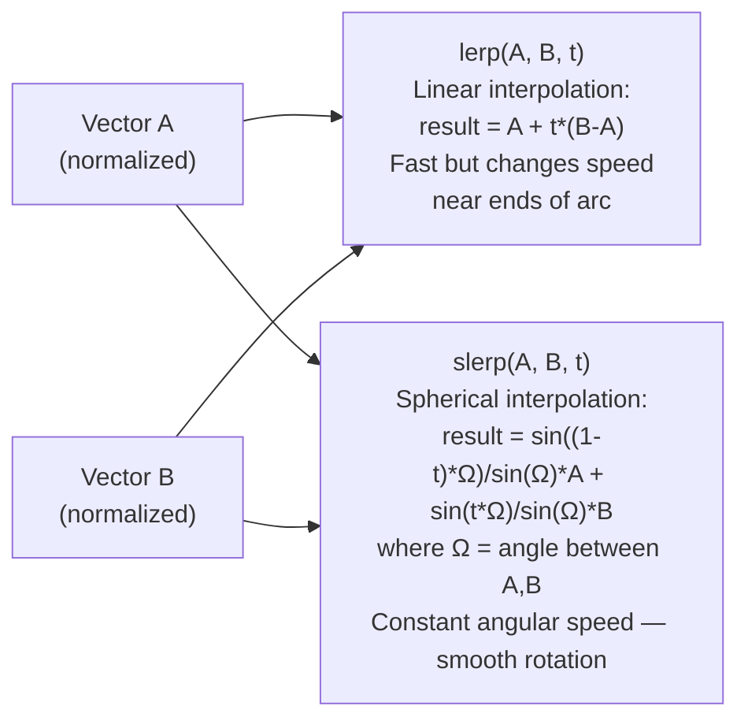

# Structure: `src_c/math.c`

**Type:** C Extension Module  
**Compiled to:** `pygame.math` — exports `Vector2`, `Vector3`, `Vector4`  
**Lines:** ~3000  
**Last reviewed:** 2026-04-05  

---

## Purpose

`math.c` provides **mathematical vector types** in C — `Vector2`, `Vector3`, and `Vector4`. These are fully-featured, mutable, iterable, pickleable Python objects optimized for 2D/3D game math.

All three types share a common C implementation layer with dimension-specific dispatching.

---

## Public Python API

### `pygame.math.Vector2`

```python
v = pygame.math.Vector2(x=0, y=0)
v = pygame.math.Vector2((x, y))
v = pygame.math.Vector2(scalar)  # both x and y = scalar
```

#### Attributes

| Attribute | Description |
|---|---|
| `x`, `y` | Component access |
| `xy`, `yx`, `xx`, `yy` | Swizzle access (returns Vector2) |

#### Methods

| Method | Description |
|---|---|
| `length()` | Euclidean length: `sqrt(x²+y²)` |
| `length_squared()` | `x²+y²` (no sqrt, fast) |
| `magnitude()` | Alias for length |
| `magnitude_squared()` | Alias for length_squared |
| `normalize()` | Return unit vector (length=1). Raises if zero vector |
| `normalize_ip()` | Normalize in-place |
| `is_normalized()` | True if length ≈ 1.0 (within epsilon) |
| `scale_to_length(length)` | Return vector scaled to given length |
| `reflect(normal)` | Return reflection of self across normal |
| `reflect_ip(normal)` | Reflect in-place |
| `distance_to(other)` | Euclidean distance to other vector |
| `distance_squared_to(other)` | Squared distance (fast, no sqrt) |
| `move_towards(target, max_dist)` | Return vector moved toward target by up to max_dist |
| `move_towards_ip(target, max_dist)` | Move in-place |
| `lerp(other, t)` | Linear interpolation. `t=0` = self, `t=1` = other |
| `slerp(other, t)` | Spherical linear interpolation (smooth direction change) |
| `elementwise()` | Returns proxy for per-component operations |
| `rotate(angle_deg)` | Return vector rotated CCW by angle degrees |
| `rotate_rad(angle_rad)` | Same but in radians |
| `rotate_ip(angle_deg)` | Rotate in-place |
| `rotate_ip_rad(angle_rad)` | Rotate in-place (radians) |
| `angle_to(other)` | Signed angle from self to other (degrees, CCW) |
| `as_polar()` | Returns `(r, phi)` — polar coordinates (r = length, phi = angle degrees) |
| `from_polar(r, phi)` | Set from polar coordinates |
| `project(other)` | Return projection of self onto other |
| `clamp_magnitude(min, max)` | Return vector with length clamped to range |
| `clamp_magnitude_ip(min, max)` | Clamp in-place |
| `dot(other)` | Scalar dot product |
| `cross(other)` | 2D cross product: scalar (z-component of 3D cross) |
| `update(x, y)` | Set components in-place |
| `copy()` | Return copy |

#### Operators

- `+`, `-`, `*`, `/`, `//`, `%` — with scalar or other vector
- `==`, `!=` — with epsilon tolerance
- `*` with scalar = scale, `*` with vector = elementwise multiply
- `abs(v)` → length
- `-v` → negation
- `len(v)` → 2 (always)
- `iter(v)` → yields x, y
- `v[0]`, `v[1]` — index access
- `bool(v)` → True if not zero vector

---

### `pygame.math.Vector3`

All Vector2 operations plus:

| Method | Description |
|---|---|
| `cross(other)` | True 3D cross product → Vector3 |
| `rotate(angle_deg, axis)` | Rotate around arbitrary axis |
| `rotate_rad(angle_rad, axis)` | Same in radians |
| `rotate_x(angle_deg)` / `rotate_x_rad` | Rotate around X axis |
| `rotate_y(angle_deg)` / `rotate_y_rad` | Rotate around Y axis |
| `rotate_z(angle_deg)` / `rotate_z_rad` | Rotate around Z axis |
| `rotate_ip(angle_deg, axis)` | Rotate in-place |
| `as_spherical()` | Returns `(r, theta, phi)` — spherical coordinates |
| `from_spherical(r, theta, phi)` | Set from spherical coordinates |

Swizzle: `v.xyz`, `v.xzy`, `v.zyx`, `v.xy`, `v.xz`, `v.yz`, etc.

---

### `pygame.math.Vector4`

Basic operations: `x, y, z, w` components, add, subtract, scale, dot product, length, normalize. No rotation methods (use Matrix4x4 when that's added in Viking Edition Phase 4C).

---

## Common Implementation Patterns

### Epsilon Comparison

All vector equality uses configurable epsilon tolerance:
```c
// Global epsilon (default 1e-6):
#define VECTOR_EPSILON 1e-6

bool vectors_equal(vec_a, vec_b):
    for each component i:
        if abs(a[i] - b[i]) > epsilon: return False
    return True
```

Access via `pygame.math.enable_swizzle_err()` and `pygame.math.Vector2.epsilon`.

### elementwise() Proxy

```python
v = Vector2(2, 3)
result = v.elementwise() * Vector2(4, 5)   # → Vector2(8, 15)
result = v.elementwise() ** 2              # → Vector2(4, 9)
result = v.elementwise() > 1              # → (True, True)
```

The elementwise proxy intercepts operators and applies them per-component rather than using scalar semantics.

### slerp vs lerp



---

## Pickling

All vector types support pickle. Implementation:
```python
# Vector2:
def __reduce__(self):
    return (Vector2, (self.x, self.y))
```

---

## Dependencies

- **Imports from:** `base.c` (error handling)
- **No other pygame deps** — standalone math types
- **Depended on by:** `sprite.py` (for position math), user game code, future `pygame.gl` (Phase 4A)

---

## Known Quirks / Notes

- `Vector2.rotate()` rotates **counter-clockwise** (mathematical convention) not clockwise (screen/compass convention). Screen y-axis points down, so visually on screen CCW rotation appears clockwise. Game code often uses `-angle` to get intuitive clockwise screen rotation.
- `slerp()` raises `ValueError` if angle between vectors is exactly 180° (degenerate case — undefined rotation axis). Handle with `try/except` or check `dot < -0.9999`.
- `normalize()` raises `ValueError` if called on the zero vector `(0, 0)`. Check `length_squared() > 0` before normalizing.
- `cross(other)` on Vector2 returns a **scalar** (the z-component of the 3D cross product), not a Vector. This is mathematically correct but surprising if you expect a Vector3.
- `elementwise()` returns a proxy object. Do not store it or call arbitrary Python on it — only use it in an expression context for the operation.
- `as_polar()` returns angle in degrees in the range `[-180, 180]`. `from_polar()` accepts any angle (normalizes internally).
- Vector math is **not validated** for NaN/Inf inputs. Passing NaN components produces NaN output silently — no exception is raised. In AI/physics systems, validate inputs at the boundary.
