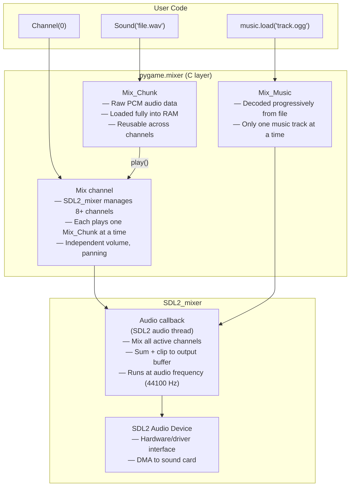
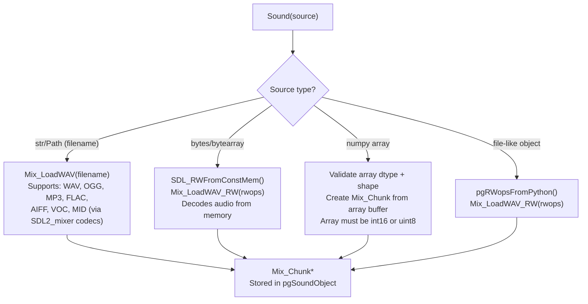
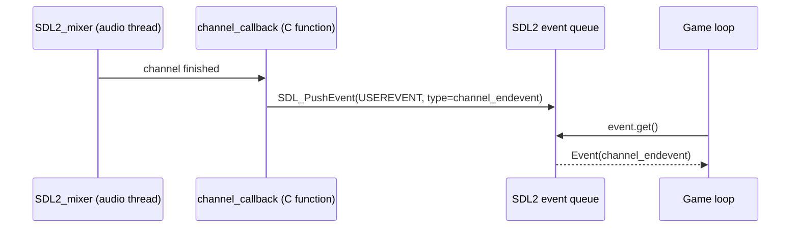

# Structure: `src_c/mixer.c` + `src_c/music.c` + `src_c/mixer.h`

**Type:** C Extension Modules  
**Compiled to:** `pygame.mixer` + `pygame.mixer.music`  
**Lines:** mixer.c ~1500, music.c ~700  
**Last reviewed:** 2026-04-05  

---

## Purpose

`mixer.c` implements the **sound mixing system** — loading audio samples, playing them on channels, controlling volume and panning, and mixing multiple sounds simultaneously. It wraps SDL2_mixer (Mix_* API).

`music.c` implements **streaming music playback** — long audio files (MP3, OGG, MOD) that are decoded progressively rather than loaded fully into memory. It operates as a sub-module: `pygame.mixer.music`.

---

## Public Python API — `pygame.mixer`

### Module-Level Functions

| Function | Description |
|---|---|
| `init(frequency, size, channels, buffer, devicename, allowedchanges)` | Initialize mixer. Defaults: 44100 Hz, -16 (signed 16-bit), 2 (stereo), 512 samples |
| `pre_init(frequency, size, channels, buffer, devicename, allowedchanges)` | Set defaults before automatic init |
| `quit()` | Shut down mixer |
| `get_init()` | Returns `(frequency, size, channels)` if initialized, else None |
| `stop()` | Stop all sounds on all channels |
| `pause()` | Pause all channels |
| `unpause()` | Resume all paused channels |
| `fadeout(time)` | Fade out all channels over `time` ms |
| `set_num_channels(count)` | Set number of mixing channels (default 8) |
| `get_num_channels()` | Get current channel count |
| `set_reserved(count)` | Reserve first N channels (not used by `Sound.play()`) |
| `find_channel(force)` | Find an idle channel, or oldest if force=True |
| `get_busy()` | Returns True if any channel is playing |
| `get_sdl_mixer_version(linked)` | Returns SDL2_mixer version tuple |

### `pygame.mixer.Sound`

```python
sound = pygame.mixer.Sound(filename_or_buffer_or_array)
```

| Method | Description |
|---|---|
| `play(loops, maxtime, fade_ms)` | Play on any available channel. Returns Channel |
| `stop()` | Stop on all channels where this Sound is playing |
| `fadeout(time)` | Fade out all instances |
| `set_volume(value)` | Set volume 0.0-1.0 for this Sound |
| `get_volume()` | Get volume |
| `get_num_channels()` | Count channels currently playing this Sound |
| `get_length()` | Duration in seconds |
| `get_raw()` | Return raw audio bytes as buffer |
| `get_buffer()` | Return BufferProxy of audio data |

### `pygame.mixer.Channel`

```python
ch = pygame.mixer.Channel(0)  # channel 0
ch = sound.play()             # returns the channel used
```

| Method | Description |
|---|---|
| `play(sound, loops, maxtime, fade_ms)` | Play Sound on this specific channel |
| `stop()` | Stop this channel |
| `pause()` | Pause this channel |
| `unpause()` | Resume this channel |
| `fadeout(time)` | Fade out this channel |
| `set_volume(left, right)` | Stereo panning: 0.0-1.0 per side |
| `get_volume()` | Get current volume |
| `get_busy()` | True if currently playing |
| `get_sound()` | Returns the Sound currently playing, or None |
| `queue(sound)` | Queue a Sound to play when current finishes |
| `get_queue()` | Returns queued Sound, or None |
| `set_endevent(event_type)` | Post event when channel finishes |
| `get_endevent()` | Get end event type |

---

## Public Python API — `pygame.mixer.music`

| Function | Description |
|---|---|
| `load(filename_or_fileobj)` | Load music file (replaces current music) |
| `unload()` | Unload current music, free memory |
| `play(loops, start, fade_ms)` | Start playing loaded music |
| `rewind()` | Jump to beginning |
| `stop()` | Stop music playback |
| `pause()` | Pause music |
| `unpause()` | Resume music |
| `fadeout(time)` | Fade out then stop |
| `set_volume(value)` | Set music volume 0.0-1.0 |
| `get_volume()` | Get music volume |
| `get_busy()` | True if music is playing |
| `set_pos(pos)` | Seek to position (seconds, or bytes for MOD) |
| `get_pos()` | Returns ms elapsed |
| `queue(filename)` | Queue next file to play after current |
| `set_endevent(event_type)` | Post event when music ends |
| `get_endevent()` | Get end event type |

---

## Audio Architecture



---

## Init Parameters

```python
pygame.mixer.init(
    frequency=44100,   # Sample rate in Hz (22050, 44100, 48000)
    size=-16,          # Sample format: 8=u8, -8=s8, 16=u16, -16=s16
    channels=2,        # 1=mono, 2=stereo, 4=quadraphonic, 6=5.1
    buffer=512,        # Buffer size in samples (power of 2; smaller=lower latency)
    devicename=None,   # Audio device name (None=default)
    allowedchanges=5   # SDL2 allowed format changes bitmask
)
```

**Latency formula:** `latency_ms = (buffer / frequency) * 1000`  
e.g. 512 samples / 44100 Hz × 1000 = ~11.6ms latency

---

## Sound Loading



---

## Channel End Events

When a channel finishes playing, if `set_endevent()` was called, SDL2_mixer's channel-finished callback fires. pygame hooks this via `Mix_ChannelFinished()`:



---

## `mixer.h` Internal Macros

```c
// Check mixer is initialized before any mixer operation
MIXER_INIT_CHECK()
// Expands to: if (!SDL_WasInit(SDL_INIT_AUDIO)) return RAISE(pgExc_SDLError, "mixer not initialized")

// Validate that a Sound object's Mix_Chunk is not NULL
CHECK_CHUNK_VALID(chunk, return_value)
```

---

## Slot API — What mixer.c Exports

| Slot | Symbol | Description |
|---|---|---|
| 0 | `pgSound_Type` | Sound Python type object |
| 1 | `pgChannel_Type` | Channel Python type object |
| 2 | `pgSound_New` | Create Sound from Mix_Chunk* |
| 3 | `pgChannel_New` | Create Channel from index |
| 4 | `pgMixer_AutoInit` | Called by pygame.init() to auto-init mixer |

---

## Dependencies

- **Imports from:** `base.c` (error, RegisterQuit), `pygame_mixer.h`
- **External:** SDL2_mixer (`Mix_OpenAudio`, `Mix_LoadWAV`, `Mix_PlayChannel`, etc.)
- **Depended on by:** `music.c` (sub-module), `sndarray.py`
- **Optional:** numpy (for array-based Sound creation)

---

## Known Quirks / Notes

- **One music track at a time.** `music.load()` replaces whatever was loaded. If you need multiple simultaneous music tracks, use regular Sound objects (they're loaded fully into RAM but can play on multiple channels simultaneously).
- **Buffer size trade-off:** Smaller buffer = lower latency but more CPU and risk of audio dropouts. 512 is a good default for most games. Set to 256 for more responsive audio feedback (e.g., rhythm games), 2048 if experiencing crackling on slow hardware.
- **`Sound.play(loops=-1)`** plays indefinitely. `loops=0` means play once. `loops=1` means play twice total (once + one repeat). The `loops` parameter is "extra repeats", not "total plays".
- **SDL2_mixer occupies the entire audio device.** You cannot simultaneously use `pygame.mixer` and `pygame._sdl2.audio` on the same audio device.
- **Music position seeking** with `music.set_pos()` works reliably for OGG Vorbis. For MP3, seek accuracy depends on the decoder. For tracker music (MOD/XM), the value is pattern order, not seconds.
- **`Sound.get_raw()`** returns a `memoryview` of the raw PCM bytes (16-bit signed integers for default -16 size format). This is useful for feeding audio to other systems (e.g., AI audio analysis).
- The `devicename` parameter in `init()` lets you target a specific audio output device by name — useful on systems with multiple audio interfaces (e.g., directing game audio to speakers while keeping headset for voice chat).
