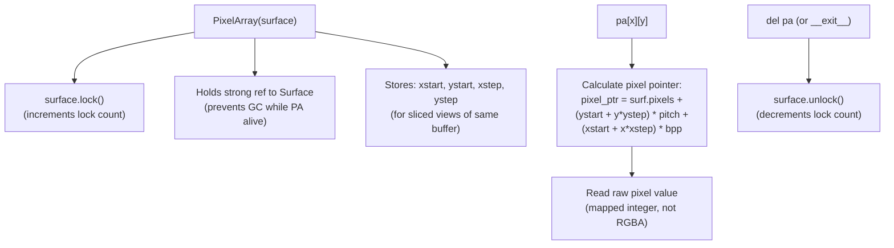

# Structure: Pixel Systems — `pixelarray.c`, `pixelcopy.c`, `bufferproxy.c`, `newbuffer.c`

**Type:** C Extension Modules  
**Compiled to:** `pygame.pixelarray`, `pygame.pixelcopy`, `pygame.bufferproxy`  
**Last reviewed:** 2026-04-05  

---

## Overview

Four interrelated modules that provide **direct pixel-level access** to Surface data. Each serves a different use case:

| Module | Use Case | Zero-Copy? | Numpy? |
|---|---|---|---|
| `PixelArray` | Interactive pixel editing, color replacement | Yes (locks surface) | No |
| `pixelcopy` | Fast bulk pixel data transfer | Yes or No | Yes |
| `BufferProxy` | Low-level buffer protocol access | Yes | Optional |
| `newbuffer` | numpy array interface compatibility shim | Yes | Yes |

---

## `pygame.pixelarray` — `pixelarray.c`

### Purpose
A 2D array interface to a Surface's pixel data. Supports slicing, color replacement, and per-pixel access. Keeps the surface locked while alive.

### Usage
```python
pa = pygame.PixelArray(surface)
pa[10][20] = surface.map_rgb(255, 0, 0)   # Set pixel to red
pa[::2] = surface.map_rgb(0, 255, 0)       # Set every other column to green

color = pa[10][20]                          # Get mapped pixel value (integer)

del pa  # IMPORTANT: unlock the surface!
# Or use as context manager:
with pygame.PixelArray(surface) as pa:
    pa[5][5] = surface.map_rgb(0, 0, 255)
```

### Slicing
```python
pa[x1:x2:step]          # Column slice → new PixelArray (subsection)
pa[x][y1:y2:step]       # Row slice of a column
pa[x1:x2, y1:y2]        # 2D slice → new PixelArray (sub-region)
```

### Methods

| Method | Description |
|---|---|
| `make_surface()` | Create a new Surface from the PixelArray data |
| `replace(color, repcolor, distance, weights)` | Replace pixels matching color (within distance) with repcolor |
| `extract(color, distance, weights)` | Return new black/white PixelArray (white where color matches) |
| `compare(other, distance, weights)` | Compare two PixelArrays, return white where different |
| `transpose()` | Swap x and y axes → new PixelArray |
| `close()` | Explicitly unlock and release (like del) |

### Internal Architecture



---

## `pygame.pixelcopy` — `pixelcopy.c`

### Purpose
Fast, format-aware bulk pixel data transfer between Surfaces and numpy arrays. More capable than surfarray — handles format conversion directly.

### Public API

```python
pygame.pixelcopy.surface_to_array(array, surface, kind, opaque, clear)
pygame.pixelcopy.array_to_surface(surface, array)
pygame.pixelcopy.map_array(surface, array, output)
pygame.pixelcopy.make_surface(array)
```

### `surface_to_array` — kind parameter

| kind | Output type | Description |
|---|---|---|
| `'P'` | uint (pixel) | Raw mapped pixel values (format-dependent) |
| `'R'` | uint8 | Red channel only |
| `'G'` | uint8 | Green channel only |
| `'B'` | uint8 | Blue channel only |
| `'A'` | uint8 | Alpha channel only |
| `'C'` | uint | Colorkey-mapped: 0=colorkey, pixel value otherwise |
| `'?'` | bool | True where pixel ≠ colorkey |

### `map_array`

Applies `Surface.map_rgb()` to every element of an input array (of shape [h, w, 3] or [h, w, 4] of uint8 RGBA), writing mapped pixel values to output array. Useful for converting numpy color arrays to Surface-compatible mapped values.

### `make_surface`

```python
# From a numpy array of shape (w, h) or (w, h, 3) or (w, h, 4):
surface = pygame.pixelcopy.make_surface(array)
```

Creates a new Surface and copies the array data into it.

---

## `pygame.bufferproxy` — `bufferproxy.c`

### Purpose
Implements the Python buffer protocol for Surface pixel data. Returned by `surface.get_buffer()` and `surface.get_view()`.

### Usage
```python
buf = surface.get_buffer()          # Raw bytes view
view = surface.get_view('2')        # 2D uint array view
view = surface.get_view('3')        # 3D RGBA array view

# Use with ctypes:
import ctypes
ptr = ctypes.cast(buf.raw, ctypes.POINTER(ctypes.c_uint8))

# Use with numpy:
import numpy
arr = numpy.frombuffer(buf, dtype=numpy.uint8)
```

### View Kinds

| kind | Shape | dtype | Description |
|---|---|---|---|
| `'0'` | (size_bytes,) | uint8 | Raw bytes |
| `'1'` | (width * height,) | uint | 1D pixel array |
| `'2'` | (width, height) | uint | 2D pixel array (mapped values) |
| `'3'` | (width, height, 3) | uint8 | 3D RGB array |
| `'r'`/`'g'`/`'b'`/`'a'` | (width, height) | uint8 | Single channel |

### Internal Structure

```c
typedef struct {
    PyObject_HEAD
    PyObject *dict;        // Extra attributes
    PyObject *weakrefs;    // Weak reference list
    Py_buffer view;        // Python buffer protocol struct
    PyObject *obj;         // The object being viewed (Surface)
    Uint8 *buf;            // Pointer to pixel data
    Py_ssize_t len;        // Buffer length in bytes
    int readonly;          // True if read-only view
} pgBufferProxyObject;
```

Holds a reference to the Surface and increments its lock count. Released when BufferProxy is deleted or `release()` called.

---

## `newbuffer.c`

Internal compatibility module (not publicly exported). Handles the numpy `__array_interface__` and `__array_struct__` protocols. Bridges pygame's `pg_buffer` type with numpy's older array interface for backward compatibility with pre-PEP-3118 code.

---

## `surfarray.py` (built on pixelcopy)

```python
# Zero-copy views (surface stays LOCKED until del):
arr = pygame.surfarray.pixels2d(surface)     # (w, h) uint, mapped values
arr = pygame.surfarray.pixels3d(surface)     # (w, h, 3) uint8, RGB
arr = pygame.surfarray.pixels_alpha(surface) # (w, h) uint8, alpha only
arr = pygame.surfarray.pixels_red(surface)   # (w, h) uint8, red only

# Copies (surface NOT locked):
arr = pygame.surfarray.array2d(surface)      # copy of pixels2d
arr = pygame.surfarray.array3d(surface)      # copy of pixels3d
arr = pygame.surfarray.array_alpha(surface)  # copy of pixels_alpha

# Write back:
pygame.surfarray.blit_array(surface, array)  # array → surface pixels
pygame.surfarray.map_array(surface, array, output)  # color map

# Create surface from array:
surface = pygame.surfarray.make_surface(array)
```

---

## Performance Comparison

```
Operation                    | Time for 1920×1080 surface
-----------------------------|---------------------------
surface.get_at() loop (slow) | ~45 seconds (Python loop)
PixelArray indexed loop      | ~12 seconds (C indexing)
surfarray.pixels3d + numpy   | ~0.5 seconds (SIMD numpy)
pixelcopy.surface_to_array   | ~0.2 seconds (optimized C)
surface.blit() blend mode    | ~0.016 seconds (SIMD blitter)
```

Use numpy/pixelcopy for bulk operations. Never use get_at()/set_at() in a loop.

---

## Known Quirks / Notes

- `PixelArray` **locks the surface** — you cannot blit to or from the surface while a PixelArray is alive. Always delete the PixelArray before blitting.
- `surfarray.pixels2d()` returns **mapped pixel values** — integers in the surface's native format (e.g., for a 32-bit ARGB surface, the value is `AARRGGBB`). Use `surface.unmap_rgb(value)` to convert to `(r, g, b, a)`.
- `surfarray.pixels3d()` requires a 24-bit or 32-bit surface (3 or 4 bytes per pixel). Raises `ValueError` on 8-bit or 16-bit surfaces.
- `pixelcopy.surface_to_array(arr, surface, 'A')` on a surface without per-pixel alpha (no SRCALPHA flag) returns an array of 255 (fully opaque). No error is raised.
- `surface.get_view('3')` on a surface without an alpha channel still returns a 3-channel view (RGB only). Getting `'a'` view on such a surface raises `ValueError`.
- All zero-copy views hold a lock on the surface. Forgetting to delete them (or not using `with` blocks) causes "cannot blit to locked surface" errors that appear far from the locking call — very confusing to debug.
