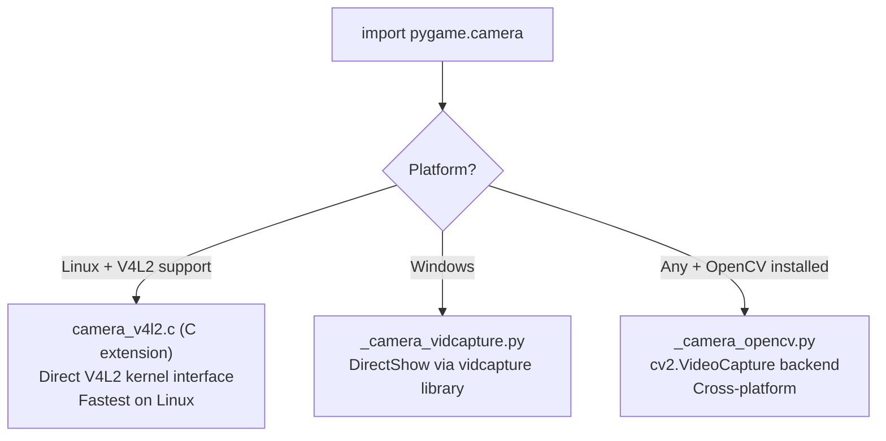

# Structure: Python-Side Modules — `src_py/`

**Covers:** `camera.py`, `colordict.py`, `cursors.py`, `draw_py.py`, `fastevent.py`,  
`freetype.py`, `ftfont.py`, `locals.py`, `macosx.py`, `midi.py`,  
`pkgdata.py`, `sndarray.py`, `surfarray.py`, `sysfont.py`, `threads/__init__.py`  
**Type:** Pure Python modules  
**Last reviewed:** 2026-04-05  

---

## `camera.py` — Camera Abstraction

### Purpose
Unified camera API that selects a backend based on platform and available libraries.

### Backend Selection



### Public API

```python
pygame.camera.init(backend=None)  # None = auto-detect
pygame.camera.quit()
pygame.camera.get_backends()       # List of available backends
pygame.camera.colorspace(surface, format, dest_surface)  # Color space conversion

cameras = pygame.camera.list_cameras()  # List connected camera devices

cam = pygame.camera.Camera(device, size, format)
cam.start()                        # Begin capture
cam.stop()                         # End capture
cam.get_image(dest_surface)        # Get latest frame as Surface
cam.query_image()                  # True if new frame available (non-blocking)
cam.get_size()                     # Returns (width, height) of capture
cam.set_controls(hflip, vflip, brightness)
cam.get_controls()
```

---

## `colordict.py` — Named Color Database

A single dict `THECOLORS` mapping 600+ color names to `(r, g, b, a)` tuples.

```python
from pygame.colordict import THECOLORS
THECOLORS["red"]        # → (255, 0, 0, 255)
THECOLORS["aliceblue"]  # → (240, 248, 255, 255)
THECOLORS["rebeccapurple"]  # → (102, 51, 153, 255)
```

Sourced from CSS3/X11 color names. Used by `pygame.Color("name")` lookup (imported via `PyImport` in `color.c`).

**Extension for Viking Edition:** Add Norse/runic themed color names (e.g., `"jormungandr"`, `"valhalla_gold"`, `"bifrost_blue"`).

---

## `cursors.py` — Cursor Shapes

Built-in cursor bitmaps and the `Cursor` class.

### Built-in Cursors

```python
pygame.cursors.arrow          # Standard arrow cursor (XBM format)
pygame.cursors.diamond        # Diamond shape
pygame.cursors.broken_x       # Broken X (for "invalid" state)
pygame.cursors.tri_left       # Left-pointing triangle
pygame.cursors.tri_right      # Right-pointing triangle
pygame.cursors.load_xbm(cursorfile, maskfile)  # Load XBM cursor file
```

### `pygame.Cursor`

```python
# System cursor:
cursor = pygame.Cursor(pygame.SYSTEM_CURSOR_ARROW)

# From Surface (color cursor):
cursor = pygame.Cursor((hotspot_x, hotspot_y), surface)

# From XBM bitmaps:
cursor = pygame.Cursor(size, hotspot, xormasks, andmasks)
```

Internally wraps `SDL_CreateSystemCursor()` or `SDL_CreateColorCursor()`.

---

## `draw_py.py` — Pure Python Drawing Fallback

A pure Python reimplementation of some `pygame.draw` functions — specifically `aaline()` and `aalines()`. Exists as:
- A reference implementation for correctness testing
- A fallback if the C extension is unavailable (very rare)
- Documentation by example of the algorithm

Not used in normal operation. The C `draw.c` implementation is always faster.

---

## `fastevent.py` — Thread-Safe Event Posting

```python
import pygame.fastevent
pygame.fastevent.init()
pygame.fastevent.post(event)  # Thread-safe event post
events = pygame.fastevent.get()  # Get all events (thread-safe)
event = pygame.fastevent.wait()  # Block until event (thread-safe)
event = pygame.fastevent.poll()  # Non-blocking get (thread-safe)
```

Wraps `SDL_PushEvent()` which SDL2 guarantees is thread-safe. Allows worker threads to communicate with the main game loop via events without race conditions.

**Usage pattern:**
```python
# Worker thread:
def background_task():
    result = do_heavy_computation()
    pygame.fastevent.post(pygame.event.Event(COMPUTE_DONE, result=result))

# Main thread game loop:
for event in pygame.event.get():
    if event.type == COMPUTE_DONE:
        handle_result(event.result)
```

---

## `freetype.py` — FreeType Python Bridge

A thin Python wrapper that sets up `pygame.freetype` with sensible defaults and provides the `SysFont()` function for freetype-based system fonts. Mostly delegates to `pygame.freetype` C extension.

```python
import pygame.freetype
pygame.freetype.init()
font = pygame.freetype.SysFont("Arial", 24)
```

---

## `ftfont.py` — pygame.font Compatibility Shim

Implements the exact `pygame.font.Font` API using the `pygame.freetype` backend. Drop-in replacement.

```python
# Activated by environment variable:
# os.environ["PYGAME_FREETYPE"] = "1"
# Then import pygame normally

# Or directly:
import pygame.ftfont as font
f = font.Font(None, 24)
surf = f.render("Hello", True, (255, 255, 255))
```

Translates `pygame.font` calls to `pygame.freetype` equivalents:
- `render(text, antialias, color, bgcolor)` → `freetype.Font.render(text, color, bgcolor)` with AA settings

---

## `locals.py` — Constants Re-Export

```python
from pygame.locals import *
```

Imports all constants from `pygame.constants` (C extension) and makes them available as module-level names. Exists for the common idiom of `from pygame.locals import *` to get `K_UP`, `QUIT`, `HWSURFACE`, etc. into the namespace.

Contains no code — just `from pygame.constants import *`.

---

## `macosx.py` — macOS-Specific Init

```python
# Called internally by pygame on macOS
pygame.macosx.init()    # Set up macOS dock icon, menu bar, app name
pygame.macosx.get_init()
```

Handles macOS-specific initialization:
- Sets the application name in the Dock
- Works with `sdlmain_osx.m` (Objective-C) for app lifecycle
- Needed for proper macOS behavior with Python apps

---

## `midi.py` — MIDI I/O

Full MIDI input/output via portmidi library.

```python
pygame.midi.init()
pygame.midi.quit()
pygame.midi.get_count()      # Number of MIDI devices
pygame.midi.get_device_info(device_id)  # Returns (interface, name, is_input, is_output, is_open)
pygame.midi.get_default_input_id()
pygame.midi.get_default_output_id()
pygame.midi.time()           # portmidi timer in ms

# Input:
input_dev = pygame.midi.Input(device_id, buffer_size=4096)
events = input_dev.read(num_events)  # Returns [(status, data1, data2, data3), timestamp] list
input_dev.close()

# Output:
output_dev = pygame.midi.Output(device_id, latency=0, buffer_size=4096)
output_dev.note_on(note, velocity, channel=0)
output_dev.note_off(note, velocity, channel=0)
output_dev.write_short(status, data1, data2)
output_dev.write(event_list)
output_dev.close()

# Utility:
pygame.midi.midis2events(midi_events, device_id)  # Convert MIDI data to pygame Events
pygame.midi.frequency_to_midi(freq)
pygame.midi.midi_to_frequency(midi_note)
pygame.midi.midi_to_ansi_note(midi_note)  # → "A4", "C#5", etc.
```

### MIDI Event Format

MIDI events from `Input.read()`:
```python
[[status, data1, data2, data3], timestamp_ms]
```
- `status`: MIDI status byte (0x80=note_off, 0x90=note_on, 0xB0=control, etc.)
- `data1`, `data2`, `data3`: Data bytes (meaning depends on status)
- `timestamp_ms`: portmidi timestamp

---

## `pkgdata.py` — Package Data Access

Internal utility for accessing pygame's bundled data files (fonts, icons):

```python
from pygame.pkgdata import getResource
font_file = getResource("freesansbold.ttf")  # Returns file-like object
icon_file = getResource("pygame_icon.bmp")
```

Handles finding data files whether pygame is installed as a regular package, inside a zip (py2exe), or as an egg.

---

## `sndarray.py` — numpy ↔ Sound Buffer Bridge

```python
import pygame.sndarray

# Zero-copy view of Sound's audio buffer:
arr = pygame.sndarray.samples(sound)        # numpy array, modifies Sound in-place
arr = pygame.sndarray.array(sound)          # numpy array copy
sound = pygame.sndarray.make_sound(array)   # Create Sound from numpy array
```

Array shape: `(num_samples,)` for mono, `(num_samples, 2)` for stereo.  
Dtype: `int16` (signed 16-bit, standard PCM format).

Useful for: audio visualization (FFT on samples), procedural audio synthesis, AI audio analysis.

---

## `threads/__init__.py` — Thread Utilities

Minimal threading utilities:

```python
pygame.threads.tmap(func, iterable, stop_on_error=True)
```

A parallel map implementation using Python threads. Applies `func` to each item in `iterable` in parallel. Used internally by some transform operations for parallelism on multi-core CPUs.

---

## `sysfont.py` — System Font Discovery

Platform-specific font enumeration:

```python
pygame.font.get_fonts()      # Returns list of available system font names (lowercase, no spaces)
pygame.font.match_font(name, bold=False, italic=False)  # Returns file path or None
pygame.font.SysFont(name, size, bold=False, italic=False)  # Returns pygame.font.Font
```

### Platform Implementation

| Platform | Method |
|---|---|
| Windows | Read `HKLM\SOFTWARE\Microsoft\Windows NT\CurrentVersion\Fonts` registry key |
| macOS | Scan `/System/Library/Fonts/`, `~/Library/Fonts/`, `/Library/Fonts/` |
| Linux | Run `fc-list` (fontconfig), parse output. Fallback: scan `/usr/share/fonts/` |

Font names are normalized (lowercase, spaces removed) for cross-platform portability.
`SysFont("Arial", 24)` on Windows finds Arial; on Linux finds the best available alternative.

---

## Known Quirks / Notes Across Python Modules

- `fastevent` must be initialized separately: `pygame.fastevent.init()`. The regular `pygame.init()` does NOT initialize it.
- `midi.py` requires the portmidi library — on many systems this is not installed by default. Check `pygame.midi.get_count()` — it raises `MidiException` if portmidi is unavailable.
- `sndarray.samples()` holds a lock on the Sound's audio buffer. Do not play the Sound while the array is alive (you'll hear corrupted audio). Use `sndarray.array()` (copy) for safe concurrent access.
- `sysfont.SysFont()` performs I/O at call time (reads registry/fontconfig). Cache the result; don't call it in the game loop.
- `camera.py` on macOS requires `PYGAME_CAMERA_MAC_BACKEND=videocapture` or OpenCV to be installed. Native macOS camera support via AVFoundation is not yet implemented.
