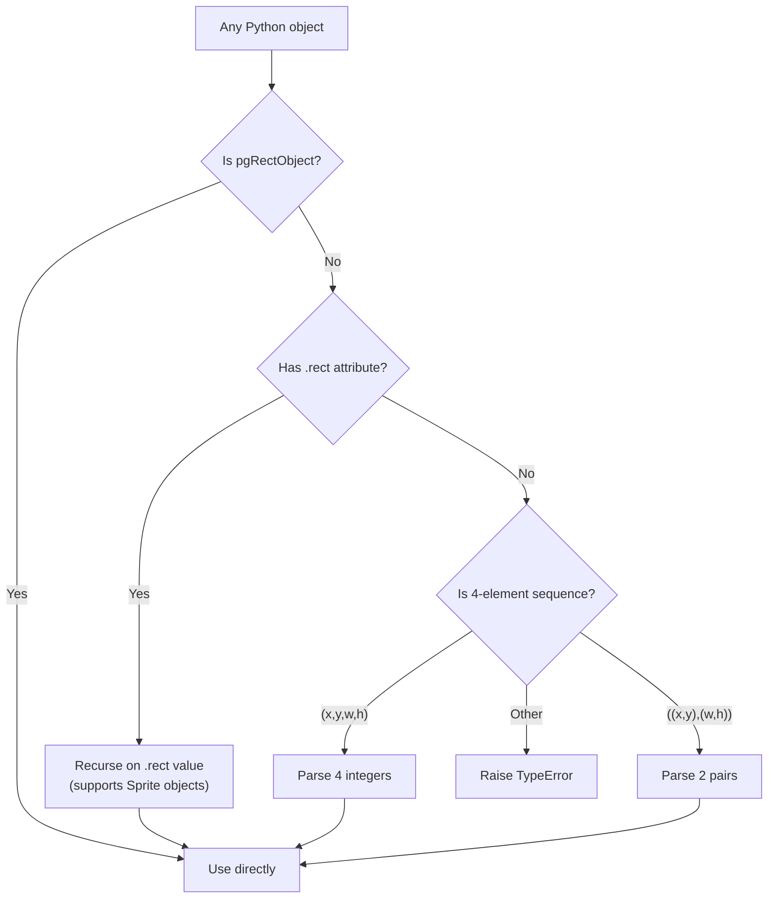
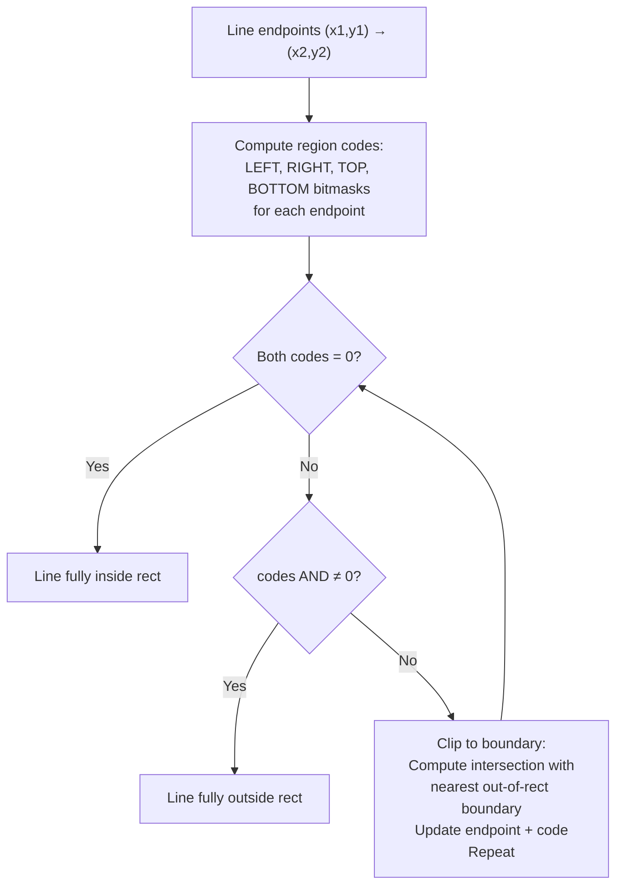

# Structure: `src_c/rect.c`

**Type:** C Extension Module  
**Compiled to:** `pygame.rect` — exports `Rect` type  
**Lines:** ~1400  
**Last reviewed:** 2026-04-05  

---

## Purpose

`rect.c` defines the **`Rect` Python type** — an axis-aligned bounding rectangle used throughout pygame for collision detection, surface areas, clipping regions, and drawing bounds. `Rect` objects are mutable, support rich comparison, are pickleable, and have a large set of convenience attributes.

---

## Public Python API — `pygame.Rect`

### Constructor

```python
Rect(left, top, width, height)
Rect((left, top), (width, height))
Rect((left, top, width, height))
Rect(rect_like_object)   # anything with .rect attribute
```

### Attributes (all readable and writable)

| Attribute | Description |
|---|---|
| `x`, `y` | Top-left corner position |
| `top`, `left`, `bottom`, `right` | Individual edge positions |
| `topleft`, `topright`, `bottomleft`, `bottomright` | Corner (x,y) tuples |
| `midtop`, `midbottom`, `midleft`, `midright` | Mid-edge (x,y) tuples |
| `center`, `centerx`, `centery` | Center point |
| `size` | `(width, height)` tuple |
| `width`, `height`, `w`, `h` | Dimensions |

Setting any position attribute moves the rect. Setting size attributes resizes from top-left.

### Methods

| Method | Description |
|---|---|
| `copy()` | Return a new identical Rect |
| `move(x, y)` | Return new Rect moved by offset |
| `move_ip(x, y)` | Move in-place |
| `inflate(x, y)` | Return new Rect expanded by x,y (centered) |
| `inflate_ip(x, y)` | Expand in-place |
| `scale_by(factor_x, factor_y)` | Return new Rect scaled by factors (centered) |
| `scale_by_ip(factor_x, factor_y)` | Scale in-place |
| `update(left, top, width, height)` | Set all values in-place |
| `clamp(other_rect)` | Return new Rect moved to fit inside other_rect |
| `clamp_ip(other_rect)` | Clamp in-place |
| `clip(other_rect)` | Return intersection, or zero-size Rect if no overlap |
| `clipline(x1, y1, x2, y2)` | Clip a line to this rect's bounds (Cohen-Sutherland) |
| `union(other_rect)` | Return new Rect that encloses both |
| `union_ip(other_rect)` | Union in-place |
| `unionall(rect_list)` | Return Rect enclosing self and all rects in list |
| `unionall_ip(rect_list)` | Unionall in-place |
| `fit(other_rect)` | Return new Rect scaled to fit inside other_rect, preserving aspect ratio |
| `normalize()` | Make width and height positive (handle negative sizes) |
| `contains(other_rect)` | True if other_rect is fully inside this rect |
| `collidepoint(x, y)` | True if point is inside rect |
| `colliderect(other_rect)` | True if rects overlap |
| `collidelist(rect_list)` | Return index of first colliding rect, or -1 |
| `collidelistall(rect_list)` | Return list of indices of all colliding rects |
| `collidedict(rect_dict, use_values)` | Return (key, value) of first colliding rect in dict |
| `collidedictall(rect_dict, use_values)` | Return list of (key, value) for all collisions |

---

## Internal C Struct

```c
typedef struct {
    PyObject_HEAD
    SDL_Rect r;    // x, y, w, h (int)
} pgRectObject;

// SDL_Rect is:
typedef struct {
    int x, y;
    int w, h;
} SDL_Rect;
```

All coordinates are **integers**. pygame does not have a float Rect — use tuples or `pygame.math.Vector2` for float positions and round when needed.

---

## Slot API — What rect.c Exports

| Slot | Symbol | Description |
|---|---|---|
| 0 | `pgRect_Type` | The Rect Python type object |
| 1 | `pgRect_New` | Create new Rect from (x, y, w, h) |
| 2 | `pgRect_New4` | Create new Rect from 4 ints |
| 3 | `pgRect_FromObject` | Parse any rect-like Python object into SDL_Rect* |
| 4 | `pgRect_Normalize` | Normalize negative dimensions in-place |

---

## `pgRect_FromObject` — Universal Rect Parsing

This is one of the most-called internal functions in all of pygame. It accepts:



---

## Collision Detection

### `collidepoint(x, y)`
```c
return (x >= r.x && x < r.x + r.w &&
        y >= r.y && y < r.y + r.h);
```
Note: **right and bottom edges are exclusive** (not inside the rect).

### `colliderect(other)`
```c
return !(other.x >= r.x + r.w || other.x + other.w <= r.x ||
         other.y >= r.y + r.h || other.y + other.h <= r.y);
```

### `clipline(x1, y1, x2, y2)` — Cohen-Sutherland



---

## `fit(other_rect)` — Aspect-Preserving Fit

Scales `self` to fit inside `other_rect` while preserving the aspect ratio of `self`:

```python
# Example: fit a 320x240 surface into a 1920x1080 window
rect = Rect(0, 0, 320, 240)
window = Rect(0, 0, 1920, 1080)
fitted = rect.fit(window)
# → Rect(0, 0, 1440, 1080)  (fits by height)
```

---

## Normalization

A Rect with negative width or height is "invalid" but representable. `normalize()` flips it:

```c
if (r.w < 0) { r.x += r.w; r.w = -r.w; }
if (r.h < 0) { r.y += r.h; r.h = -r.h; }
```

Many operations call `normalize()` internally before proceeding.

---

## Pickling

`Rect` supports `pickle` via `copyreg` (registered in `src_py/__init__.py`):
```python
copyreg.pickle(Rect, __rect_reduce, __rect_constructor)
# reduce: lambda r: (__rect_constructor, (r.x, r.y, r.w, r.h))
```

---

## Dependencies

- **Imports from:** `base.c` (error handling macros)
- **Depended on by:** Virtually all other modules — `surface.c`, `draw.c`, `display.c`, `image.c`, `transform.c`, `sprite.py`, `mask.c`, `event.c`

---

## Known Quirks / Notes

- Rect uses **integer coordinates only**. Float positions are truncated. For sub-pixel positioning, store position as a float Vector2 and round to Rect when needed.
- The **right and bottom edges are exclusive**: `Rect(0,0,10,10).right == 10`, but `Rect(0,0,10,10).collidepoint(10,10) == False`.
- Setting `rect.right = 100` moves the rect so the right edge is at x=100 (moves `rect.x`). It does NOT resize the rect.
- `rect.move(dx, dy)` returns a new Rect — use `move_ip()` for in-place.
- `colliderect()` with a zero-width or zero-height rect always returns False (zero-size rects don't collide with anything, including themselves).
- `collidelist()` and `collidelistall()` do a linear scan — O(n). For large sprite counts, use spatial hashing or pygame's Group collision functions which can be optimized.
- `Rect(0, 0, -10, -10)` is a valid object — it has `x=0, y=0, w=-10, h=-10`. Call `normalize()` before any geometric operation.
