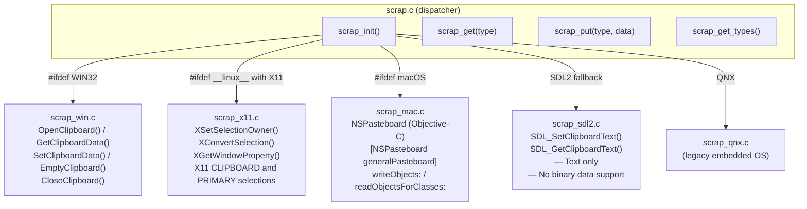

# Structure: `src_c/scrap.c` + platform implementations

**Type:** C Extension Module  
**Compiled to:** `pygame.scrap`  
**Implementation files:** `scrap_win.c`, `scrap_x11.c`, `scrap_mac.c`, `scrap_sdl2.c`, `scrap_qnx.c`  
**Last reviewed:** 2026-04-05  

---

## Purpose

`pygame.scrap` provides **clipboard access** — reading and writing text and binary data to/from the OS clipboard. Implemented separately per-platform via a thin `scrap.c` dispatcher.

---

## Public Python API

```python
pygame.scrap.init()
pygame.scrap.quit()
pygame.scrap.get_init()

data = pygame.scrap.get(type_string)          # Read from clipboard. Returns bytes or None
pygame.scrap.put(type_string, data)           # Write to clipboard
types = pygame.scrap.get_types()              # List available data types on clipboard
pygame.scrap.contains(type_string)            # True if clipboard has this type
pygame.scrap.lost()                           # True if we no longer own the clipboard
```

### Type Strings

The type string identifies the MIME type or platform format:
- `pygame.SCRAP_TEXT` = `"text/plain;charset=utf-8"` — plain text
- `pygame.SCRAP_BMP` = `"image/bmp"` — BMP image data
- `pygame.SCRAP_PBM` = `"image/pbm"` — PBM image data
- `pygame.SCRAP_PPM` = `"image/ppm"` — PPM image data
- Custom types: any string (e.g., `"application/x-mygamedata"`)

---

## Platform Architecture



---

## Platform Notes

### Windows (`scrap_win.c`)
- Uses Win32 `OpenClipboard()` / `SetClipboardData()` / `GetClipboardData()`
- Supports both text and binary clipboard formats
- Format IDs: `CF_TEXT`, `CF_UNICODETEXT`, `CF_DIB`, or registered custom formats via `RegisterClipboardFormat()`

### Linux X11 (`scrap_x11.c`)
- X11 clipboard uses a request/response protocol — clipboard owner keeps data until someone requests it
- `CLIPBOARD` selection (persistent, explicit copy) vs `PRIMARY` selection (auto-selected text)
- Getting clipboard data triggers an `XConvertSelection()` request and waiting for `SelectionNotify` event
- SDL2 window handle is needed (`pg_GetDefaultWindow()` → `SDL_GetWindowWMInfo()` → `XID`)
- **Does not work under Wayland** — falls back to SDL2 text-only path

### macOS (`scrap_mac.c`)
- Objective-C code in a `.c` file (using `@interface`/`@implementation`)
- NSPasteboard general pasteboard
- Handles `NSStringPboardType` for text, `NSTIFFPboardType` for images
- Modern macOS: `NSPasteboardTypeString`, `NSPasteboardTypeRTF`, etc.

### SDL2 Fallback (`scrap_sdl2.c`)
- `SDL_SetClipboardText()` / `SDL_GetClipboardText()` — **text only**
- No support for binary data, images, or custom formats
- Available everywhere but very limited

---

## Dependencies

- **Imports from:** `base.c` (error), `display.c` (needs window handle for X11)
- **Platform-specific:** Win32 API, X11, Objective-C NSPasteboard, SDL2
- **Depended on by:** Game code for copy/paste features (rare in games, common in game editors)

---

## Known Quirks / Notes

- `scrap.init()` must be called **after** `display.set_mode()` — it needs the SDL2 window handle to set up platform clipboard integration.
- `scrap.lost()` returns True when another application took clipboard ownership after we called `scrap.put()`. On X11, this is common since the clipboard is selection-based.
- The SDL2 fallback path (`scrap_sdl2.c`) only supports text. Calling `scrap.get(pygame.SCRAP_BMP)` on SDL2 fallback returns None even if there's bitmap data on the clipboard.
- Wayland users on Linux will get the SDL2 fallback, not the X11 implementation. This is a known limitation — SDL2's Wayland backend does support text clipboard but not arbitrary binary types.
- `scrap.get_types()` on X11 returns all format atoms available. On Windows it returns Win32 format names. The format strings are platform-specific except for `pygame.SCRAP_TEXT`.
