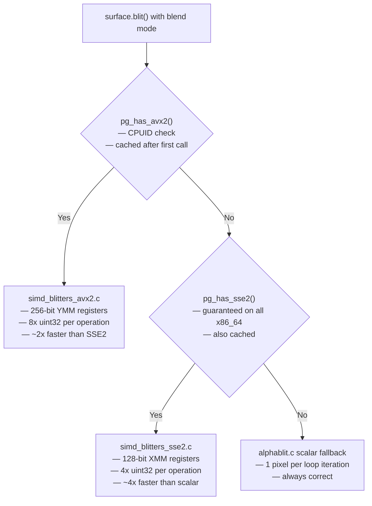

# Structure: SIMD Blitters — `simd_blitters_sse2.c`, `simd_blitters_avx2.c`, `simd_blitters.h`, `alphablit.c`

**Type:** C implementation files (compiled into `pygame.surface`)  
**Not a separate module** — these are compiled into surface.c's blend pipeline  
**Last reviewed:** 2026-04-05  

---

## Purpose

These files implement **CPU-accelerated pixel blending** using SIMD (Single Instruction Multiple Data) intrinsics. When a blit with a blend mode is requested and the CPU supports SIMD, these functions process 4–8 pixels per clock cycle instead of 1. This gives significant frame rate improvements for blend-heavy rendering (alpha compositing, particle systems, UI effects).

---

## File Responsibilities

| File | Purpose |
|---|---|
| `simd_blitters.h` | Shared declarations: function prototypes, runtime CPU detection |
| `simd_blitters_sse2.c` | SSE2 implementations (128-bit, 4 pixels/op, all x86_64 CPUs) |
| `simd_blitters_avx2.c` | AVX2 implementations (256-bit, 8 pixels/op, modern CPUs 2013+) |
| `alphablit.c` | Scalar C fallback + all blend mode reference implementations |
| `sse2neon.h` | SSE2 → ARM NEON translation header (for cross-compilation) |

---

## Runtime CPU Detection



---

## Blend Operations Accelerated

| Operation | SSE2 | AVX2 | Notes |
|---|---|---|---|
| Alpha blend (BLEND_RGBA) | ✓ | ✓ | Porter-Duff over |
| Add (BLEND_ADD) | ✓ | ✓ | Saturating add |
| Subtract (BLEND_SUB) | ✓ | ✓ | Saturating subtract |
| Multiply (BLEND_MULT) | ✓ | ✓ | Fixed-point multiply |
| Min/Max | ✗ | ✗ | Scalar only |
| Premultiplied alpha | ✓ | ✗ | SSE2 only |

---

## SSE2 Alpha Blend (Core Algorithm)

```c
// Process 4 pixels at once using 128-bit XMM registers
// Input: 4x uint32 source pixels, 4x uint32 dest pixels
// Output: 4x uint32 blended pixels

// Load 4 pixels:
__m128i src4 = _mm_loadu_si128(src_ptr);  // [A3R3G3B3 | A2R2G2B2 | A1R1G1B1 | A0R0G0B0]
__m128i dst4 = _mm_loadu_si128(dst_ptr);

// Unpack to 16-bit components (shuffle + zero-extend):
// Work in 16-bit to avoid overflow during multiply

// Alpha blend per component:
// result = (src_alpha * src_component + (255 - src_alpha) * dst_component) / 255
// Optimized: result = dst + (src_alpha * (src - dst) + 127) / 255

// Pack back to 8-bit:
__m128i result = _mm_packus_epi16(lo, hi);

// Write 4 pixels:
_mm_storeu_si128(dst_ptr, result);
```

---

## AVX2 Alpha Blend

Same algorithm as SSE2 but operates on 8 pixels simultaneously using 256-bit YMM registers. Requires `__attribute__((target("avx2")))` on GCC/Clang so the compiler generates AVX2 instructions even if the default target doesn't include AVX2.

---

## Compile Guards

```c
// In simd_blitters_sse2.c:
#if PG_COMPILE_SSE2  // defined in pgplatform.h when compiler supports it
#include <emmintrin.h>  // SSE2 intrinsics
// ... SSE2 functions
#endif

// In simd_blitters_avx2.c:
#if PG_COMPILE_AVX2
#include <immintrin.h>  // AVX2 intrinsics
// ... AVX2 functions
#endif
```

If compiled without SIMD support (e.g., on a non-x86 target), the function pointers in `simd_blitters.h` point to the scalar fallback. `pg_warn_simd_at_runtime_but_uncompiled()` emits a warning if the CPU supports SIMD but the binary wasn't compiled for it.

---

## `sse2neon.h` — ARM Cross-Compilation

A header that translates SSE2 intrinsic names to ARM NEON equivalents. Allows the SSE2 code to be compiled for ARM with minimal changes. Coverage is partial — the most common blending intrinsics are covered. Not all SSE2 instructions have exact NEON equivalents; some require emulation sequences.

For ARM-native optimization (Raspberry Pi 4/5), NEON-specific blit functions are needed (Phase 2C Viking Edition work).

---

## `alphablit.c` — Scalar Reference + Fallback

Contains:
- The complete scalar C implementation of all blend modes
- `pygame_AlphaBlit()` — main blit dispatcher (chooses SIMD or scalar)
- `pygame_Blit()` — outer blit wrapper (calls AlphaBlit for custom blend modes)
- Per-bit-depth specializations (8bpp, 16bpp, 24bpp, 32bpp paths)

The scalar code also serves as the **authoritative reference implementation** — the SIMD versions must produce identical results.

---

## Scale Operations

`scale_mmx.c`, `scale_mmx32.c`, `scale_mmx64.c`, `scale_mmx64_gcc.c`, `scale_mmx64_msvc.c`:
- Legacy MMX acceleration for `pygame.transform.scale()`
- 64-bit MMX (8 bytes per register)
- Separate GCC and MSVC variants (different inline assembly syntax)
- Superseded by the SSE2/AVX2 blitters for modern code but still present for compatibility

---

## Viking Edition Plan (Phase 2C — ARM/RPi Optimization)

For Raspberry Pi 4/5 (Cortex-A72/A76, ARMv8 with NEON):
- Write native NEON blit functions (not translated from SSE2 via sse2neon.h)
- Use `vld1q_u8` / `vst1q_u8` for 16-byte (4 pixel) loads/stores
- ARM NEON has different shuffle/permute semantics than SSE2 — native code will be faster
- Add `PG_COMPILE_NEON` check similar to SSE2/AVX2

---

## Notes

- SIMD code is highly sensitive to alignment. `_mm_loadu_si128` is used (unaligned load) rather than `_mm_load_si128` (requires 16-byte alignment) because Surface pixel buffers are not guaranteed aligned.
- The SIMD functions handle the "tail" (remaining pixels when count not divisible by 4/8) with a scalar loop.
- Profiling shows that on a modern CPU with AVX2, the SIMD blitters are 3-5x faster than the scalar path for large alpha-composited blits (e.g., particle systems with 1000+ blended sprites).
