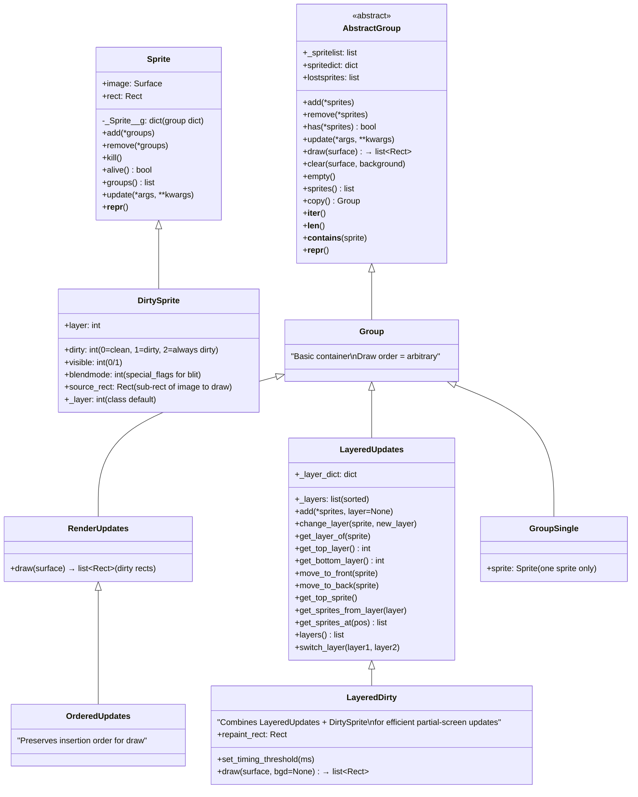
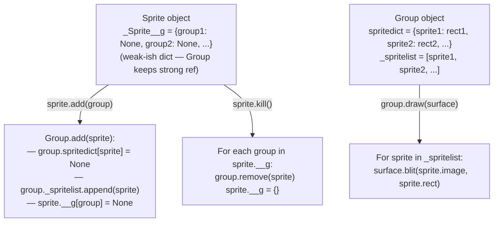

# Structure: `src_py/sprite.py`

**Type:** Pure Python module  
**Compiled to:** `pygame.sprite`  
**Lines:** ~1800  
**Last reviewed:** 2026-04-05  

---

## Purpose

`sprite.py` provides the **Sprite and Group system** — high-level game object management for collections of game entities. It implements container classes for sprites (game objects) that handle: batch drawing, batch updating, membership tracking, and collision detection.

This is pygame's closest thing to an object-oriented game entity system. All classes are pure Python — no C extension.

---

## Class Hierarchy



---

## Sprite ↔ Group Relationship



---

## `Group.draw()` Implementation

```python
def draw(self, surface):
    sprites = self.sprites()
    surface_blit = surface.blit
    # Batch blit call:
    for sprite in sprites:
        self.spritedict[sprite] = surface_blit(sprite.image, sprite.rect)
    # spritedict[sprite] = dirty rect returned by blit (for later clear())
    self.lostsprites = []
    dirty = self.lostsprites
    return dirty
```

`RenderUpdates.draw()` additionally collects and returns the list of dirty rects for use with `pygame.display.update(dirty_rects)` — enabling partial screen updates instead of full `flip()`.

---

## `Group.clear()` Implementation

```python
def clear(self, surface, background):
    # Erase sprites from their last-drawn positions:
    for sprite, rect in self.spritedict.items():
        if rect:
            surface.blit(background, rect, rect)
    # Also erase sprites that were removed since last draw:
    for rect in self.lostsprites:
        surface.blit(background, rect, rect)
```

`background` can be a Surface (the background image) or a callable `background(surface, rect)` for custom clearing.

---

## Collision Functions

All collision functions are module-level (not methods):

```python
# Single sprite vs group:
collided = pygame.sprite.spritecollide(sprite, group, dokill=False, collided_func=None)
# Returns list of sprites in group that collide with sprite

# Any collision (early exit):
hit = pygame.sprite.spritecollideany(sprite, group, collided_func=None)
# Returns first colliding sprite, or None

# Group vs group:
collisions = pygame.sprite.groupcollide(group1, group2, dokill1=False, dokill2=False, collided_func=None)
# Returns {sprite1: [colliding_sprites_from_group2], ...}
```

### Built-in Collision Functions (`collided_func` parameter)

| Function | Algorithm |
|---|---|
| `pygame.sprite.collide_rect` | Rect overlap (default) |
| `pygame.sprite.collide_rect_ratio(ratio)` | Returns collision func using scaled rect |
| `pygame.sprite.collide_circle` | Circle overlap using sprite.radius attribute |
| `pygame.sprite.collide_circle_ratio(ratio)` | Circle collision with scaled radius |
| `pygame.sprite.collide_mask` | Pixel-perfect via Mask (slow but exact) |

---

## `LayeredDirty` — Efficient Partial Updates

The most capable group class. Tracks:
- Which sprites changed since last draw (`dirty=1`)
- Which sprites are always redrawn (`dirty=2`)  
- Which sprites are invisible (`visible=0`)

Only redraws the minimum necessary pixels. For complex UIs or games with mostly static backgrounds, this can be significantly faster than full flip.

---

## `DirtySprite` Attributes

```python
class DirtySprite(Sprite):
    dirty = 1        # 0=clean, 1=needs redraw, 2=always redraw
    visible = 1      # 0=skip draw, 1=draw normally
    blendmode = 0    # special_flags for blit (e.g., BLEND_ADD)
    source_rect = None  # Sub-rect of sprite.image to blit (None = whole image)
    _layer = 0       # Default layer for new instances
```

---

## Cython Optimization (`src_c/cython/pygame/_sprite.pyx`)

A Cython-compiled version of the innermost sprite/group logic for performance. When compiled, it replaces the pure Python implementation for the hot paths (add/remove/draw/collide). The Python version remains as a fallback.

---

## Dependencies

- **Imports:** `pygame.surface` (for Surface blit), `pygame.rect` (for Rect), `pygame.mask` (for collide_mask)
- **No C extension dependency** beyond imported pygame modules
- **Depended on by:** Most game code, `pygame._sdl2.video` (Texture sprites)

---

## Known Quirks / Notes

- `sprite.kill()` removes the sprite from all its groups but does **not** delete the sprite object. It's safe to call `kill()` during group iteration — the sprite is just marked as leaving.
- `group.draw()` uses `surface.blit()` which **does not** handle `sprite.visible=0`. Only `LayeredDirty.draw()` respects the `visible` attribute. If you use regular Group, invisible sprites must be removed from the group.
- `spritecollide()` with `dokill=True` calls `sprite.kill()` on colliding sprites. This modifies the group during what might feel like iteration — but the implementation handles this safely.
- `groupcollide()` returns a dict where keys are sprites from group1, values are lists of colliding sprites from group2. Only sprites that have at least one collision appear in the dict.
- `collide_mask` requires both sprites to have a `mask` attribute. Create it via `sprite.mask = pygame.mask.from_surface(sprite.image)`. It's expensive — build masks at load time, not every frame.
- The sprite/group membership tracking uses plain Python dicts, so adding/removing/checking is O(1) amortized. Group iteration order depends on insertion order (Python 3.7+ dicts preserve insertion order).
