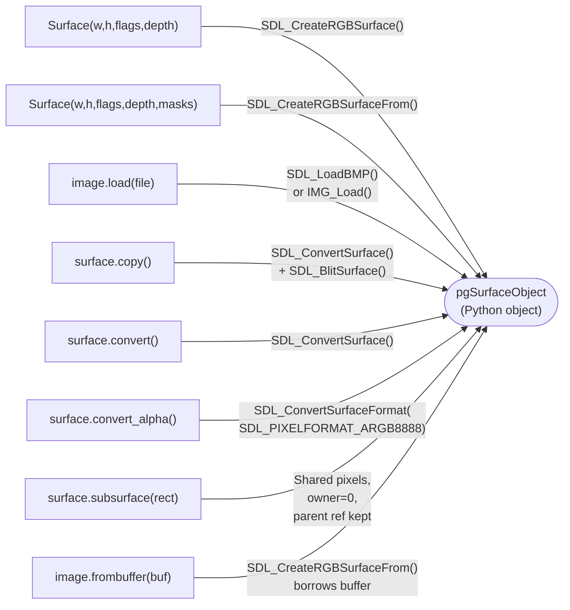
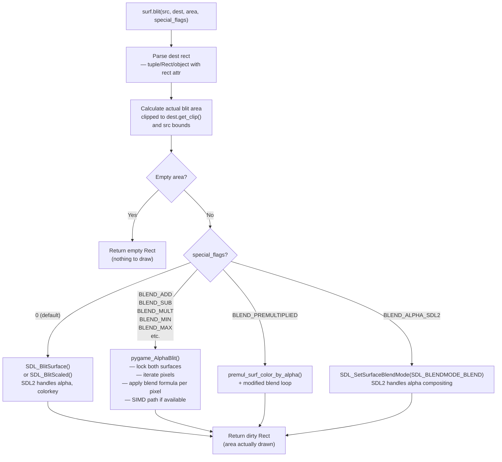
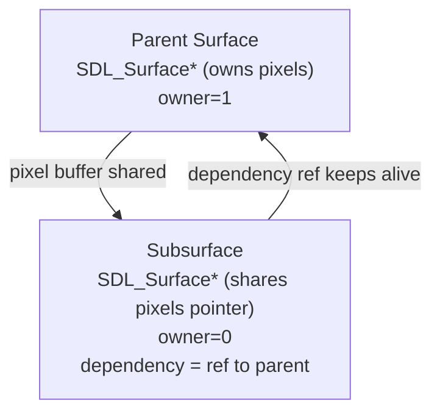

# Structure: `src_c/surface.c` + `src_c/surface.h`

**Type:** C Extension Module + Header  
**Compiled to:** `pygame.surface` (Surface type), also exports to all other modules via Slot API  
**Lines:** surface.c ~3500, surface.h ~360  
**Last reviewed:** 2026-04-05  

---

## Purpose

`surface.c` defines the **`Surface` Python type** — the central data type of all pygame. A Surface is a pixel buffer: a rectangular array of pixels with a specific format, held in CPU RAM and optionally locked.

Almost every pygame operation either takes a Surface as input or produces one as output. The entire rendering pipeline flows through Surface objects.

---

## Public Python API — `pygame.Surface`

### Constructor

```python
Surface(size, flags=0, depth=0, masks=None)
Surface(size, flags=0, surface=None)  # copy format from another Surface
```

### Instance Methods

| Method | Description |
|---|---|
| `blit(source, dest, area, special_flags)` | Copy source surface onto this surface |
| `blits(blit_list, doreturn)` | Batch blit: list of `(surface, dest)` or `(surface, dest, area)` |
| `convert(surface_or_depth)` | Return new surface with different pixel format |
| `convert_alpha(surface)` | Return new surface with per-pixel alpha (32-bit) |
| `copy()` | Return an identical copy |
| `fill(color, rect, special_flags)` | Fill entire surface or rect with a color |
| `scroll(dx, dy)` | Shift pixels in-place |
| `set_colorkey(color, flags)` | Set transparent color for blit (colorkey) |
| `get_colorkey()` | Get current colorkey |
| `set_alpha(value, flags)` | Set per-surface alpha value (0-255) |
| `get_alpha()` | Get current surface alpha |
| `lock()` | Lock pixel buffer for direct access |
| `unlock()` | Unlock pixel buffer |
| `mustlock()` | Returns True if surface must be locked before pixel access |
| `get_locked()` | Returns True if currently locked |
| `get_locks()` | Returns tuple of objects that are locking this surface |
| `get_at(xy)` | Get pixel color at (x, y) → Color |
| `set_at(xy, color)` | Set pixel color at (x, y) |
| `get_at_mapped(xy)` | Get raw mapped pixel value at (x, y) |
| `map_rgb(r, g, b, a)` | Map RGBA to integer pixel value for this surface's format |
| `unmap_rgb(pixel)` | Unmap pixel integer to (r, g, b, a) Color |
| `set_clip(rect)` | Set clipping rectangle (all drawing clipped to this) |
| `get_clip()` | Get current clip rectangle |
| `get_rect(**kwargs)` | Get bounding Rect, with optional anchor kwargs |
| `get_width()` | Surface width in pixels |
| `get_height()` | Surface height in pixels |
| `get_size()` | `(width, height)` tuple |
| `get_bitsize()` | Bits per pixel |
| `get_bytesize()` | Bytes per pixel |
| `get_flags()` | SDL surface flags |
| `get_pitch()` | Bytes per row (may include padding) |
| `get_masks()` | `(R, G, B, A)` bitmask tuple |
| `get_shifts()` | `(R, G, B, A)` bit shift tuple |
| `get_losses()` | `(R, G, B, A)` precision loss tuple |
| `get_bounding_rect(min_alpha)` | Smallest rect containing non-transparent pixels |
| `get_buffer()` | Returns BufferProxy of pixel data |
| `get_view(kind)` | Returns BufferProxy view ('0'=raw, '1'=uint row, '2'=2D array, '3'=3D RGBA) |
| `subsurface(rect)` | Return a Surface sharing pixel data with parent (zero-copy sub-region) |
| `premul_alpha()` | Return new surface with premultiplied alpha |

---

## The `pgSurfaceObject` C Struct

```c
typedef struct {
    PyObject_HEAD
    SDL_Surface *surf;          // The actual SDL pixel buffer
    int owner;                  // 1 = we own surf, 0 = borrowed (subsurface)
    struct pgSubSurface_Data *subsurface;  // Subsurface parent link
    PyObject *weakreflist;      // Python weak references
    PyObject *locklist;         // Objects locking this surface (PixelArray, etc.)
    PyObject *dependency;       // Parent Surface (for subsurfaces, keeps parent alive)
    int dirty;                  // Dirty flag for display update tracking
} pgSurfaceObject;
```

---

## Surface Creation Paths



---

## Blit Pipeline



---

## Blend Mode Constants (surface.h)

| Constant | Value | Operation |
|---|---|---|
| `PYGAME_BLEND_ADD` | 0x1 | `dst = min(dst + src, 255)` |
| `PYGAME_BLEND_SUB` | 0x2 | `dst = max(dst - src, 0)` |
| `PYGAME_BLEND_MULT` | 0x3 | `dst = (dst * src + 255) >> 8` |
| `PYGAME_BLEND_MIN` | 0x4 | `dst = min(dst, src)` |
| `PYGAME_BLEND_MAX` | 0x5 | `dst = max(dst, src)` |
| `PYGAME_BLEND_RGBA_ADD` | 0x6 | Same but includes alpha channel |
| `PYGAME_BLEND_RGBA_SUB` | 0x7 | Same but includes alpha channel |
| `PYGAME_BLEND_RGBA_MULT` | 0x8 | Same but includes alpha channel |
| `PYGAME_BLEND_RGBA_MIN` | 0x9 | Same but includes alpha channel |
| `PYGAME_BLEND_RGBA_MAX` | 0x10 | Same but includes alpha channel |
| `PYGAME_BLEND_PREMULTIPLIED` | 0x11 | Premultiplied alpha composite |
| `PYGAME_BLEND_ALPHA_SDL2` | 0x12 | Use SDL2 native alpha blend |

---

## Pixel Format Macros (surface.h)

These macros are used everywhere in the codebase for reading/writing pixel data:

```c
// Read a pixel from a pointer, handling 2/3/4 bpp
GET_PIXEL(pxl, bpp, source)

// Extract RGBA components using SDL format
GET_PIXELVALS(sR, sG, sB, sA, px, fmt, has_per_pixel_alpha)

// Write a pixel back to a pointer
CREATE_PIXEL(buf, r, g, b, a, bpp, format)

// Alpha blend component: sC over dC with alpha sA
ALPHA_BLEND_COMP(sC, dC, sA)

// Full RGBA alpha blend macro (Porter-Duff over)
ALPHA_BLEND(sR, sG, sB, sA, dR, dG, dB, dA)

// Duff's device loop unrolling (performance)
LOOP_UNROLLED4(code, n, width)
```

---

## Locking

Some operations require locking the surface before accessing pixel data. Surfaces backed by special memory (GPU, shared) may need `SDL_LockSurface()`.

```mermaid
flowchart TD
    LOCK["surface.lock()"]
    LOCK --> MUST{mustlock()?}
    MUST -->|Yes| SDL_LOCK["SDL_LockSurface(surf)\n— guarantees pixel buffer is accessible"]
    MUST -->|No| NOP["No-op (regular surfaces\nare always accessible)"]
    SDL_LOCK --> INCREMENT["lock_count++\nAdd locking object to locklist"]
    NOP --> INCREMENT

    UNLOCK["surface.unlock()"]
    UNLOCK --> DECREMENT["lock_count--\nRemove from locklist"]
    DECREMENT --> ZERO{lock_count == 0?}
    ZERO -->|Yes| SDL_UNLOCK["SDL_UnlockSurface(surf)"]
    ZERO -->|No| STILL_LOCKED["Still locked by other code"]
```

**What locks surfaces:** PixelArray, surfarray.pixels2d(), surfarray.pixels_alpha(), explicit lock() calls.

---

## Subsurfaces

A subsurface shares pixel data with its parent — no copy is made:



- Writing to a subsurface writes to the parent's pixel buffer
- Parent cannot be garbage collected while any subsurface holds a reference to it
- Subsurface's clip rect is in parent coordinates, intersected with parent's bounds

---

## Slot API — What surface.c Exports

| Slot | Symbol | Description |
|---|---|---|
| 0 | `pgSurface_Type` | The Surface Python type object |
| 1 | `pgSurface_New` | Create a new pgSurfaceObject from SDL_Surface* |
| 2 | `pgSurface_NewNoOwn` | Create Surface without taking ownership |
| 3 | `pgSurface_Blit` | C-level blit (used by display.c) |
| 4 | `pgSurface_Lock` | Lock a surface (C-callable) |
| 5 | `pgSurface_Unlock` | Unlock a surface (C-callable) |
| 6 | `pgSurface_Check` | Type check: is this a Surface? |

---

## Dependencies

- **Imports from:** `base.c` (error, RegisterQuit, buffer protocol), `rect.c` (pgRect_FromObject), `color.c` (pgColor_FromObj)
- **Depended on by:** `display.c`, `draw.c`, `transform.c`, `image.c`, `imageext.c`, `font.c`, `_freetype.c`, `mask.c`, `pixelarray.c`, `pixelcopy.c`, `bufferproxy.c`, `gfxdraw.c`, `_sdl2/video.pyx`
- **SDL2:** `SDL_Surface`, `SDL_BlitSurface`, `SDL_ConvertSurface`, `SDL_LockSurface`, `SDL_FillRect`

---

## Key Internal Functions

| Function | Purpose |
|---|---|
| `pgSurface_New(SDL_Surface *)` | Wrap an SDL_Surface* in a Python Surface object |
| `pgSurface_Blit(dst, src, dstrect, srcrect, blend)` | C-level blit, called from display flip |
| `pygame_AlphaBlit(src, srcrect, dst, dstrect, args)` | Custom blend mode blit loop |
| `pygame_Blit(src, srcrect, dst, dstrect, args)` | Main blit dispatcher (chooses SDL vs custom path) |
| `surface_fill_blend(surface, rect, color, blendargs)` | Fill with blend mode |
| `surface_respect_clip_rect(surface, rect)` | Clip a rect to the surface's clip rect |
| `premul_surf_color_by_alpha(src, dst)` | Premultiply surface pixels by their alpha values |

---

## Known Quirks / Notes

- `surface.get_at()` and `surface.set_at()` are **very slow** — they lock/unlock the surface for every single pixel. For bulk pixel operations, use `surfarray`, `pixelarray`, or `pixelcopy`.
- `surface.convert()` without arguments uses the display surface's format — must be called after `display.set_mode()` or it raises an error.
- `convert_alpha()` always produces `SDL_PIXELFORMAT_ARGB8888` (32-bit). This is the only format that reliably supports per-pixel alpha blending in pygame.
- The `SRCCOLORKEY` flag (colorkey transparency) and per-pixel alpha (`SRCALPHA`) are mutually exclusive on 32-bit surfaces — colorkey is ignored when SRCALPHA is active.
- `surface.scroll()` is an in-place pixel shift. There is no bounds checking for the shift amount — scrolling by an amount larger than the surface dimension results in the surface being cleared (effectively filled with black/transparent).
- Subsurfaces do not have their own clip rect unless explicitly set — they inherit the parent's coordinate space.
