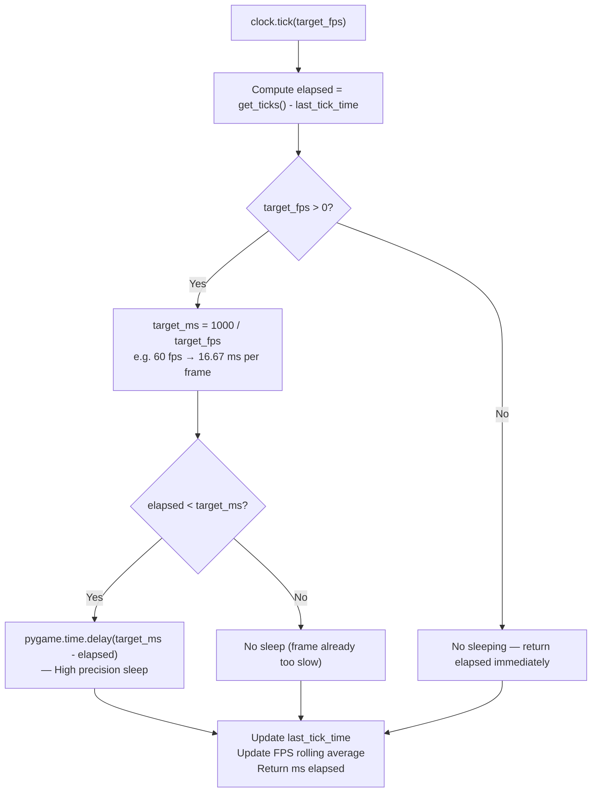

# Structure: `src_c/time.c`

**Type:** C Extension Module  
**Compiled to:** `pygame.time`  
**Lines:** ~500  
**Last reviewed:** 2026-04-05  

---

## Purpose

`time.c` provides **timing and frame rate management** — querying elapsed time, sleeping, frame-rate capping, and timer-based events. Built on SDL2's timer subsystem.

---

## Public Python API — `pygame.time`

| Function | Description |
|---|---|
| `pygame.time.get_ticks()` | Milliseconds since `pygame.init()`. Uses `SDL_GetTicks64()` (no rollover) |
| `pygame.time.wait(milliseconds)` | Sleep for at least N ms. Blocks the thread. Returns actual time waited |
| `pygame.time.delay(milliseconds)` | Like wait() but uses CPU spinning for high precision (no OS scheduling slop). Returns actual time |
| `pygame.time.set_timer(event, millis, loops)` | Post event every N ms. `loops=0` = repeat forever. `millis=0` = cancel |
| `pygame.time.Clock()` | Create a Clock object for frame timing |

---

## `pygame.time.Clock`

```python
clock = pygame.time.Clock()
```

| Method | Description |
|---|---|
| `tick(framerate=0)` | Cap frame rate to framerate FPS. Returns ms elapsed since last tick. `framerate=0` = no cap |
| `tick_busy_loop(framerate=0)` | Like tick() but uses CPU spinning for precision |
| `get_time()` | Returns ms between last two tick() calls |
| `get_rawtime()` | Returns ms actually spent in game logic (excludes delay) |
| `get_fps()` | Returns current FPS as float (rolling average) |

---

## Frame Timing Architecture



**FPS rolling average:** Clock maintains a rolling window of recent frame times and computes an exponential moving average. `get_fps()` is smoothed — it doesn't jitter every frame.

---

## Timer Events

```python
# Post pygame.USEREVENT every 1000ms (forever):
pygame.time.set_timer(pygame.USEREVENT, 1000)

# Post a custom event type every 500ms, 3 times then stop:
pygame.time.set_timer(my_event_type, 500, loops=3)

# Cancel timer for a specific event type:
pygame.time.set_timer(pygame.USEREVENT, 0)
```

Internal implementation:
- Uses `SDL_AddTimer()` callback
- Callback posts `SDL_UserEvent` to SDL2 event queue
- Each event type gets its own SDL2 timer ID
- Timer fires on SDL's internal thread, but event posting is thread-safe

**Limit:** SDL2 allows up to 32 simultaneous timers. `set_timer()` with a new event type consumes one slot; canceling frees it.

---

## `wait()` vs `delay()` vs `tick()` vs `tick_busy_loop()`

| Function | Precision | CPU Usage | Use Case |
|---|---|---|---|
| `wait(ms)` | Low (~1-15ms jitter on Windows) | Minimal (OS sleep) | Non-critical delays |
| `delay(ms)` | High (1ms or better) | High (busy spin) | Precise short delays |
| `tick(fps)` | Low-medium | Minimal | Normal game loop |
| `tick_busy_loop(fps)` | High | High | Rhythm games, precise timing |

Windows has notorious 15ms sleep granularity by default. Calling `timeBeginPeriod(1)` (from winmm) before pygame init improves this — some pygame builds do this automatically.

---

## `SDL_GetTicks64()`

pygame uses `SDL_GetTicks64()` (available SDL2 ≥ 2.0.18) which returns a 64-bit millisecond counter. The older `SDL_GetTicks()` returned a 32-bit value that rolled over after ~49 days. Games running continuously for 49 days (e.g., kiosk installations, servers) had subtle timing bugs with the 32-bit version.

---

## Dependencies

- **Imports from:** `base.c` (error, RegisterQuit), `event.c` (for timer events)
- **SDL2:** `SDL_TIMER` subsystem — `SDL_GetTicks64`, `SDL_Delay`, `SDL_AddTimer`, `SDL_RemoveTimer`
- **No other pygame deps**

---

## Known Quirks / Notes

- `clock.tick(60)` does not guarantee exactly 60 FPS — it only caps the **minimum** frame time. If your game logic + draw takes longer than 16.67ms, `tick()` cannot compensate. Monitor `clock.get_fps()` to detect when you're dropping frames.
- `clock.get_rawtime()` is useful for performance profiling — it tells you how much time the game actually spent (excluding the sleep). If rawtime > target_ms, you're too slow.
- `set_timer()` with `loops > 0` fires exactly N times and then auto-cancels. There's no callback for "timer finished" — you must track the count yourself in event handling.
- Multiple timers can post the same event type — SDL2 assigns separate timer IDs but the Python API keys by event type. Calling `set_timer(event_type, ms)` twice for the same type cancels the first and starts a new one.
- `time.wait()` releases the GIL — other Python threads can run during the wait. `time.delay()` does **not** release the GIL (it's a busy spin in C) — other threads cannot run.
