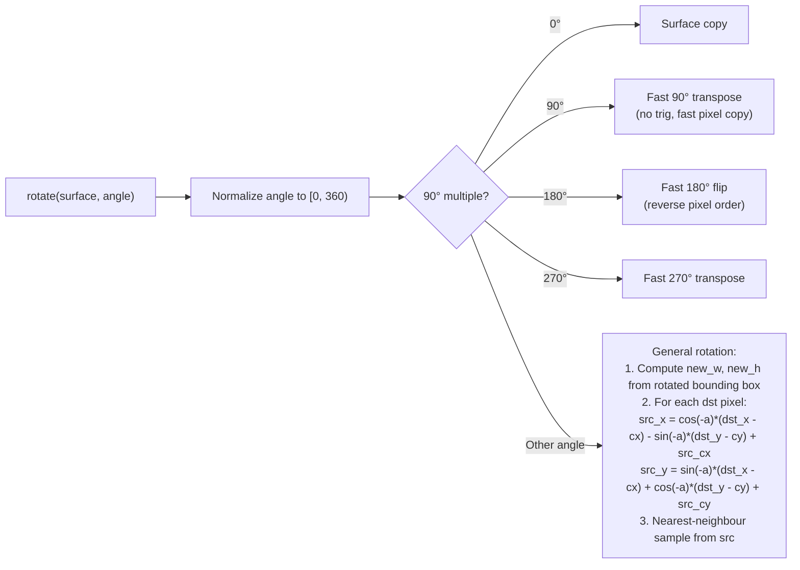

# Structure: `src_c/transform.c`

**Type:** C Extension Module  
**Compiled to:** `pygame.transform`  
**Lines:** ~1400  
**Last reviewed:** 2026-04-05  

---

## Purpose

`transform.c` implements geometric and pixel **transformation operations** on Surfaces. All operations produce new Surfaces (non-destructive) unless explicitly in-place.

---

## Public Python API — `pygame.transform`

| Function | Description |
|---|---|
| `scale(surface, size, dest_surface)` | Scale to new size. Uses nearest-neighbour by default |
| `scale_by(surface, factor, dest_surface)` | Scale by a float factor (e.g. 2.0 = double size) |
| `rotate(surface, angle)` | Rotate by angle (degrees, counter-clockwise). Expands bounding box |
| `rotozoom(surface, angle, scale)` | Combined rotate + scale (anti-aliased) |
| `scale2x(surface, dest_surface)` | AdvMAME Scale2X pixel-art doubler algorithm |
| `smoothscale(surface, size, dest_surface)` | Scale with bilinear filtering (slower, better quality) |
| `smoothscale_by(surface, factor, dest_surface)` | Smoothscale by float factor |
| `flip(surface, flip_x, flip_y)` | Mirror horizontally and/or vertically |
| `chop(surface, rect)` | Remove a rectangular region (collapses the gap) |
| `laplacian(surface, dest_surface)` | Edge-detection filter (Laplacian operator) |
| `average_surfaces(surfaces, dest_surface, palette_colors)` | Average pixel values across multiple surfaces |
| `average_color(surface, rect, consider_alpha)` | Return average color of all pixels |
| `threshold(dest, surface, search_color, threshold, set_color, set_behavior, search_surf, inverse_set)` | Pixel thresholding / color replacement |
| `grayscale(surface, dest_surface)` | Convert to grayscale |
| `invert(surface, dest_surface)` | Invert all pixel values (bitwise NOT) |

---

## Algorithm Details

```mermaid
flowchart TD
    FUNC["pygame.transform.*()"]

    FUNC --> SCALE["scale() / scale_by()\n— nearest-neighbour\n— integer ratio fast path\n— SDL2 SDL_BlitScaled for general case\n— MMX/SSE optimized paths for 2x, 4x"]

    FUNC --> SMOOTH["smoothscale() / smoothscale_by()\n— bilinear filter (2-pass: X then Y)\n— MMX-accelerated if available\n— Correct for non-integer ratios"]

    FUNC --> ROTATE["rotate(angle)\n— Compute new bounding box dimensions\n— sin/cos of angle\n— Nearest-neighbour pixel mapping\n— Expands canvas to fit rotated image\n— Background: colorkey or transparent"]

    FUNC --> ROTOZOOM["rotozoom(angle, scale)\n— Combined rotate + scale\n— Anti-aliased (bilinear sampling)\n— Always returns new surface"]

    FUNC --> FLIP["flip(flip_x, flip_y)\n— SDL_BlitSurface to new surface\n   with mirrored coordinates\n— Fast: direct memory copy with stride tricks"]

    FUNC --> SCALE2X["scale2x()\n— AdvMAME Scale2X algorithm\n— Pixel-art specific: preserves sharp edges\n— 2x only (no arbitrary scale)"]

    FUNC --> THRESH["threshold()\n— Per-pixel comparison\n— Compare against search_color ± threshold\n— Write set_color or copy pixel\n— Returns count of matched pixels"]

    FUNC --> LAPLACE["laplacian()\n— 3×3 Laplacian kernel convolution\n— Detects edges (zero-crossing)\n— [0,1,0,1,-4,1,0,1,0] kernel"]

    FUNC --> GRAY["grayscale()\n— Per-pixel: luma = 0.299R + 0.587G + 0.114B\n— RGB luminance formula\n— Sets R=G=B=luma"]

    FUNC --> AVG_SURF["average_surfaces()\n— Sum all surfaces' pixel values\n— Divide by count\n— Handles palette surfaces separately"]

    FUNC --> AVG_COLOR["average_color()\n— Sum all pixels in rect (or whole surface)\n— Return (R/n, G/n, B/n, A/n)"]

    FUNC --> INVERT["invert()\n— Bitwise NOT on each pixel component\n— Result: 255-R, 255-G, 255-B"]
```



---

## Scale Algorithm Details

### Nearest-Neighbour Scale

```c
// For each (dst_x, dst_y):
src_x = (dst_x * src_width) / dst_width;
src_y = (dst_y * src_height) / dst_height;
dst_pixel = src_pixel[src_x][src_y];
```

Fast but produces blocky results for non-integer ratios. Best for pixel art.

### Smoothscale (Bilinear)

Two-pass horizontal + vertical:
1. Scale horizontally into a temporary surface
2. Scale vertically from temp to output

Each output pixel is the weighted average of the 4 surrounding source pixels. Produces smooth results for photos/gradients. ~4x slower than nearest-neighbour.

### Scale2X (AdvMAME)

For pixel-art doubling only. Each source pixel becomes a 2×2 block:
```
Source pixel E with neighbors B(top), D(left), F(right), H(bottom):
  E0 = (D==B && B!=F && D!=H) ? D : E
  E1 = (B==F && B!=D && F!=H) ? F : E
  E2 = (D==H && D!=B && H!=F) ? D : E
  E3 = (H==F && D!=H && B!=F) ? F : E
```
Preserves diagonal edges and curves that nearest-neighbour blurs.

---

## Rotation Details

`rotate(surface, angle)` (degrees, CCW):



The bounding box for general rotation:
```
new_w = |src_w * cos(a)| + |src_h * sin(a)|
new_h = |src_w * sin(a)| + |src_h * cos(a)|
```

---

## Threshold Operation

The most complex transform — used for color replacement, green-screen effects, sprite extraction:

```python
count = pygame.transform.threshold(
    dest,           # destination surface (modified in-place)
    surface,        # source surface
    search_color,   # color to search for
    threshold=(0,0,0,0),  # per-channel tolerance
    set_color=(0,0,0,0),  # color to write when matched (if set_behavior=1)
    set_behavior=1, # 0=count only, 1=set set_color, 2=copy source pixel
    search_surf=None,  # compare against another surface instead of search_color
    inverse_set=False  # if True, set pixels that DON'T match
)
```

Per-pixel comparison:
```c
matched = (|src_R - search_R| <= threshold_R) &&
          (|src_G - search_G| <= threshold_G) &&
          (|src_B - search_B| <= threshold_B) &&
          (|src_A - search_A| <= threshold_A);
```

---

## Dependencies

- **Imports from:** `base.c` (error), `surface.c` (Surface type, pgSurface_New), `rect.c`
- **Math:** `<math.h>` — sin, cos, sqrt, fabs
- **scale.h** — MMX/SSE scale function declarations
- **rotozoom.c** — rotozoom implementation (separate file, included)

---

## Known Quirks / Notes

- `rotate()` at non-90° angles **always expands the canvas** to fit the rotated image. The original image is centered in the new larger surface. Game code using animated sprites needs to handle the changing size.
- `rotate()` fills the expanded area with the surface's colorkey if one is set, or with black (0,0,0,0) if the surface has per-pixel alpha.
- `smoothscale()` is significantly slower than `scale()` — avoid in the hot render loop. Pre-scale assets at load time instead.
- `rotozoom()` at angle=0 + scale=1.0 still creates a new surface (no special-case optimization). Don't use it as a copy function.
- `threshold()` returns the count of matched pixels as an integer. The `dest` surface must be pre-created with the right size and format.
- `average_surfaces()` with palette surfaces treats pixel values as palette indices and averages those, not the actual colors. This usually produces wrong results — convert to 32-bit first.
- `laplacian()` can produce negative intermediate values; these are clamped to 0-255. On very smooth surfaces with no edges, the output is near-black.
